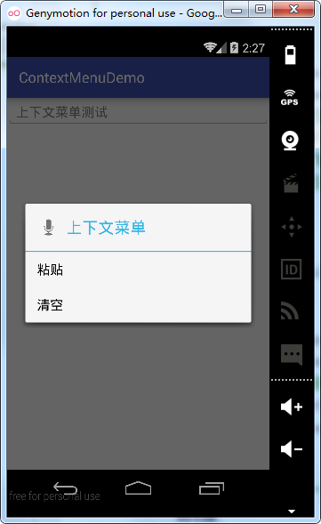
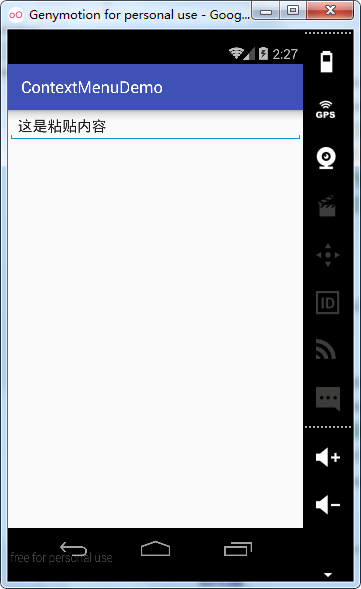
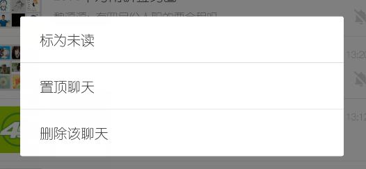
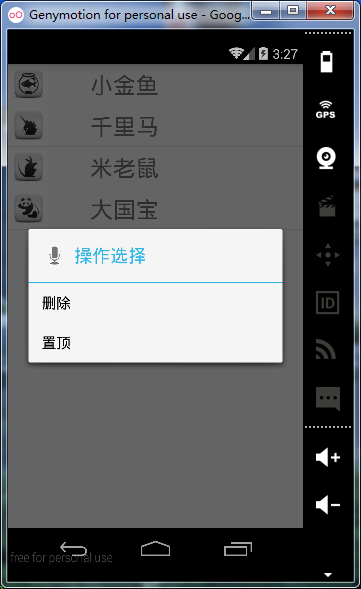
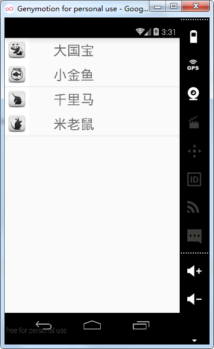
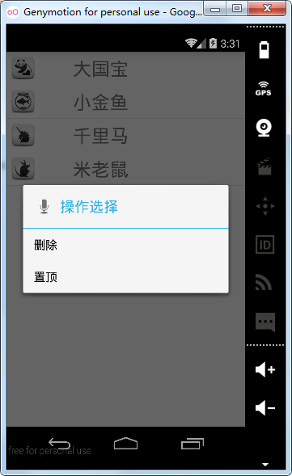
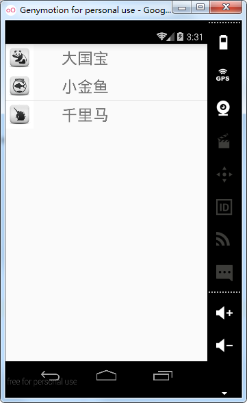

# 第二十章-Android菜单之上下文菜单

上下文菜单可以理解成PC端上的右键，当需要进行复制或粘贴、删除或重命名时就可以选定想要操作的对象点击右键，在弹出菜单中选择所需的操作。Android提供了长按被操作对象，弹出浮动的操作菜单的交互方式，这个弹出菜单就被称为上下文菜单，任何控件都可以注册上下文菜单，采用的有EditText弹出上下文菜单，进行清空或粘贴的操作、ListView子Item的删除和添加等。

设置一个上下文菜单一般分为三个步骤：

- 创建上下文菜单：覆写onCreateContenxtMenu方法，由其参数ContextMenu类的menu对象结合其add方法，添加子菜单。

- 添加单项选择监听：覆写onContextItemSelected方法，由其参数MenuItem类的item对象结合其getItemId方法，判断选择了哪一个子菜单。

- 注册上下文菜单：将想要注册上下文菜单的控件对象作为registerForContextMenu方法的参数传入，即可为其添加上下文菜单。
下面通过一个实例来创建上下文菜单，方便和熟悉其用法。
MainActivity代码（MainActivity.java）

```
public class MainActivity extends AppCompatActivity {
    private EditText editText;
    @Override
    protected void onCreate(Bundle savedInstanceState) {
        super.onCreate(savedInstanceState);
        LinearLayout linearLayout = new LinearLayout(this);
        linearLayout.setLayoutParams(new LinearLayout.LayoutParams(LinearLayout.LayoutParams.MATCH_PARENT, LinearLayout.LayoutParams.MATCH_PARENT));
        editText = new EditText(this);
        editText.setLayoutParams(new LinearLayout.LayoutParams(LinearLayout.LayoutParams.MATCH_PARENT, LinearLayout.LayoutParams.WRAP_CONTENT));
        editText.setHint("上下文菜单测试");
        registerForContextMenu(editText);//为EditText控件添加上下文菜单
        linearLayout.addView(editText);
        setContentView(linearLayout);
    }
    @Override
    public void onCreateContextMenu(ContextMenu menu, View v, ContextMenu.ContextMenuInfo menuInfo) {//创建上下文菜单
        super.onCreateContextMenu(menu, v, menuInfo);
        menu.setHeaderTitle("上下文菜单");//上下文菜单的标题
        menu.setHeaderIcon(android.R.drawable.ic_btn_speak_now); //上下文菜单图标
        menu.add(Menu.NONE, 1, 1, "粘贴");
        menu.add(Menu.NONE, 2, 2, "清空");
    }
    @Override
    public boolean onContextItemSelected(MenuItem item) {//子菜单选择事件监听
        switch (item.getItemId()) {//根据子菜单ID进行菜单选择判断
            case 1:
                ClipboardManager copy = (ClipboardManager) MainActivity.this
                        .getSystemService(Context.CLIPBOARD_SERVICE);
                copy.setText("这是粘贴内容");//调用了系统服务
                String text = copy.getText().toString().trim();
                editText.setText(text);
                break;
            case 2:
                editText.setText("");
                break;
        }
        return super.onContextItemSelected(item);
    }
}
```

有几点说明：

- 用到了通过Java代码动态构建控件，首先初始化一个LinearLayout作为父布局，然后调用其setLayoutParams方法设置父布局的宽度和高度，setLayoutParams方法需要传入一个LinearLayout.LayoutParams类的对象，这里通过new方法实例化了一个对象，传入宽（ViewGroup.LayoutParams.MATCH_PARENT）和（ViewGroup.LayoutParams.MATCH_PARENT）两个参数。同样，初始化了一个EditText对象，并设置了其宽和高属性，最后父布局调用addView方法，将子控件（EditText）引入。最后，使用setContentView方法传入父布局（LinearLayout）。

- 这里要对EditText控件添加上下文菜单，因此，将其对象editText作为参数，传入registerForContextMenu方法。

- 在创建上下文菜单时，调用了ContextMenu类的setHeaderTitle和setHeadIcon方法为上下文菜单添加标题和标题图标。同时通过调用ContextMenu类的add方法添加了“粘贴”和“清空”两个功能按钮。这里的add方法需要传入四个参数，即分组ID、子菜单ID、子菜单顺序和子菜单文本。

- 在上下文菜单选择事件的监听中，通过调用Activity类的getSystemService方法并传入Context.CLIPBOARD_SERVICE作为常量参数获取了Android剪贴板服务类对象，调用其setText方法，可以设置要粘贴的内容。

运行实例如下：




长按EditText控件弹出上下文菜单，选择粘贴功能，将剪切板管理类设置的粘贴内容粘贴到EditText中，选择清空功能，则清空EditText控件。
ListView中也经常会使用到上下文菜单，打开全中国最火的APP微信，长按任一item，弹出上下文菜单如下图：



我们可以看出，该上下文菜单提供了三个功能标记未读、置顶聊天和删除该聊天，下面通过一个实例Demo看一下如何实现置顶和删除子项的功能。
主布局文件代码（activity_main.xml）

```
<?xml version="1.0" encoding="utf-8"?>
<RelativeLayout xmlns:android="http://schemas.android.com/apk/res/android"
    android:layout_width="match_parent"
    android:layout_height="match_parent">
    <ListView
        android:id="@+id/listview"
        android:layout_width="match_parent"
        android:layout_height="match_parent" />
</RelativeLayout>
```

主布局文件中仅防止了一个ListView控件，设置宽高属性为match_parent，id为listview。
ListView子布局代码（item.xml）

```
<LinearLayout xmlns:android="http://schemas.android.com/apk/res/android"
    android:layout_width="match_parent"
    android:orientation="horizontal"
    android:layout_height="match_parent">
    <ImageView
        android:id="@+id/img"
        android:src="@mipmap/ic_launcher"
        android:layout_width="50dp"
        android:layout_height="50dp" />
    <TextView
        android:id="@+id/tv"
        android:text="hello"
        android:gravity="center"
        android:layout_marginLeft="50dp"
        android:textSize="28sp"
        android:layout_width="wrap_content"
        android:layout_height="50dp" />
</LinearLayout>
```

设置了一个ImageView用于图片显示，固定宽高为50dp，设置一个TextView显示文本信息，设置字号、宽高、文本内容等属性。
bean类（Animal.java）
为了方便读写操作，这里同样设置了JavaBean类：

```
public class Animal {
    public Animal(String animal, int imgId) {
        this.animal = animal;
        this.imgId = imgId;
    }
    private String animal;
    private int imgId;
    public String getAnimal() {
        return animal;
    }
    public void setAnimal(String animal) {
        this.animal = animal;
    }
    public int getImgId() {
        return imgId;
    }
    public void setImgId(int imgId) {
        this.imgId = imgId;
    }
}
```

包括两个属性String性的animal-动物名和int性的imgId-图片id，并设置了构造方法。
适配器类（AnimalAdapter.java）

```
public class AnimalAdapter extends BaseAdapter {
    private Context context;
    private List<Animal> datas;
    //构造函数需要传入两个必要的参数：上下文对象和数据源
    public AnimalAdapter(Context context,List<Animal> datas) {
        this.context=context;
        this.datas=datas;
    }
    //返回子项的个数
    @Override
    public int getCount() {
        return datas.size();
    }
    //返回子项对应的对象
    @Override
    public Object getItem(int position) {
        return datas.get(position);
    }
    //返回子项的下标
    @Override
    public long getItemId(int position) {
        return position;
    }
    //返回子项视图
    @Override
    public View getView(int position, View convertView, ViewGroup parent) {
        Animal animal= (Animal) getItem(position);
        View view;
        ViewHolder viewHolder;
        if(convertView==null){
            view = LayoutInflater.from(context).inflate(R.layout.item,null);
            viewHolder=new ViewHolder();
            viewHolder.animalImage=(ImageView)view.findViewById(R.id.img);
            viewHolder.animalName=(TextView)view.findViewById(R.id.tv);
            view.setTag(viewHolder);
        }else{
            view=convertView;
            viewHolder= (ViewHolder) view.getTag();
        }
        viewHolder.animalName.setText(animal.getAnimal());
        viewHolder.animalImage.setImageResource(animal.getImgId());
        return view;
    }
    //创建ViewHolder类
    class ViewHolder{
        ImageView animalImage;
        TextView animalName;
    }
}
```

构造函数传入两个参数，上下文对象和数据集。同样覆写了四个必须覆写的方法，创建了ViewHolder类提高ListView性能。
MainActivity类（MainActivity.java）

```
public class MainActivity extends Activity {
    private ListView listView;
    private SimpleAdapter simpleAdapter;
    private List<Map<String, Object>> datas=new ArrayList<Map<String, Object>>();
    @Override
    protected void onCreate(Bundle savedInstanceState) {
        super.onCreate(savedInstanceState);
        setContentView(R.layout.activity_main);
        listView=(ListView)findViewById(R.id.listview);
        initDatas();//初始化数据集
//实例化SimpleAdapter
        simpleAdapter=new SimpleAdapter(this,datas,R.layout.item,new String[]{"img","name"},new int[]{R.id.img,R.id.tv});        listView.setAdapter(simpleAdapter);//设置配置器

        registerForContextMenu(listView);//注册上下文菜单
    }
    private void initDatas() {
        Map map1=new HashMap();
        map1.put("img",R.drawable.fish);
        map1.put("name", "小金鱼");
        Map map2=new HashMap();
        map2.put("img",R.drawable.horse);
        map2.put("name", "千里马");
        Map map3=new HashMap();
        map3.put("img",R.drawable.mouse);
        map3.put("name", "米老鼠");
        Map map4=new HashMap();
        map4.put("img",R.drawable.panda);
        map4.put("name","大国宝");
        datas.add(map1);
        datas.add(map2);
        datas.add(map3);
        datas.add(map4);

    }
    //覆写生成上下文菜单的方法
    @Override
    public void onCreateContextMenu(ContextMenu menu, View v, ContextMenu.ContextMenuInfo menuInfo) {
        super.onCreateContextMenu(menu, v, menuInfo);
        menu.setHeaderIcon(android.R.drawable.ic_btn_speak_now);//设置图标，仅作示例
        menu.setHeaderTitle("操作选择");
        menu.add(0, 0, 0, "删除");
        menu.add(0,1,1,"置顶");
    }
    //对上下文菜单进行选择监听
    @Override
    public boolean onContextItemSelected(MenuItem item) {
        AdapterView.AdapterContextMenuInfo adapterContextMenuInfo= (AdapterView.AdapterContextMenuInfo) item.getMenuInfo();
        int index=adapterContextMenuInfo.position;
        switch (item.getItemId()){
            case 0:
                datas.remove(index);
                simpleAdapter.notifyDataSetChanged();
                break;
            case 1:
                Map temp=new HashMap();//临时对象
                temp=datas.get(index);
                datas.remove(index);//注意删除和添加的顺序，颠倒之后会出现错误，读者可以自行测试，并思考为什么？
                datas.add(0,temp);
                simpleAdapter.notifyDataSetChanged();
                break;
        }
        return super.onContextItemSelected(item);
    }
}
```

这里覆写了生成上下文菜单的方法onCreateContextMenu和上下文菜单的选择监听事件onContextItemSelected，在menu的add方法中传入了四个参数，分别是：组id，菜单id,显示顺序（int型）和菜单标题。需要注意的是在上下文监听事件的方法中，通过传入对象item的getMenuInfo方法可以获得AdapterView.AdapterContextMenuInfo对象，该对象中有position属性，记录了上下文菜单作用的子项位置信息，这个信息用于删除对应的子项。删除后调用notifyDataSetChanged方法，刷新ListView显示。

在置顶操作中，首先用一个临时Map集合保存要置顶的对象，而后调用remove方法删除这个对象，然后再调用add方法，传入两个参数，第一个参数是插入位置，这里传入0表示插入在头部，第二个是插入对象，这里传入临时对象temp。最后调用notifyDataSetChanged方法，刷新ListView显示。

注意不要忘记在onCreate方法中调用registerForContextMenu方法，参数传入要添加上下文菜单的对象，这里传入了listView对象。
运行项目实例：




选择最后一项长按弹出上下文菜单，选择置顶操作，最后一项移动到第一项。




选择最后一项并长按弹出上下文菜单，选择删除操作，则最后一项被删除。