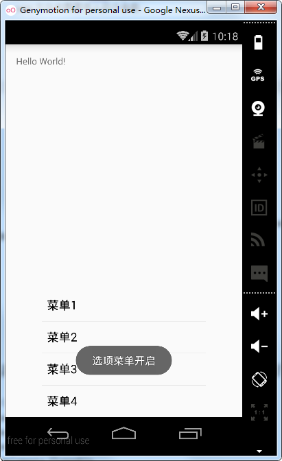

# 第十九章-Android菜单之选项菜单

Android菜单包括选项菜单（OptionsMenu）、上下文菜单（ContextMenu）和子菜单（SubMenu）三种，本节将对这选项菜单的用法进行学习。

选项菜单共有五个常用的方法，下面对这些方法进行一一介绍：

- public boolean onCreateOptionsMenu(Menu menu)：使用此方法创建选项菜单，通常有两种方式，一种称为静态方式（xml布局文件创建菜单），另一种通过Menu的add方法动态添加选项菜单；
- public boolean onOptionsItemSelected(MenuItem item)：选中菜单项被选择后触发，可以根据item对象的getItemId方法判断点击了哪一个菜单；
- public void onOptionsMenuClosed(Menu menu):菜单关闭时触发；
- public boolean onPrepareOptionsMenu(Menu menu)：选项菜单显示之前触发；
- public boolean onMenuOpened(int featureId, Menu menu)：选项菜单打开时触发。

下面通过静态和动态的方式构建选项菜单

1.静态方式：通过定义xml文件的形式确定子项菜单
菜单文件（menu.xml）

```
<?xml version="1.0" encoding="utf-8"?>
<menu xmlns:android="http://schemas.android.com/apk/res/android">
    <item
        android:id="@+id/meun1"
        android:icon="@mipmap/ic_launcher"
        android:orderInCategory="3"
        android:title="菜单一" />
    <item
        android:id="@+id/menu2"
        android:orderInCategory="2"
        android:title="菜单二" />
    <item
        android:id="@+id/menu3"
        android:enabled="false"
        android:orderInCategory="4"
        android:title="不可用菜单" />
</menu>
```

这里定义了三个item，每个item都有特定的属性，下面总结一下常用属性含义：


MainActivity代码（MainActivity.java）

```
public class MainActivity extends Activity {
    @Override
    protected void onCreate(Bundle savedInstanceState) {
        super.onCreate(savedInstanceState);
        setContentView(R.layout.activity_main);
    }
    @Override
    public boolean onCreateOptionsMenu(Menu menu) {
        getMenuInflater().inflate(R.menu.menu,menu);
        return true;
    }
   @Override
    public boolean onOptionsItemSelected(MenuItem item) {
        switch (item.getItemId()) {
            case R.id.meun1:
                Toast.makeText(MainActivity.this, "菜单一被选择了", Toast.LENGTH_SHORT).show();
                break;
            case R.id.menu2:
                Toast.makeText(MainActivity.this, "菜单二被选择了", Toast.LENGTH_SHORT).show();
                break;
            case R.id.menu3:
                Toast.makeText(MainActivity.this, "菜单三被选择了", Toast.LENGTH_SHORT).show();
                break;
        }
        return super.onOptionsItemSelected(item);
    }
    @Override
    public boolean onMenuOpened(int featureId, Menu menu) {
        Toast.makeText(MainActivity.this, "选项菜单开启", Toast.LENGTH_SHORT).show();
        return super.onMenuOpened(featureId, menu);
    }
    @Override
    public void onOptionsMenuClosed(Menu menu) {
        super.onOptionsMenuClosed(menu);
        Toast.makeText(MainActivity.this, "选项菜单关闭", Toast.LENGTH_SHORT).show();
    }
}
```

这里使用了getMenuInflater().inflate(R.menu.menu,menu);方式导入菜单文件，inflate方法需要传入两个参数，第一个是菜单文件，第二个是Menu对象。同时也调用了onOptionsItemSelected方法监听菜单项的选择，调用了onMenuOpened和onOptionMenuClosed方法监听菜单选项的打开和关闭。

运行项目实例：


我们在menu文件中设置了第三个菜单的enable为false，所以它不可点击。

2.动态方式

MainActivity（MainActivity.java）

```
public class MainActivity extends Activity {
    @Override
    protected void onCreate(Bundle savedInstanceState) {
        super.onCreate(savedInstanceState);
        setContentView(R.layout.activity_main);
    }
    @Override
    public boolean onCreateOptionsMenu(Menu menu) {//创建选项菜单
        menu.add(menu.NONE, 1, 1, "菜单1");
        menu.add(menu.NONE, 2, 2, "菜单2");
        menu.add(menu.NONE, 3, 3, "菜单3");
        menu.add(menu.NONE, 4, 4, "菜单4");
        return super.onCreateOptionsMenu(menu);
    }
    @Override
    public boolean onOptionsItemSelected(MenuItem item) {//菜单选择监听
        switch (item.getItemId()) {
            case 1:
                Toast.makeText(MainActivity.this, "菜单一被选择了", Toast.LENGTH_SHORT).show();
                break;
            case 2:
                Toast.makeText(MainActivity.this, "菜单二被选择了", Toast.LENGTH_SHORT).show();
                break;
            case 3:
                Toast.makeText(MainActivity.this, "菜单三被选择了", Toast.LENGTH_SHORT).show();
                break;
            case 4:
                Toast.makeText(MainActivity.this, "菜单四被选择了", Toast.LENGTH_SHORT).show();
                break;
        }
        return super.onOptionsItemSelected(item);
    }
    @Override
    public boolean onMenuOpened(int featureId, Menu menu) {//菜单打开事件监听
        Toast.makeText(MainActivity.this, "选项菜单开启", Toast.LENGTH_SHORT).show();
        return super.onMenuOpened(featureId, menu);
    }
    @Override
    public void onOptionsMenuClosed(Menu menu) {//菜单关闭事件监听
        super.onOptionsMenuClosed(menu);
        Toast.makeText(MainActivity.this, "选项菜单关闭", Toast.LENGTH_SHORT).show();
    }
}
```

这里采用了动态添加的方式，调用了Menu类的add方法，如下：
public MenuItem add(int groupId, int itemId, int order, CharSequence title);
add方法中需要传入四个参数：

- groupId：组别，不分组可以写Menu.NONE
- itemId：子菜单项Id，作为子菜单的唯一标识
- order：菜单显示顺序
- title：菜单文本显示

菜单选择事件监听通过传入的MenuItem对象，并调用其getItemId来判断哪一个子菜单被选择了。

运行项目实例如下：




点击选项菜单按钮时，选项菜单弹出，选项菜单开启事件触发，选择菜单二，选择事件触发，选择完成后，菜单自动关闭，这时选项菜单关闭事件触发。

细心的读者会发现，上面的实例中设置了子菜单的图标，但是并没有显示，原因是在Android2.3以上的版本的源码进行了改变，若要想显示图标可以通过修改源码实现，这一方法可以参考博文：http://blog.csdn.net/stevenhu_223/article/details/9705173。我们这里给出一个自定义弹出框的形式来实现更美观的菜单选项。

弹出框布局文件（view.xml）
弹出框布局采用GridView控件进行布局，代码如下：

```
<?xml version="1.0" encoding="utf-8"?>
<LinearLayout xmlns:android="http://schemas.android.com/apk/res/android"
    android:layout_width="fill_parent"
    android:layout_height="fill_parent"
    android:orientation="vertical">
    <GridView
        android:id="@+id/gridview"
        android:layout_width="300dp"
        android:layout_height="150dp"
        android:gravity="center"
        android:numColumns="3" />
</LinearLayout>
```

GridView子布局文件（item.xml）

```
<?xml version="1.0" encoding="utf-8"?>
<RelativeLayout xmlns:android="http://schemas.android.com/apk/res/android"
    android:id="@+id/RelativeLayout_Item"
    android:layout_width="fill_parent"
    android:layout_height="wrap_content"
    android:padding="10dp">
    <ImageView
        android:id="@+id/iv_icon"
        android:layout_width="40dp"
        android:layout_height="40dp"
        android:layout_centerHorizontal="true"></ImageView>
    <TextView
        android:id="@+id/tv_title"
        android:layout_width="wrap_content"
        android:layout_height="wrap_content"
        android:layout_below="@id/iv_icon"
        android:layout_centerHorizontal="true"
        android:text="选项"></TextView>
</RelativeLayout>
```

MainActivity代码（MainActivity.java）

```
public class MainActivity extends Activity {
    private AlertDialog alertDialog;
    private GridView gridView;
    private View view;
    private int[] icons = {R.drawable.exit, R.drawable.fold, R.drawable.set, R.drawable.newpic, R.drawable.more};
    private String[] titles = {"退出", "文件", "设置", "新建", "更多"};
    private SimpleAdapter simpleAdapter;
    private List<Map<String, Object>> datas;
    @Override
    protected void onCreate(Bundle savedInstanceState) {
        super.onCreate(savedInstanceState);
        setContentView(R.layout.activity_main);
        view = LayoutInflater.from(this).inflate(R.layout.view, null);//获得弹出框布局文件对象
        initDatas();//初始化数据集
        //初始化SimpleAdapter
        simpleAdapter = new SimpleAdapter(this, datas, R.layout.item, new String[]{"icon", "title"}, new int[]{R.id.iv_icon, R.id.tv_title});
        alertDialog=new AlertDialog.Builder(this).create();//创建弹出框
        alertDialog.setView(view);//设置弹出框布局
        gridView=(GridView)view.findViewById(R.id.gridview);
        gridView.setAdapter(simpleAdapter);//设置适配器
        gridView.setOnItemClickListener(new AdapterView.OnItemClickListener() {//GridView子项单击事件监听
            @Override
            public void onItemClick(AdapterView<?> parent, View view, int position, long id) {
                Toast.makeText(MainActivity.this,"您点击了"+titles[position]+"按钮",Toast.LENGTH_SHORT).show();
                alertDialog.dismiss();
            }
        });
    }
    private void initDatas() {
        datas = new ArrayList<>();
        for (int i = 0; i < titles.length; i++) {
            Map map = new HashMap();
            map.put("icon", icons[i]);
            map.put("title", titles[i]);
            datas.add(map);
        }
    }
    @Override
    public boolean onKeyDown(int keyCode, KeyEvent event) {//覆写了onKeyDown方法
        if(keyCode==KeyEvent.KEYCODE_MENU){//当按下菜单键时
            if (alertDialog == null) {
                alertDialog = new AlertDialog.Builder(this).setView(view).show();
            } else
                alertDialog.show();
        }
        return super.onKeyDown(keyCode, event);
    }
}
```

这里覆写了onKeyDown方法，当菜单键按下时，弹出对话框，对话框布局采用了GridView控件，设置了GridView子项单击事件监听，处理对于逻辑。SimpleAdapter适配器类初始化时要传入五个参数，不熟悉的读者可以参考前面的GridView章节。

运行实例如下：


点击设置按钮，弹出对话菜单选择框，选择对应的子菜单对应不同的逻辑操作。