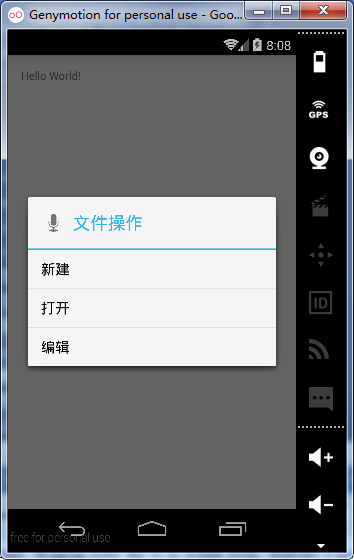
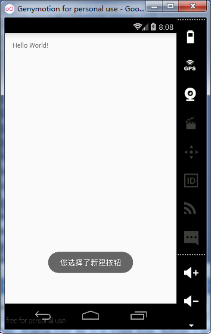

# 第二十一章-Android菜单之子菜单

子菜单和选项菜单比较类似，它的特点是可以将菜单进行分组，更方面用户进行选择和操作。创建子菜单的步骤也大致可以分为三步：

- 覆写Activity的onCreateOptionsMenu()方法，调用Menu类的addSubMenu()方法来添加子菜单。

- 调用SubMenu的add()方法，添加子菜单子项，add方法有四个参数，同样也是分组ID、子项ID、子项顺序和子项文本信息。

- 覆写onContextItemSelected()方法，为子菜单添加选择事件监听。 
和选项菜单类似，子菜单的创建也可以通过两种方式，即布局文件方式（静态方式）和代码动态添加（动态方式）的方式，下面分别进行讲解。

- 布局文件方式
子菜单布局文件（menu.xml）

```
<?xml version="1.0" encoding="utf-8"?>
<menu xmlns:android="http://schemas.android.com/apk/res/android">
    <item
        android:id="@+id/file"
        android:icon="@mipmap/ic_launcher"
        android:orderInCategory="100"
        android:showAsAction="never"
        android:title="文件操作">
        <menu>
            <item
                android:id="@+id/new_file"
                android:showAsAction="never"
                android:title="新建" />
            <item
                android:id="@+id/open_file"
                android:showAsAction="never"
                android:title="打开" />
            <item
                android:id="@+id/edit_file"
                android:showAsAction="never"
                android:title="编辑" />
        </menu>
    </item>
    <item
        android:id="@+id/set"
        android:icon="@mipmap/ic_launcher"
        android:orderInCategory="100"
        android:showAsAction="never"
        android:title="设置">
        <menu>
            <item
                android:id="@+id/delete_set"
                android:showAsAction="never"
                android:title="删除" />
            <item
                android:id="@+id/exit_set"
                android:showAsAction="never"
                android:title="退出" />
        </menu>
    </item>
</menu>
```

这里创建了两个子菜单项：文件操作和设置，文件操作包括三个子项：新建、打开和编辑；设置包括两个子项：删除和退出。可以看出不论是子菜单项或者子菜单子项都是由item标签包裹，一个子菜单下的所有子菜单子项由menu标签包裹。

MainActivity代码（MainActivity.java）

```
public class MainActivity extends Activity {
    @Override
    protected void onCreate(Bundle savedInstanceState) {
        super.onCreate(savedInstanceState);
        setContentView(R.layout.activity_main);
    }
    @Override
    public boolean onCreateOptionsMenu(Menu menu) {//构建菜单
        MenuInflater menuInflater=getMenuInflater();
        menuInflater.inflate(R.menu.menu,menu);
        return super.onCreateOptionsMenu(menu);
    }
    @Override
    public boolean onOptionsItemSelected(MenuItem item) {//菜单选择事件监听
        switch (item.getItemId()){
            case R.id.new_file:
                Toast.makeText(this,"您选择了新建按钮",Toast.LENGTH_SHORT).show();
                break;
            case R.id.open_file:
                Toast.makeText(this,"您选择了打开按钮",Toast.LENGTH_SHORT).show();
                break;
            case R.id.edit_file:
                Toast.makeText(this,"您选择了编辑按钮",Toast.LENGTH_SHORT).show();
                break;
            case R.id.delete_set:
                Toast.makeText(this,"您选择了删除按钮",Toast.LENGTH_SHORT).show();
                break;
            case R.id.exit_set:
                Toast.makeText(this,"您选择了退出按钮",Toast.LENGTH_SHORT).show();
                break;
        }
        return super.onOptionsItemSelected(item);
    }
}
```

在onCreateOptionsMenu中首先调用getMenuInflater方法获取MenuInflater

类的对象，然后调用其inflate方法引入菜单文件，这里需要传入两个参数，第一个参数是菜单资源文件，第二个是Menu对象。

- 代码动态方式
MainActivity代码（MainActivity.java）

```
public class MainActivity extends Activity {
    @Override
    protected void onCreate(Bundle savedInstanceState) {
        super.onCreate(savedInstanceState);
        setContentView(R.layout.activity_main);
    }
    @Override
    public boolean onCreateOptionsMenu(Menu menu) {//构建菜单
        SubMenu file =menu.addSubMenu("文件");//获得子菜单对象
        file.setHeaderIcon(android.R.drawable.ic_btn_speak_now);
        file.setHeaderTitle("文件操作");
        file.add(1,1,1,"新建");//调用add方法添加子菜单子项
        file.add(1,2,2,"打开");
        file.add(1,3,3,"编辑");
        SubMenu set =menu.addSubMenu("设置");
        set.add(1,4,4,"删除");
        set.add(1,5,5,"退出");
        return super.onCreateOptionsMenu(menu);
    }
    @Override
    public boolean onOptionsItemSelected(MenuItem item) {//菜单选择事件监听
        switch (item.getItemId()){
            case 1:
                Toast.makeText(this,"您选择了新建按钮",Toast.LENGTH_SHORT).show();
                break;
            case 2:
                Toast.makeText(this,"您选择了打开按钮",Toast.LENGTH_SHORT).show();
                break;
            case 3:
                Toast.makeText(this,"您选择了编辑按钮",Toast.LENGTH_SHORT).show();
                break;
            case 4:
                Toast.makeText(this,"您选择了删除按钮",Toast.LENGTH_SHORT).show();
                break;
            case 5:
                Toast.makeText(this,"您选择了退出按钮",Toast.LENGTH_SHORT).show();
                break;
        }
        return super.onOptionsItemSelected(item);
    }
}
```

调用menu对象的addSubMenu方法添加一个子菜单，同时这个方法返回一个SubMenu对象，为了便于下面给子菜单添加子项，这里使用一个SubMenu对象进行接收，添加子菜单子项调用add方法。

运行项目实例：


