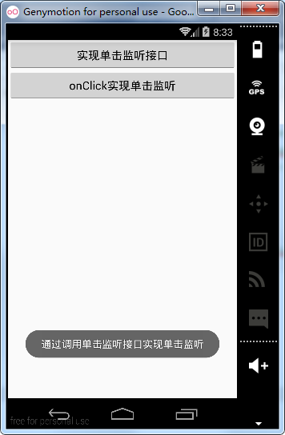
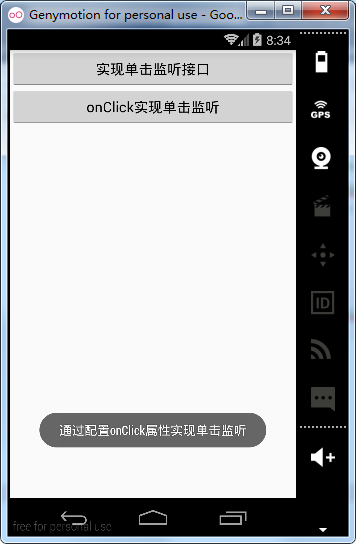
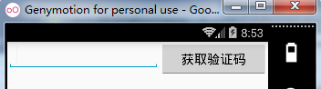
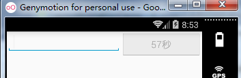
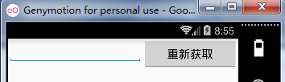

# 第三章-交互之王Button控件

Button按钮是Android应用中最常用到的控件，说它为交互之王一点都不过分，每个应用中都包含了多个Button响应和解决用户各种点击交互事件，下面我们看一下API文档中怎么定义Button控件的吧，其继承结构如下：

```
public class
Button
extends TextView
java.lang.Object
   ↳	android.view.View
 	   ↳	android.widget.TextView
 	 	   ↳	android.widget.Button
```

可以看出Button控件继承自TextView控件，自然TextView的属性和方法在Button中也同样适用。实现Button控件的单击监听有两种方式。

经典方式，获取Button对象，设置其监听事件，参考API提供的方法：

```
 public class MyActivity extends Activity {
     protected void onCreate(Bundle icicle) {
         super.onCreate(icicle);
         setContentView(R.layout.content_layout_id);
         final Button button = (Button) findViewById(R.id.button_id);
         button.setOnClickListener(new View.OnClickListener() {
             public void onClick(View v) {
                 // Perform action on click
             }
         });
     }
 }
```

第二种，在布局文件中配置onClick属性，并设置相应的监听方法名：

```
 <Button
     android:layout_height="wrap_content"
     android:layout_width="wrap_content"
     android:text="@string/self_destruct"
     android:onClick="selfDestruct" />

```
在Activity中编写同名方法，在方法中处理单击逻辑：

```
 public void selfDestruct(View view) {
     // Kabloey
 }
```

下面通过一个具体实例，来看一下这两种方式是如何实现的

布局文件如下：（activity_main.xml）

```
<?xml version="1.0" encoding="utf-8"?>
<RelativeLayout xmlns:android="http://schemas.android.com/apk/res/android"
    xmlns:tools="http://schemas.android.com/tools"
    android:layout_width="match_parent"
    android:layout_height="match_parent">
    <Button
        android:id="@+id/btn"
        android:layout_width="wrap_content"
        android:layout_height="wrap_content"
        android:text="实现单击监听接口"
        android:layout_alignParentRight="true"
        android:layout_alignParentEnd="true"
        android:layout_alignParentLeft="true"
        android:layout_alignParentStart="true" />
    <Button
        android:layout_width="wrap_content"
        android:layout_height="wrap_content"
        android:onClick="test"
        android:layout_below="@+id/btn"
        android:text="onClick实现单击监听"
        android:layout_alignParentLeft="true"
        android:layout_alignParentStart="true"
        android:layout_alignParentRight="true"
        android:layout_alignParentEnd="true" />
</RelativeLayout>
```

可以看出第二个Button配置了onClick属性。

Activity程序（MainActivity.java）

```
public class MainActivity extends Activity {
    private Button button;
    @Override
    protected void onCreate(Bundle savedInstanceState) {
        super.onCreate(savedInstanceState);
        setContentView(R.layout.activity_main);
        button=(Button)findViewById(R.id.btn);
        button.setOnClickListener(new View.OnClickListener() {
            @Override
            public void onClick(View v) {
                Toast.makeText(MainActivity.this,"通过调用单击监听接口实现单击监听",Toast.LENGTH_SHORT).show();
            }
        });
    }
    public  void test(View view){
        Toast.makeText(MainActivity.this,"通过配置onClick属性实现单击监听",Toast.LENGTH_SHORT).show();
    }
}
```

第一个Button实现了单击监听接口，采用匿名内部类的方式，第二个Button通过编写的test方法实现单击监听。
运行实例如下：




一般APP都有用户注册功能，用户注册需要获取手机验证码，点击验证码短信平台通过短信的形式发送到用户手机，为了防止用户多次点击并提高用户体验，下面引入一个实例，提供点击一次即将Button设为不可点击并在Button上显示倒计时的功能，显示倒计时是为了告知用户下一次可以获取验证码的剩余时间，提高用户体验。
布局文件如下：

```
<?xml version="1.0" encoding="utf-8"?>
<RelativeLayout xmlns:android="http://schemas.android.com/apk/res/android"
    android:layout_width="match_parent"
    android:layout_height="match_parent">
    <EditText
        android:layout_width="match_parent"
        android:layout_height="wrap_content"
        android:layout_toLeftOf="@+id/btn" />
    <Button
        android:id="@+id/btn"
        android:layout_width="150dp"
        android:layout_height="wrap_content"
        android:layout_alignParentEnd="true"
        android:layout_alignParentRight="true"
        android:layout_alignParentTop="true"
        android:text="获取验证码" />
</RelativeLayout>

```
Activity程序（MainActivity.java）

```
public class MainActivity extends Activity {
    private Button buttonClock;
    private TimeCount timeCount;
    @Override
    protected void onCreate(Bundle savedInstanceState) {
        super.onCreate(savedInstanceState);
        setContentView(R.layout.activity_main);
        buttonClock=(Button)findViewById(R.id.btn);
        timeCount=new TimeCount(60*1000,1000);//实例化TimeCount类
        buttonClock.setOnClickListener(new View.OnClickListener() {
            @Override
            public void onClick(View v) {
                timeCount.start();//调用start方法开始倒计时
            }
        });
    }
    class  TimeCount extends CountDownTimer{
        //构造方法
       public  TimeCount(long totalTime,long interval){
           super (totalTime,interval);
       }
        @Override
        public void onTick(long millisUntilFinished) {//覆写方法-计时中
            buttonClock.setEnabled(false);//按钮不可点击
            //参数millisUntilFinished表示剩余时间
            buttonClock.setText(millisUntilFinished/1000+"秒");
        }
        @Override
        public void onFinish() {//覆写方法，即时结束
            buttonClock.setEnabled(true);//恢复按钮可点击
            buttonClock.setText("重新获取");//修改按钮提示文字
        }
    }
}

```
这里需要说明：
这里用到了CountDownTimer类，它是一个抽象类，这个类可以实现倒计时功能，覆写onTick方法可以实现定期通知的操作，覆写onFinish方法，执行定时结束后的相关操作。API中给出了参考实例：

```
new CountDownTimer(30000, 1000) {
     public void onTick(long millisUntilFinished) {
         mTextField.setText("seconds remaining: " + millisUntilFinished / 1000);
     }
     public void onFinish() {
         mTextField.setText("done!");
     }
  }.start();

```
CountDownTimer类实例化时需要传递两个参数，第一个参数是倒计时总时长，第二个参数是时间间隔。从样例代码中也可以看出，实现该抽象类同时覆写了两个方法onTick方法（根据实例化CountDownTimer类时传入的时间间隔，定期调用的方法，样例中利用它实现了信息更新的操作）和onFinish方法（倒计时结束时调用的方法）。最后调用其start方法，开始倒计时，从API文档中可以看出start方法考虑了线程安全问题。

运行项目实例：
首先Button上显示”获取验证码”信息。



点击后显示倒计时秒数，此时Button不可点击。



倒计时结束后，Button上显示“重新获取”字样，Button可点击。

