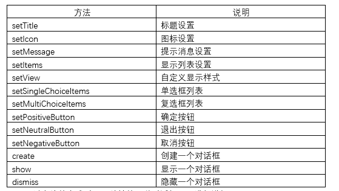
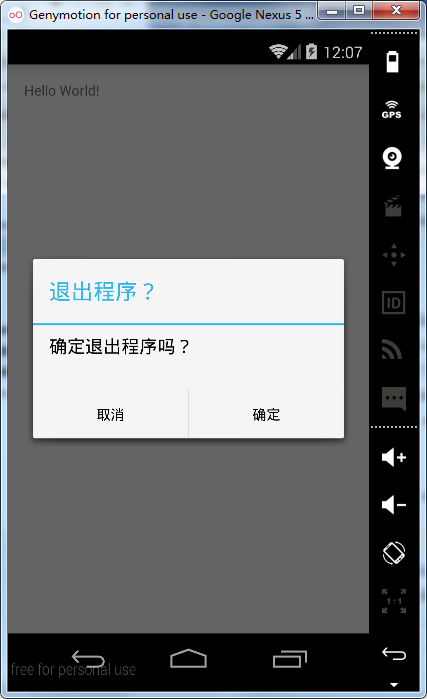
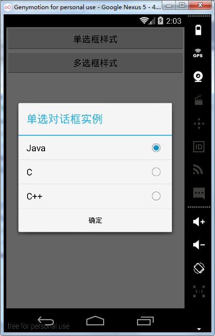
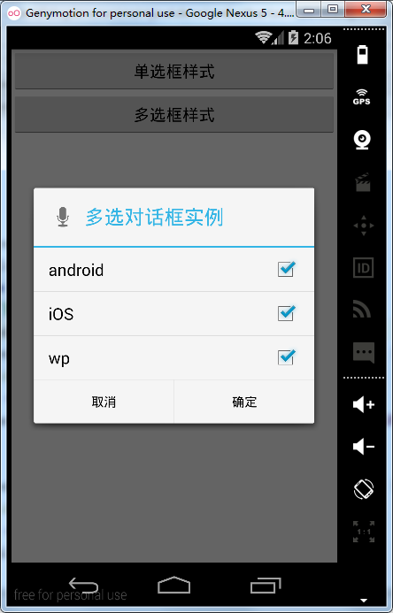
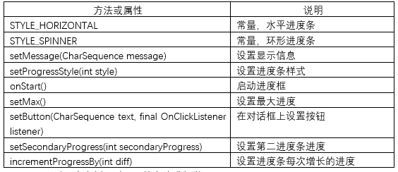
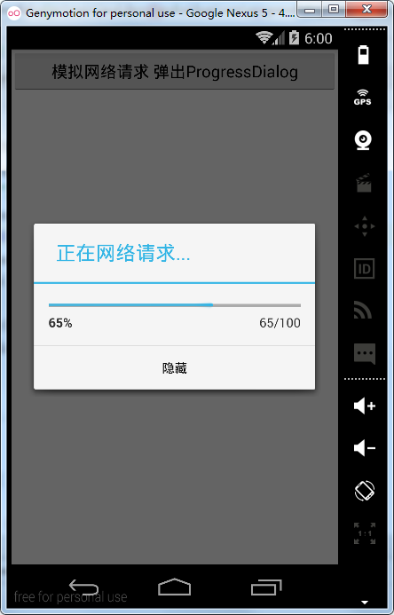
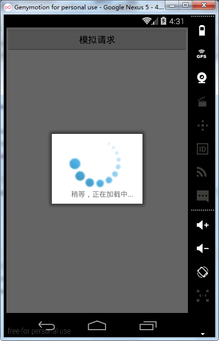

# 第十一章-各种对话框Dialog集锦

对话框是人机交互中的重要控件，在开发中也经常会用到各式各样的对话框，总结一下主要有以下几种：

-	AlertDialog ：警告对话框是最常见的对话框形式，是Dialog的直接子类，如果想要实例化AlertDialog类，往往需要依靠其内部类AlertDialog.Builder类完成。
-	DatePickerDialog和TimePickerDialog：日期选择对话框和时间选择对话框，前面我们降到了DatePicker和TimePicker控件，这两种控件都比较占用布局界面，导致布局很不美观，而以对话框的形式展示可以大大较少界面占用。
-	ProgressDialog：进度对话框，在进行网络请求或文件操作等耗时操作时常常会用到。
-	定制对话框，对于一些复杂的界面想做成对话框的形式，可以自行定制一个对话框。
总结一下常用的方法主要有：



下面通过实战的方式对上面总结的几种对话框一一进行讲解。


## AlertDialog

在进行删除、应用退出等操作时，通常要进一步提示用户是否进行该操作，我们以开发中最常用的连续点两次返回键，提示用户是否退出为例，介绍一下AlertDialog是如何使用的。
这里不需要布局文件，MainActivity.java代码如下：

```
public class MainActivity extends Activity {
    private long mExitTime=0;
    @Override
    protected void onCreate(Bundle savedInstanceState) {
        super.onCreate(savedInstanceState);
        setContentView(R.layout.activity_main);
    }
    @Override
    public boolean onKeyDown(int keyCode, KeyEvent event) {
        if(keyCode==KeyEvent.KEYCODE_BACK){
            if((System.currentTimeMillis()-mExitTime)>1000){
               showDialog();
                mExitTime = System.currentTimeMillis();
            }
        }
        return super.onKeyDown(keyCode, event);
    }
    private void showDialog() {
        Dialog dialog=new AlertDialog.Builder(this)
                .setTitle("退出程序？")//设置标题    
                .setMessage("确定退出程序吗？")//设置提示内容
                //确定按钮
                .setPositiveButton("确定", new DialogInterface.OnClickListener() {
                    @Override
                    public void onClick(DialogInterface dialog, int which) {
                        finish();
                    }
                })
                //取消按钮
                .setNegativeButton("取消", new DialogInterface.OnClickListener() {
                    @Override
                    public void onClick(DialogInterface dialog, int which) {
                    }
                })
                .create();//创建对话框
        dialog.show();//显示对话框
    }
}

```

这里有几点要说明：

-	覆写了onKeyDown方法，通过这个方法可以监听系统自带按钮的按下操作 ，通过keyCode==KeyEvent.KEYCODE_BACK进行判断是否是返回键的按下，是返回键按下则进行下一步逻辑判断。

-	System.currentTimeMillis()方法返回的是当前计算机时间和GMT时间(格林威治时间)1970年1月1号0时0分0秒之差的毫秒数。因此，我们设置了一个全局变量，用于记录第一次按下返回键的时间，第二次按下时，用

- System.currentTimeMillis()获取第二次按下的时间，两者之差就可以认为是第一次按下返回键和第二次按下返回键之间的间隔了，这里可以好好理解一下。当时间间隔在1000毫秒内，我们可以认为连续按了两次返回键，这时调用我们自定义的showDialog方法。

-	showDialog是我们自定义的方法，里面调用了对话框的很多常用方法用以构造一个警告对话框，已经在代码中做了详细注释。这里需要说明的是，调用create方法构造对话框之前是一个语句，采用分行可以更好理解创建步骤及每一步的含义。最后记得调用show方法显示对话框。
运行实例如下：



上面是最基本的警告对话框的样式，下面看一下如何使用setMultiChoiceItems和setSingleChoiceItems方法，构造一个可供选择的对话框。
布局文件如下：

```
<?xml version="1.0" encoding="utf-8"?>
<LinearLayout xmlns:android="http://schemas.android.com/apk/res/android"
    android:layout_width="match_parent"
    android:layout_height="match_parent"
    android:orientation="vertical">
    <Button
        android:layout_width="match_parent"
        android:layout_height="wrap_content"
        android:onClick="singleChoiceItems"
        android:text="单选框样式" />
    <Button
        android:layout_width="match_parent"
        android:layout_height="wrap_content"
        android:onClick="multiChoiceItems"
        android:text="多选框样式" />
</LinearLayout>

```

定义了两个按钮，并分别设置了对应的onClick属性，用以监听它们的单击事件。
MainActivity.java代码如下：

```
public class MainActivity extends Activity {
    String single[] = {"Java", "C", "C++"};
    String multi[] = {"android", "iOS", "wp"};
    StringBuilder sb;
    private String singleChoice;

    @Override
    protected void onCreate(Bundle savedInstanceState) {
        super.onCreate(savedInstanceState);
        setContentView(R.layout.activity_main);
    }
    public void singleChoiceItems(View view) {//单选按钮监听
        Dialog dialog = new AlertDialog.Builder(this)
                .setTitle("单选对话框实例")
                .setPositiveButton("确定", new DialogInterface.OnClickListener() {
                    @Override
                    public void onClick(DialogInterface dialog, int which) {
singleChoice = single[0];//默认选择第一项
                        Toast.makeText(MainActivity.this, "选择了" + singleChoice, Toast.LENGTH_SHORT).show();
                        dialog.dismiss();
                    }
                })
                        //设置单选框监听
                .setSingleChoiceItems(single, 0, new DialogInterface.OnClickListener() {
                    @Override
                    public void onClick(DialogInterface dialog, int which) {
                        singleChoice = single[which];//根据which决定选择了哪一个子项
                    }
                }).create();
        dialog.show();
    }
    public void multiChoiceItems(View view) {//多选按钮监听
        sb = new StringBuilder();
        Dialog dialog = new AlertDialog.Builder(this)
                .setTitle("多选对话框实例")
                .setIcon(android.R.drawable.ic_btn_speak_now)//设置图标
                .setPositiveButton("确定", new DialogInterface.OnClickListener() {
                    @Override
                    public void onClick(DialogInterface dialog, int which) {
                        Toast.makeText(MainActivity.this, "选择了" + sb, Toast.LENGTH_SHORT).show();
                    }
                })
                .setNegativeButton("取消", new DialogInterface.OnClickListener() {
                    @Override
                    public void onClick(DialogInterface dialog, int which) {
                        dialog.dismiss();//隐藏对话框
                    }
                })
                        //设置多选框监听
                .setMultiChoiceItems(multi, null, new DialogInterface.OnMultiChoiceClickListener() {
                    @Override
                    public void onClick(DialogInterface dialog, int which, boolean isChecked) {
                        if (isChecked) {//满足选择条件
                            sb.append(multi[which] + "、");//根据which决定选择了哪一个子项
                        }

                    }
                }).create();
        dialog.show();
    }
}

```

这里主要用到了两个方法：

-	setSingleChoiceItems：单选对话框形式，这里要传入几个参数，第一个是数据源；第二个是默认选择项，传入数字下表；第三个是选择事件监听，这里实现DialogInterface.OnClickListener并覆写了其onClick方法，根据其参数值which获得选择项内容。

-	setMultiChoiceItems：多选对话框形式，也要传入几个参数，第一个是数据源；第二个是初始选择的boolean数组，这里我们选择传入的null,默认都不选；第三个是选择事件监听，实现了DialogInterface.OnMultiChoiceClickListener，并覆写了其onClick方法，方法中传入了三个参数，要根据isChecked和which两个参数获得选择项内容。

-	我们可以看出，这两个方法参数内容和监听都是较为相似的，学习技术就是要分析出事物的相似性，辨别其不同性，这样才能举一反三，增进理解，并提高学习速度。
运行如下：




选择项目之后，点击确定即可Toast出选择项目的内容。

## DatePickerDialog和TimePickerDialog


顾名思义，这控件以对话框的形式设置时间和日期，下面可以通过一个实例直观的展示它们的用法。
布局文件如下：

```
<?xml version="1.0" encoding="utf-8"?>
<LinearLayout xmlns:android="http://schemas.android.com/apk/res/android"
    android:layout_width="match_parent"
    android:layout_height="match_parent"
    android:orientation="vertical">
    <Button
        android:layout_width="match_parent"
        android:layout_height="wrap_content"
        android:onClick="datePickerDialog"
        android:text="日期对话框" />
    <Button
        android:layout_width="match_parent"
        android:layout_height="wrap_content"
        android:onClick="timePickerDialog"
        android:text="时间对话框" />
</LinearLayout>

```

MainActivity.java代码如下：

```
public class MainActivity extends AppCompatActivity {
    @Override
    protected void onCreate(Bundle savedInstanceState) {
        super.onCreate(savedInstanceState);
        setContentView(R.layout.activity_main);
    }
    //日期选择对话框
    public void datePickerDialog(View view) {
        Dialog dialog = new DatePickerDialog(this, new DatePickerDialog.OnDateSetListener() {
            @Override
            public void onDateSet(DatePicker view, int year, int monthOfYear, int dayOfMonth) {
                Toast.makeText(MainActivity.this, "您选择的是" + year + "年" + (monthOfYear + 1) + "月" + dayOfMonth + "日", Toast.LENGTH_SHORT).show();
            }
        }, 2016, 03, 24);
        dialog.show();//显示对话框
    }
    //时间选择对话框
    public void timePickerDialog(View view) {
        Dialog dialog = new TimePickerDialog(this, new TimePickerDialog.OnTimeSetListener() {
            @Override
            public void onTimeSet(TimePicker view, int hourOfDay, int minute) {
                Toast.makeText(MainActivity.this, "您选择的是" + hourOfDay + "时" + minute + "分", Toast.LENGTH_SHORT).show();
            }
        }, 14, 20, true);
        dialog.show();//显示对话框
    }
}

```

两个构造方法需要如下说明：

-	DatePickerDialog构造方法

DatePickerDialog(Context context, DatePickerDialog.OnDateSetListener callBack, int year, int monthOfYear, int dayOfMonth)共有五个参数，第一个是上下文对象，第二个是日期选择事件监听，第三个是初始化年，第四个是初始化月，第五个是初始化日。实现日期选择监听接口，同时要覆写onDateSet方法，这个方法给我们提供选择后的年、月、日参数，这里要注意的是月要加上1，才是选择的月份。

-	TimePickerDialog构造方法

TimePickerDialog(Context context, TimePickerDialog.OnTimeSetListener callBack, int hourOfDay, int minute, boolean is24HourView)也有五个参数，第一个是上下文对象，第二个是时间选择事件监听，第三个是初始化小时，第四个是初始化分钟，第五个是布尔型变量，是否是24小时制，传入true设置24小时制，反之亦然。

## ProgressDialog

进度对话框在项目开发中经常会用到，进行耗时操作时经常会用到，将操作进度实时反馈给用户，可以提高用户体验。
API文档中给我们提供的方法主要有：



下面通过一个实例，对上面的方法进行学习。
布局文件：

```
<?xml version="1.0" encoding="utf-8"?>
<RelativeLayout xmlns:android="http://schemas.android.com/apk/res/android"
    android:layout_width="match_parent"
    android:layout_height="match_parent">
    <Button
        android:layout_width="match_parent"
        android:layout_height="wrap_content"
        android:onClick="progressDialog"
        android:text="模拟网络请求 弹出ProgressDialog" />
</RelativeLayout>

```

MainActivity.java代码如下：

```
public class MainActivity extends Activity {
    @Override
    protected void onCreate(Bundle savedInstanceState) {
        super.onCreate(savedInstanceState);
        setContentView(R.layout.activity_main);
    }
    public void progressDialog(View view) {
        final ProgressDialog progressDialog = new ProgressDialog(this);//获得ProgressDialog对象
        progressDialog.setTitle("正在网络请求...");
//设置进度对话框样式
     progressDialog.setProgressStyle(ProgressDialog.STYLE_HORIZONTAL);
        progressDialog.setMax(100);//设置最大进度	
        progressDialog.setProgress(10);//设置初始进度
//设置按钮
        progressDialog.setButton( "隐藏", new DialogInterface.OnClickListener() {
            @Override
            public void onClick(DialogInterface dialog, int which) {
                progressDialog.dismiss();
            }
        });
        progressDialog.onStart();//启动进度条
        new Thread() {//新开一个线程模拟网络请求
            @Override
            public void run() {
                int i = 10;
                while (i <=100) {
                    try {
                        Thread.sleep(100);//线程休眠100毫秒
                        progressDialog.incrementProgressBy(1);//每次增加1
                        i++;
                    } catch (InterruptedException e) {
                        e.printStackTrace();
                    }
                }
                progressDialog.dismiss();//进度条走完时，调用dismiss方法隐藏进度对话框
            }
        }.start();
        progressDialog.show();
    }
}

```

这里也是新开了一个线程用以模拟网络请求这一耗时操作，判断当进度小于最大进度时，调用sleep方法，休眠100毫秒，然后调用ProgressDialog的incrementProgressBy方法在原来进度的基础上加1，进度条走到最大进度时，调用ProgressDialog的dismiss方法，隐藏进度对话框。
运行实例如下：



## 定制对话框
系统的对话框形式是有限的，一般不能满足实际项目需要，这里通过一个自定义布局的进度对话框模拟网络请求的过程，并引入了动画方面的相关知识，对这部分知识不熟悉的同学可以先行跳过，后面还会对动画知识系统讲解。
主布局文件：

```
<?xml version="1.0" encoding="utf-8"?>
<RelativeLayout xmlns:android="http://schemas.android.com/apk/res/android"
    android:layout_width="match_parent"
    android:layout_height="match_parent">
    <Button
        android:onClick="test"
        android:layout_width="match_parent"
        android:layout_height="wrap_content"
        android:text="模拟请求" />
</RelativeLayout>

```

非常简单，只是一个Button，并设置其onClick属性。
对话框布局文件：

```
<?xml version="1.0" encoding="utf-8"?>
<LinearLayout xmlns:android="http://schemas.android.com/apk/res/android"
    android:id="@+id/dialog_view"
    android:layout_width="fill_parent"
    android:layout_height="fill_parent"
    android:background="#ffffff"
    android:gravity="center"
    android:minHeight="60dp"
    android:minWidth="180dp"
    android:orientation="vertical"
    android:padding="10dp">
    <ImageView
        android:id="@+id/img"
        android:layout_width="100dp"
        android:layout_height="100dp"
        android:src="@mipmap/load" />
    <TextView
        android:id="@+id/tv_tip"
        android:layout_width="wrap_content"
        android:layout_height="wrap_content"
        android:layout_marginLeft="10dp"
        android:text="数据加载中……" />
</LinearLayout> 

```

对话框布局文件包括一个图片控件和一个文本控件，通过src属性引入图片控件的图片源。这里还自定义对话框的样式，因此需要在styles.xml文件中的resources标签中加入如下代码：

```
<!-- 自定义loading dialog -->
<style name="loading_dialog" parent="android:style/Theme.Dialog">
    <item name="android:windowFrame">@null</item>
    <item name="android:windowNoTitle">true</item>
    <item name="android:windowIsFloating">true</item>
    <item name="android:windowContentOverlay">@null</item>
</style>

```

style可以理解成一部分Android属性的集合，因为具有通用性，所以被抽离出来放在一起，使用的时候通过R.style.*就可以调用该样式。定义一个样式需要style标签进行包裹，parent属性设置类似Java中继承的概念，这个是可选的。一个item标签包裹一个属性，我们这里设置了无边框、不显示标题、窗口浮动等，还有很多属性，这里就不再进行介绍。
为了显示转动的效果，这里引入了动画内容，动画属性文件如下：

```
<?xml version="1.0" encoding="utf-8"?>
<set android:shareInterpolator="false" xmlns:android="http://schemas.android.com/apk/res/android">
    <rotate
        android:interpolator="@android:anim/linear_interpolator"
        android:pivotX="50%"
        android:pivotY="50%"
        android:fromDegrees="0"
        android:toDegrees="+360"
        android:duration="1500"
        android:startOffset="-1"
        android:repeatMode="restart"
        android:repeatCount="-1"/>
</set>

```

pivotX和pivotY表示旋转基点，50%表示图片中心为旋转基点，fromDegrees是开始角度，toDegrees是结束角度。duration表示一次动画的时间，单位为毫秒。startOffset表示延迟多少秒后开始，repeatMode表示重复模式，repeatCount设置成-1表示无穷次。这些属性在后面的动画部分还会再详细介绍，不明白的同学可以看过动画部分后再进行学习。
MainActivity.java:

```
public class MainActivity extends Activity {
    @Override
    protected void onCreate(Bundle savedInstanceState) {
        super.onCreate(savedInstanceState);
        setContentView(R.layout.activity_main);
    }
    public void test(View view){
        final Dialog dialog=createloadDialog(MainActivity.this,"稍等，正在加载中...");
      new Thread(){
          @Override
          public void run() {
              try {
                  sleep(3000);
                  dialog.dismiss();
              } catch (InterruptedException e) {
                  e.printStackTrace();
              }
          }
      }.start();
        dialog.show();
    }
    //返回一个ProgressDialog对象
    public Dialog createloadDialog(Context context, String msg) {
        LayoutInflater layoutInflater = LayoutInflater.from(context);
        View v = layoutInflater.inflate(R.layout.load_layout, null);// 得到加载view
        LinearLayout linearLayout = (LinearLayout) v.findViewById(R.id.dialog_view);// 加载布局
        // 获取view对象中的ImageView
        ImageView imageView = (ImageView) v.findViewById(R.id.img);
        TextView tipTextView = (TextView) v.findViewById(R.id.tv_tip);
        // 加载动画
        Animation animation = AnimationUtils.loadAnimation(
                context, R.anim.load_animation);
        // 设置动画
        imageView.startAnimation(animation);
        tipTextView.setText(msg);// 设置加载信息
        Dialog loadDialog = new Dialog(context, R.style.loading_dialog);// 创建自定义样式dialog
        loadDialog.setCancelable(false);// 不可以用“返回键”取消
        // 设置布局
        loadDialog.setContentView(v, new LinearLayout.LayoutParams(
                LinearLayout.LayoutParams.MATCH_PARENT,
                LinearLayout.LayoutParams.MATCH_PARENT));
        return loadDialog;
    }
}

```
这里说明几点：

-	createloadDialog方法返回一个ProgressDialog对象，这里使用了LayoutInflater类的inflate获得了进度框的View对象，并使用findViewById方法获取了View对象中的控件。加载动画文件时用到了AnimationUtils的loadAnimation方法，可以得到一个动画对象，开始动画使用了Animation类的startAnimation方法。
-	对于Dialog的实例化，第一个参数是上下文对象，第二个是主题样式，设置了setCancelable方法的参数为false，表示不可以用返回键取消对话框，最后调用Dialog的setContentView方法，传入对话框布局文件对象和布局方式以渲染对话框布局界面。
-	采用了线程睡眠的方式，让线程睡眠3秒后调用Dialog的dismiss方法关闭对话框，模拟请求完成。

运行实例：

