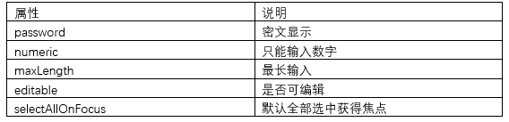
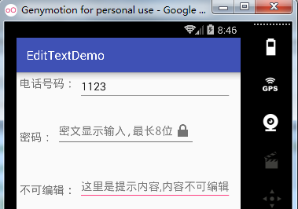
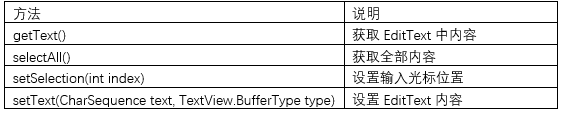
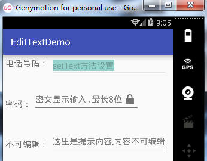
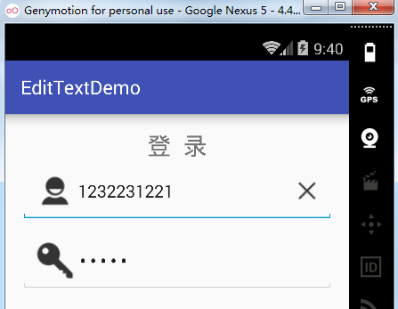

# 第二章-EditText探秘

```
public class
EditText
extends TextView
java.lang.Object
   ↳	android.view.View
 	   ↳	android.widget.TextView
 	 	   ↳	android.widget.EditText
```

由继承结构可以看出，EditText继承自TextView，因此TextView中的一些属性和方法也可以在EditText中使用。EditText的常用属性参照下表：



下面通过一段代码来演示一下上面的属性：

```
<?xml version="1.0" encoding="utf-8"?>
<RelativeLayout xmlns:android="http://schemas.android.com/apk/res/android"
    xmlns:tools="http://schemas.android.com/tools"
    android:layout_width="match_parent"
    android:layout_height="match_parent">
    <TextView
        android:id="@+id/tv_num"
        android:layout_width="wrap_content"
        android:layout_height="wrap_content"
        android:padding="5dp"
        android:text="电话号码："
        android:textSize="18sp" />
    <EditText
        android:id="@+id/et_num"
        android:layout_width="wrap_content"
        android:layout_height="wrap_content"
        android:layout_toRightOf="@+id/tv_num"
        android:hint="这里是提示内容,只能输入整数"
        android:numeric="integer"
        android:selectAllOnFocus="true" />
    <TextView
        android:id="@+id/textView"
        android:layout_width="wrap_content"
        android:layout_height="wrap_content"
        android:layout_alignParentLeft="true"
        android:layout_alignParentStart="true"
        android:layout_below="@+id/et_num"
        android:layout_marginTop="41dp"
        android:padding="5dp"
        android:text="密码："
        android:textSize="18sp" />
    <EditText
        android:id="@+id/editText"
        android:layout_width="wrap_content"
        android:layout_height="wrap_content"
        android:layout_alignBottom="@+id/textView"
        android:layout_toEndOf="@+id/textView"
        android:layout_toRightOf="@+id/textView"
        android:drawableRight="@android:drawable/ic_lock_lock"
        android:hint="密文显示输入,最长8位"
        android:maxLength="8"
        android:password="true" />
    <TextView
        android:id="@+id/textView2"
        android:layout_width="wrap_content"
        android:layout_height="wrap_content"
        android:layout_alignParentLeft="true"
        android:layout_alignParentStart="true"
        android:layout_below="@+id/textView"
        android:layout_marginTop="51dp"
        android:padding="5dp"
        android:text="不可编辑："
        android:textSize="18sp" />
    <EditText
        android:id="@+id/editText2"
        android:layout_width="wrap_content"
        android:layout_height="wrap_content"
        android:layout_alignBottom="@+id/textView2"
        android:layout_alignLeft="@+id/et_num"
        android:layout_alignStart="@+id/et_num"
        android:editable="false"
        android:hint="这里是提示内容,内容不可编辑" />
</RelativeLayout>
```

显示效果如下：



第一个输入框只能输入数字，第二个输入框输入按密文显示，且最长只能输入8位，第三个输入框不可编辑。

EditText的常用方法参照下表：



测试用例：

```
public class MainActivity extends AppCompatActivity {
    EditText editTextNum;
    @Override
    protected void onCreate(Bundle savedInstanceState) {
        super.onCreate(savedInstanceState);
        setContentView(R.layout.activity_main);
        editTextNum=(EditText)findViewById(R.id.et_num);
        editTextNum.setText("setText方法设置");//设置EditText文字
        editTextNum.setSelection(1);           //设置光标起始位置
        editTextNum.selectAll();              //全选
        editTextNum.setEnabled(false);       //不可编辑
    }
}

```

运行实例：

 

主要将表格中的方法应用到第一个EditText中，设置了初始显示文字和初始光标位置，并全选了全部内容，最后将EditText设置成不可编辑。
实战演练：

通过自定义View的方式实现一个提供一键删除全部内容的控件，布局文件如下：

```
<RelativeLayout xmlns:android="http://schemas.android.com/apk/res/android"
    xmlns:tools="http://schemas.android.com/tools"
    android:layout_width="match_parent"
    android:layout_height="match_parent" >
    <TextView
        android:id="@+id/title"
        android:layout_width="match_parent"
        android:layout_height="wrap_content"
        android:layout_alignParentTop="true"
        android:gravity="center"
        android:text="登  录"
        android:textSize="25sp" />
    <demo.androidwar.com.edittextdemo.DeleteEditText
        android:id="@+id/det_test"
        android:layout_width="match_parent"
        android:layout_height="wrap_content"
        android:layout_below="@+id/title"
        android:drawableLeft="@drawable/user_account"
        android:drawableRight="@drawable/user_delete"
        android:ems="10"
        android:hint="请输入帐号名" />
    <demo.androidwar.com.edittextdemo.DeleteEditText
        android:id="@+id/user_password_input"
        android:layout_width="match_parent"
        android:layout_height="wrap_content"
        android:layout_below="@+id/det_test"
        android:layout_marginTop="10dp"
        android:drawableLeft="@drawable/user_password"
        android:drawableRight="@drawable/user_delete"
        android:ems="10"
        android:hint="请输入密码"
        android:inputType="textPassword"
        android:singleLine="true" />
</RelativeLayout>
```

引入了自定义控件DeleteEditText，设置了drawableLeft和drawableRight属性，在控件的左右两侧分别设置了图片。

```
public class DeleteEditText extends EditText {
    private Drawable mRightDrawable;
    boolean isHasFocus;
    //构造方法1
    public DeleteEditText(Context context) {
        super(context);
        init();
    }

    //构造方法2
    public DeleteEditText(Context context, AttributeSet attrs) {
        super(context, attrs);
        init();
    }
    //构造方法3
    public DeleteEditText(Context context, AttributeSet attrs, int defStyle) {
        super(context, attrs, defStyle);
        init();
    }
    private void init() {
        Drawable drawables[] = this.getCompoundDrawables();//本方法获取控件上下左右四个方位插入的图片
        mRightDrawable = drawables[2];
        this.addTextChangedListener(new TextWatcherImpl());
        this.setOnFocusChangeListener(new OnFocusChangeImpl());

        setClearDrawableVisible(false);//初始设置所有右边图片不可见
    }
    private class OnFocusChangeImpl implements  OnFocusChangeListener{
        @Override
        public void onFocusChange(View v, boolean hasFocus) {
            isHasFocus = hasFocus;
            if (isHasFocus) {//如果获取焦点
                boolean isNoNull = getText().toString().length() >= 1;
                setClearDrawableVisible(isNoNull);
            }else{
                setClearDrawableVisible(false);
            }

        }
    }
    //本方法控制右边图片的显示与否
    private void setClearDrawableVisible(boolean isNoNull) {
        Drawable rightDrawable;
        if (isNoNull) {
            rightDrawable = mRightDrawable;
        } else {
            rightDrawable = null;
        }
        // 使用代码设置该控件left, top, right, and bottom处的图标
        setCompoundDrawables(getCompoundDrawables()[0],
                getCompoundDrawables()[1], rightDrawable,
                getCompoundDrawables()[3]);
    }
    private class TextWatcherImpl implements TextWatcher {
        //下面是三个要覆写的方法
        @Override
        public void afterTextChanged(Editable s) {//内容输入后
            boolean isNoNull = getText().toString().length() >= 1;
            setClearDrawableVisible(isNoNull);
        }
        @Override
        public void beforeTextChanged(CharSequence s, int start, int count, int after) {
            //内容输入前
        }
        @Override
        public void onTextChanged(CharSequence s, int start, int before, int count) {
            //内容输入中
        }
    }
    @Override
    public boolean onTouchEvent(MotionEvent event) {
        switch (event.getAction()) {
            case MotionEvent.ACTION_UP:
                int length1 = getWidth() - getPaddingRight();//删除图片右侧到EditText控件最左侧距离
                int length2 = getWidth() - getTotalPaddingRight();//删除图片左侧到EditText控件最左侧距离
                boolean isClean = (event.getX() > length2)
                        && (event.getX() < length1);
                if (isClean) {
                    setText("");
                }
                break;
            default:
                break;
        }
        return super.onTouchEvent(event);
    }
}
```

这里需要说明一下几点：

1. getCompoundDrawables 方法：其官方解释是Returns drawables for the left, top, right, and bottom borders，翻译过来也就是说返回控件上下左右配置的四张图片，并转换成了drawable对象，看一下配置文件的引入了左右两张图片，也就是left和top可以返回drawable对象，对应数组的0和2下标，而top和bottom则返回空。这里只对右侧图片进行操作，因此将drawable[2]传递给mRightDrawable，方便后面的方法操作引用。

2. 给EditText增加了监听器：addTextChangedListener，当EditText内容发生改变时触发，这时使用getText方法获取EditText中内容，并判断其长度是否大于1，大于1则说明输入内容不为空，这时设置最右边的图片（也就是清空图片）显示。

3. setClearDrawableVisible是我们自定义的方法，根据传入参数控制清空图片的显示与否，这里调用了setCompoundDrawables方法，当决定显示图片时将mRightDrawable当做参数进行传递，否则传递Null，即隐藏清空图片。

4. 除了设置了内容变化监听，还设置了焦点变化监听，控件获得焦点时，调用getText方法获取EditText中的内容，判断其长度决定清空图片的显示与否，失去焦点时隐藏清空图片。

5. 在决定是否清空EditText的判断中，另辟蹊径，覆写了onTouchEvent方法，根据手指抬起时的位置是否在清空图片上间接判断是否点击了清空图片。这里用到了getWidth方法获取EditText的宽度，getPaddingRight获取了清空图片右侧距离EditText控件右侧的距离，getTotalPaddingRight获得了清空图片左侧距离EditText控件右侧的距离，并通过getWidth和getPaddingRight及getWidth和getTotalPaddingRight之差判断触摸事件是否发生在清空图片之上，来决定是否清空EditText中的内容。

运行实例，如下图：

