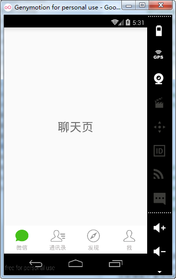

# 第十八章-ViewPager+FragmentStatePagerAdapter实现仿微信Tab

本节将结合上一节所讲的内容实现仿微信的Tab切换效果，下面通过代码进行讲解。

主布局文件（activity_main.xml）

```
<LinearLayout xmlns:android="http://schemas.android.com/apk/res/android"
    android:layout_width="match_parent"
    android:layout_height="match_parent"
    android:orientation="vertical" >
    <android.support.v4.view.ViewPager
        android:id="@+id/viewpager"
        android:layout_width="match_parent"
        android:layout_height="0dp"
        android:layout_weight="1" >
    </android.support.v4.view.ViewPager>
    <include layout="@layout/bottom" />
</LinearLayout>
```

主布局包括一个ViewPager控件和导入的bottom布局文件，使用include标签可以导入布局文件，将通用布局抽取为一个布局文件，这样更有利于系统后期维护。

底部栏文件（bottom.xml）

```
<?xml version="1.0" encoding="utf-8"?>
<LinearLayout xmlns:android="http://schemas.android.com/apk/res/android"
    android:layout_width="match_parent"
    android:layout_height="70dp"
    android:background="#ffffffff"
    android:orientation="horizontal" >
    <LinearLayout
        android:id="@+id/ll_chat"
        android:layout_width="0dp"
        android:layout_height="fill_parent"
        android:layout_weight="1"
        android:gravity="center"
        android:orientation="vertical" >
        <ImageView
            android:id="@+id/img_chat"
            android:layout_width="40dp"
            android:layout_height="40dp"
            android:background="#0000"
            android:src="@drawable/chat_yes" />
        <TextView
            android:layout_width="wrap_content"
            android:layout_height="wrap_content"
            android:text="微信"
            android:textColor="#b6b3b3" />
    </LinearLayout>
    <LinearLayout
        android:id="@+id/ll_frd"
        android:layout_width="0dp"
        android:layout_height="fill_parent"
        android:layout_weight="1"
        android:gravity="center"
        android:orientation="vertical" >
        <ImageView
            android:id="@+id/img_frd"
            android:layout_width="40dp"
            android:layout_height="40dp"
            android:background="#0000"
            android:src="@drawable/frd_no" />
        <TextView
            android:layout_width="wrap_content"
            android:layout_height="wrap_content"
            android:text="通讯录"
            android:textColor="#b6b3b3" />
    </LinearLayout>
    <LinearLayout
        android:id="@+id/ll_find"
        android:layout_width="0dp"
        android:layout_height="fill_parent"
        android:layout_weight="1"
        android:gravity="center"
        android:orientation="vertical" >
        <ImageView
            android:id="@+id/img_find"
            android:layout_width="40dp"
            android:layout_height="40dp"
            android:background="#0000"
            android:src="@drawable/find_no" />
        <TextView
            android:layout_width="wrap_content"
            android:layout_height="wrap_content"
            android:text="发现"
            android:textColor="#b6b3b3" />
    </LinearLayout>
    <LinearLayout
        android:id="@+id/ll_me"
        android:layout_width="0dp"
        android:layout_height="fill_parent"
        android:layout_weight="1"
        android:gravity="center"
        android:orientation="vertical" >
        <ImageView
            android:id="@+id/img_me"
            android:layout_width="40dp"
            android:layout_height="40dp"
            android:background="#0000"
            android:src="@drawable/me_no" />
        <TextView
            android:layout_width="wrap_content"
            android:layout_height="wrap_content"
            android:text="我"
            android:textColor="#b6b3b3" />
    </LinearLayout>
</LinearLayout>
```

底部栏布局文件采用线性布局的方式，主要包括四个LinearLayout，设置这四个LinearLayout的layout_width值为0dp，并设置其layout_weight属性值为1，可以让四个LinearLayout平分屏幕宽度。同时，每个LinearLayout中包含了一个ImageView用于显示图片，一个TextView用于显示文本信息。

子View布局文件（tab01.xml）

```
<?xml version="1.0" encoding="utf-8"?>
<LinearLayout xmlns:android="http://schemas.android.com/apk/res/android"
    android:layout_width="match_parent"
    android:layout_height="match_parent"
    android:gravity="center"
    android:orientation="vertical" >
    <TextView
        android:layout_width="wrap_content"
        android:layout_height="wrap_content"
        android:layout_gravity="center"
        android:text="聊天页"
        android:textSize="30sp" >
    </TextView>
</LinearLayout>
```

本例ViewPager共包含了四个子View，每个子View只是TextView文本属性不同，因此，其余tab02-tab04的代码就不再贴出。
Fragment代码（MyFragment1.java）
本例使用ViewPager+FragmentStatePagerAdapter来实现，因此需要准备Fragment类的数据集：

```
public class MyFragment1 extends Fragment {
    @Nullable
    @Override
    public View onCreateView(LayoutInflater inflater, ViewGroup container, Bundle savedInstanceState) {
        return inflater.inflate(R.layout.tab01,null);
    }
}
```

同样只是这些Fragment数据集只是其中布局文件的不同，MyFragment2-MyFragment4的代码就不再贴出。
适配器类代码（ViewPagerFragmentAdapter.java）

```
public class ViewPagerFragmentAdapter extends FragmentStatePagerAdapter {
    private List<Fragment> datas;
    public ViewPagerFragmentAdapter(FragmentManager fm,List<Fragment> datas) {
        super(fm);
        this.datas=datas;
    }
    @Override
    public Fragment getItem(int position) {//返回子View对象
        return datas.get(position);
    }
    @Override
    public int getCount() {//返回子View的个数
        return datas.size();
    }
    @Override
    public Object instantiateItem(ViewGroup container, int position) {//初始子View方法
        return super.instantiateItem(container, position);
    }
    @Override
    public void destroyItem(ViewGroup container, int position, Object object) {//销毁子View
        super.destroyItem(container, position, object);
    }
}
```

继承自FragmentStatePagerAdapter，说明当子View不在当前窗口时，可以被内存回收，同时覆写了四个必须要实现的方法。由于这些方法在上节中已经讲解，这里就不再重复。

MainActivity代码（MainActivity.java）

```
public class MainActivity extends FragmentActivity implements OnClickListener {
   //主要要继承自FragmentActivity,这样才能在初始适配器类是使用getSupportFragmentManager方法获取FragmentManager对象
   private ViewPager mViewPager;
   private List<Fragment> datas;
   private ViewPagerFragmentAdapter viewPagerFragmentAdapter;
   private LinearLayout mLLChat,mLLFrd,mLLFind,mLLMe;
   private ImageView mImageViewChat,mImageViewFrd,mImageViewFind,mImageViewMe;
   @Override
   protected void onCreate(Bundle savedInstanceState) {
      super.onCreate(savedInstanceState);
      requestWindowFeature(Window.FEATURE_NO_TITLE);
      setContentView(R.layout.activity_main);
      initDatas();//初始化数据集
      initView();// 初始化控件
      initEvent();// 注册单击监听
      viewPagerFragmentAdapter=new ViewPagerFragmentAdapter(getSupportFragmentManager(),datas);//初始化适配器类
      mViewPager.setAdapter(viewPagerFragmentAdapter);
   }
   private void initDatas() {
      datas=new ArrayList<Fragment>();
      datas.add(new MyFragment1());
      datas.add(new MyFragment2());
      datas.add(new MyFragment3());
      datas.add(new MyFragment4());

   }
   private void initEvent() {
      mLLChat.setOnClickListener(this);
      mLLFrd.setOnClickListener(this);
      mLLFind.setOnClickListener(this);
      mLLMe.setOnClickListener(this);
      mViewPager.setOnPageChangeListener(new OnPageChangeListener() {//ViewPager滑动切换监听
         @Override
         public void onPageSelected(int arg0) {
            int currentItem=mViewPager.getCurrentItem();
            resetImag();
            switch (currentItem) {
            case 0:
               mImageViewChat.setImageResource(R.drawable.chat_yes);
               break;
            case 1:
               mImageViewFrd.setImageResource(R.drawable.frd_yes);
               break;
            case 2:
               mImageViewFind.setImageResource(R.drawable.find_yes);
               break;
            case 3:
               mImageViewMe.setImageResource(R.drawable.me_yes);
               break;
            default:
               break;
            }
         }
         @Override
         public void onPageScrolled(int arg0, float arg1, int arg2) {
            
         }
         @Override
         public void onPageScrollStateChanged(int arg0) {
            
         }
      });
   }
   private void initView() {
      mViewPager = (ViewPager) findViewById(R.id.viewpager);
      mLLChat = (LinearLayout) findViewById(R.id.ll_chat);
      mLLFrd = (LinearLayout) findViewById(R.id.ll_frd);
      mLLFind = (LinearLayout) findViewById(R.id.ll_find);
      mLLMe = (LinearLayout) findViewById(R.id.ll_me);
      mImageViewChat = (ImageView) findViewById(R.id.img_chat);
      mImageViewFrd = (ImageView) findViewById(R.id.img_frd);
      mImageViewFind = (ImageView) findViewById(R.id.img_find);
      mImageViewMe = (ImageView) findViewById(R.id.img_me);
   }
   @Override
   public void onClick(View v) {
      resetImag();
      switch (v.getId()) {
      case R.id.ll_chat:
         mViewPager.setCurrentItem(0);
         mImageViewChat.setImageResource(R.drawable.chat_yes);
         break;
      case R.id.ll_frd:
         mViewPager.setCurrentItem(1);
         mImageViewFrd.setImageResource(R.drawable.frd_yes);
         break;
      case R.id.ll_find:
         mViewPager.setCurrentItem(2);
         mImageViewFind.setImageResource(R.drawable.find_yes);
         break;
      case R.id.ll_me:
         mViewPager.setCurrentItem(3);
         mImageViewMe.setImageResource(R.drawable.me_yes);
         break;
      default:
         break;
      }
   }
   private void resetImag() {//重置图片
      mImageViewChat.setImageResource(R.drawable.chat_no);
      mImageViewFrd.setImageResource(R.drawable.frd_no);
      mImageViewFind.setImageResource(R.drawable.find_no);
      mImageViewMe.setImageResource(R.drawable.me_no);
   }
}
```

这里实现了底部栏中四个LinearLayout的单击事件监听，用来处理图片切换逻辑。同时实现了OnPageChangeListener接口，监听页面切换，更改对应的底部栏图片。记得每次处理图片更改时都需要先调用resetImag（图片初始化方法），否则可能会出现连续几个底部栏菜单被选中的情况，读者可以自行测试。

在四个LinearLayout单击事件处理时，用到了ViewPager的setCurrentItem方法，这个方法可以用来设置ViewPager的当前页。
运行项目实例如下：




这个实例很实用，可以直接用到项目的初始界面设计中。