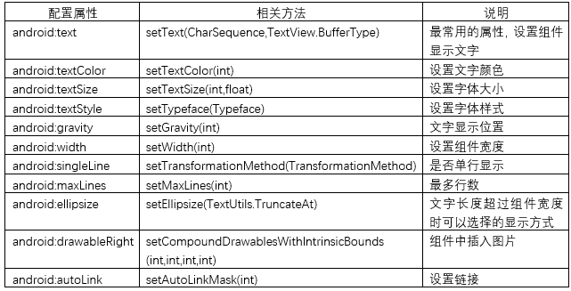
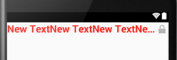

# 第一章-好玩的TextView

```
   public class
TextView
extends View
implements ViewTreeObserver.OnPreDrawListener
java.lang.Object
   ↳	android.view. View
 	   ↳	android.widget.TextView
TextView类继承View类，实现了OnPreDrawListener接口，其直接子类有：Button, CheckedTextView, Chronometer, DigitalClock, EditText, TextClock；非直接子类有：AutoCompleteTextView, CheckBox, CompoundButton, ExtractEditText, MultiAutoCompleteTextView, RadioButton, Switch, ToggleButton。
```

TextView是Android中最常用的控件，主要承担文本显示的任务，任何APP都不可避免的会用到它。同时，TextView的属性和方法在所有控件中也是算比较多的，我们没必要也很难记住所有属性和方法，在需要时查找API即可，这也是“带你去看API”模块设立的目的。

TextView常用属性和方法参见下表：



使用表中部分属性展示一下运行效果，API中还有一些不太常用的属性和方法，读者可以自行运行测试其效果。下面结合一个小实例对上面的属性进行学习，代码如下：

```
<TextView
    android:layout_width="match_parent"
    android:layout_height="wrap_content"
    android:text="New TextNew TextNew TextNew TextNew TextNew TextNew TextNew TextNew Text"
    android:textColor="#ff1911"
    android:textSize="24sp"
    android:singleLine="true"
    android:gravity="center"
    android:textStyle="bold"
    android:drawableRight="@android:drawable/ic_lock_lock"
    android:id="@+id/textView" />

```
这里设置了singleLine属性，在文字很多的情况下会以省略号的形式显示，设置了drawableRight属性，会在控件最右边显示一个图片，显示效果如下图：



在设置单行模式，而文字内容又特别多的情况下，除了上面的省略号显示方式，还有没有其他方式呢？生活中我们可以见到各式各样的LED广告显示屏，它们是通过跑马灯的方式显示广告，这种显示方式一方面解决了长信息展示的问题，另一方面也更容易吸引路人的目光。Android中可不可以实现呢？下面通过一个实例进行研究，代码如下：

```
<TextView
    android:id="@+id/tv_marquee"
    android:layout_width="match_parent"
    android:layout_height="wrap_content"
    android:textColor="@android:color/black"
    android:ellipsize="marquee"
    android:focusable="true"
    android:focusableInTouchMode="true"
    android:marqueeRepeatLimit="marquee_forever"
    android:scrollHorizontally="true"
    android:singleLine="true"
    android:text="这是跑马灯的效果这是跑马灯的效果这是跑马灯的效果这是跑马灯的效果">
</TextView>

```
这里涉及到了几个上面表格中没有的属性，进行介绍：
	ellipsize属性：主要解决文本长度长于控件宽度的问题，主要有几个值:
1.	end-省略号方式，省略号在尾部
2.	start-省略号在头部
3.	middle-省略号在中部
4.	marquee-跑马灯方式显示
	focusable属性：控件获得焦点
	focusableInTouchMode属性：针对触摸屏获得当前焦点
	marqueeRepeatLimit属性：设置跑马灯无限制次数循环
	scrollHorizontally属性：水平方式显示
显示效果如下：


如果你觉得这还不够炫，可以添加代码让字体闪烁起来，MainActivity添加如下代码：

```
public class MainActivity extends Activity {
    private int temp = 0;
    private TextView tv_marquee;
    @Override
    public void onCreate(Bundle savedInstanceState) {
        super.onCreate(savedInstanceState);
        setContentView(R.layout.activity_main);
        tv_marquee = (TextView)findViewById(R.id.tv_marquee);
        spark();
    }
    public void spark() {
        Timer timer = new Timer();
        TimerTask timerTask = new TimerTask() {
            public void run() {
                runOnUiThread(new Runnable() {//UI线程上运行
                    public void run() {
                        if (temp == 0) {
                            temp = 1;
                            tv_marquee.setTextColor(Color.YELLOW);
                        } else {
                            if (temp == 1) {
                                temp = 2;
                               tv_marquee.setTextColor(Color.TRANSPARENT);
                            } else if (temp == 2){
                                temp = 3;
                                tv_marquee.setTextColor(Color.GREEN);
                            } else {
                                temp = 0;
                                tv_marquee.setTextColor(Color.RED);
                            }
                        }
                    }
                });
            }
        };
        timer.schedule(timerTask, 1, 100);
    }
}

```
这里用到了Timer和TimerTask两个计时类，其中TimerTask是一个抽象类，有个抽象的run方法需要覆写。创建一个Timer对象，并调用Timer类的schedule方法可以实现间隔操作的效果。schedule方法有三个参数：
第一个参数是TimerTask对象，第二个参数是执行延迟时间，第三个参数为间隔周期。
同时，这里定义了一个临时变量，通过临时变量的循环改变动态改变字体的颜色，间接实现了字体闪烁的效果。
显示效果如下图：


