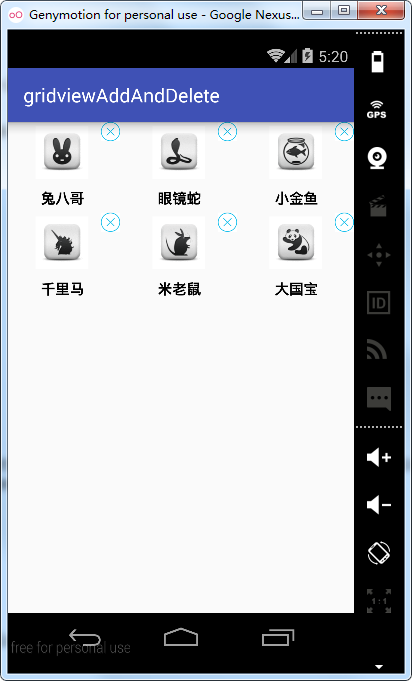
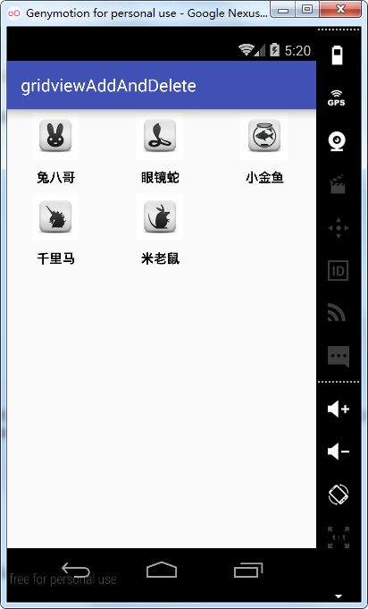
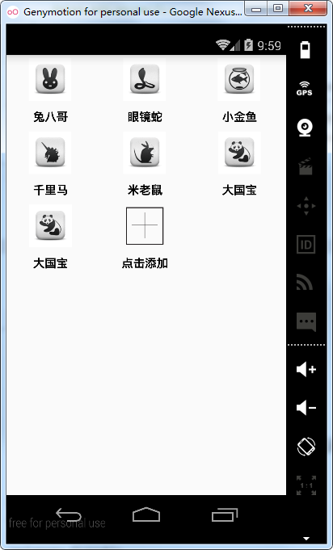
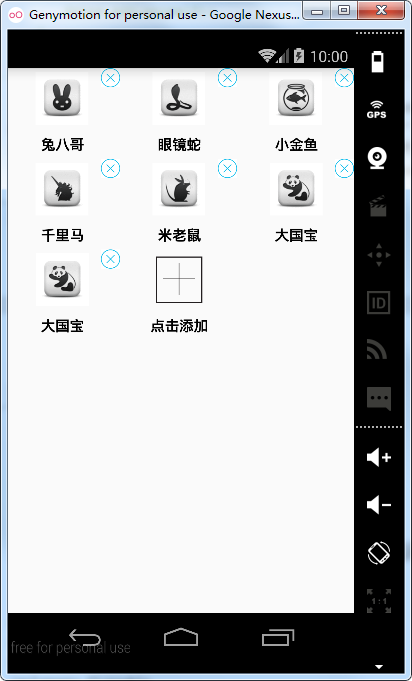

# 第十五章-GridView实现动态添加和删除子项

用过UC浏览器的相信都不会对下图所示的功能模式：


长按图标时会在左上角显示出一个删除的图片，点击这个图片就可以删除与之对应的Item，下面我们就要来研究一下，如何实现这个功能。
主布局文件代码如下：

```
<?xml version="1.0" encoding="utf-8"?>
<RelativeLayout xmlns:android="http://schemas.android.com/apk/res/android"
    android:layout_width="match_parent"
    android:layout_height="match_parent">
    <GridView
        android:id="@+id/gv"
        android:layout_width="match_parent"
        android:layout_height="match_parent"
        android:horizontalSpacing="5dp"
        android:numColumns="3"
        android:stretchMode="columnWidth"
        android:verticalSpacing="5dp" />
</RelativeLayout>

```

子项目布局文件如下：

```
<?xml version="1.0" encoding="utf-8"?>
<FrameLayout xmlns:android="http://schemas.android.com/apk/res/android"
    android:layout_width="match_parent"
    android:layout_height="match_parent">
    <LinearLayout
        android:layout_width="fill_parent"
        android:layout_height="wrap_content"
        android:layout_marginRight="4dip"
        android:layout_marginTop="4dip"
        android:gravity="center"
        android:orientation="vertical" >
        <ImageView
            android:id="@+id/iv"
            android:layout_width="60dip"
            android:layout_height="55dip" />
        <TextView
            android:id="@+id/tv"
            android:layout_width="70dip"
            android:layout_height="wrap_content"
            android:layout_marginTop="10dip"
            android:gravity="center"
            android:textColor="@android:color/black"
            android:textSize="15sp"
            android:textStyle="bold" />
    </LinearLayout>
    <ImageView
        android:id="@+id/delete_markView"
        android:layout_width="20dip"
        android:layout_height="20dip"
        android:layout_gravity="right|top"
        android:adjustViewBounds="true"
        android:src="@drawable/delete"
        android:visibility="gone" />
</FrameLayout>
```

主布局采用FrameLayout帧布局模式，设置删除图片的layout_gravity属性为right|top，即布局在右上角，并设置其visibility属性为gone，即初始时不显示该图片。

Bean类Animal和上一节一样，这里就不再进行介绍，下面看一下适配器类：

```
public class GridAdapter extends BaseAdapter {
    private Context context;
    private List<Animal> datas;
    final int position = 0;
    private boolean isShowDelete;
    public GridAdapter(Context context,List<Animal> datas){
        this.context=context;
        this.datas=datas;
    }
    //返回子项的个数
    @Override
    public int getCount() {
        return datas.size();
    }
    //返回子项对应的对象
    @Override
    public Object getItem(int position) {
        return datas.get(position);
    }
    //返回子项的下标
    @Override
    public long getItemId(int position) {
        return position;
    }
    //返回子项视图
    @Override
    public View getView(final int position, View convertView, final ViewGroup parent) {
        Animal animal= (Animal) getItem(position);
        View view;
        ViewHolder viewHolder;
        if(convertView==null){
            view = LayoutInflater.from(context).inflate(R.layout.item_layout,null);
            viewHolder=new ViewHolder();
            viewHolder.animalImage=(ImageView)view.findViewById(R.id.iv);
            viewHolder.animalName=(TextView)view.findViewById(R.id.tv);
            viewHolder.deleteImage=(ImageView)view.findViewById(R.id.delete_markView);
            view.setTag(viewHolder);
        }else{
            view=convertView;
            viewHolder= (ViewHolder) view.getTag();
        }
        viewHolder.animalName.setText(animal.getAnimal());
        viewHolder.animalImage.setImageResource(animal.getImgId());
        viewHolder.deleteImage.setVisibility(isShowDelete ? View.VISIBLE : View.GONE);
        if(isShowDelete) {
            viewHolder.deleteImage.setOnClickListener(new View.OnClickListener() {
                @Override
                public void onClick(View v) {
                   datas.remove(position);
                    setIsShowDelete(false);
                }
            });
        }
        return view;
    }
    //创建ViewHolder类
    class ViewHolder{
        ImageView animalImage,deleteImage;
        TextView animalName;
    }

    public void setIsShowDelete(boolean isShowDelete) {
        this.isShowDelete = isShowDelete;
        notifyDataSetChanged();
    }
}

```

在getView方法中为删除图片deleteImage设置了单击事件监听，若isShowDelete为真即删除图片显示的情况下，点击了删除图片，则调用数据集datas的remove方法，传入positon参数，删除对应的子项，并调用setIsShowDelete（修改isShowDelete为false，即隐藏删除图片，然后调用notifyDataSetChanged方法刷新控件）。
MainActivity.java:

```
public class MainActivity extends Activity {
    private GridView gridView;
    private GridAdapter gridAdapter;
    private boolean isShowDelete;
    private List<Animal> datas = new ArrayList<Animal>();
    @Override
    protected void onCreate(Bundle savedInstanceState) {
        super.onCreate(savedInstanceState);
        setContentView(R.layout.activity_main);
        gridView=(GridView)findViewById(R.id.gv);
        initDatas();//初始化数据
        gridAdapter=new GridAdapter(this,datas);//实例化适配器类
        gridView.setAdapter(gridAdapter);//设置适配器类
        gridView.setOnItemLongClickListener(new AdapterView.OnItemLongClickListener() {//设置长按事件监听
            @Override
            public boolean onItemLongClick(AdapterView<?> parent, View view, int position, long id) { 
                if (isShowDelete) {//删除图片显示时长按隐藏
                    isShowDelete = false;
                    gridAdapter.setIsShowDelete(isShowDelete);
                } else {//删除图片隐藏式长按显示
                    isShowDelete = true;
                    gridAdapter.setIsShowDelete(isShowDelete);

                }
                return false;
            }
        });
    }
    private void initDatas() {
        Animal animal0 = new Animal("兔八哥", R.drawable.rabbit);
        Animal animal1 = new Animal("眼镜蛇", R.drawable.snack);
        Animal animal2 = new Animal("小金鱼", R.drawable.fish);
        Animal animal3 = new Animal("千里马", R.drawable.horse);
        Animal animal4 = new Animal("米老鼠", R.drawable.mouse);
        Animal animal5 = new Animal("大国宝", R.drawable.panda);
        datas.add(animal0);
        datas.add(animal1);
        datas.add(animal2);
        datas.add(animal3);
        datas.add(animal4);
        datas.add(animal5);
    }
}

```

设置了GridView的长按事件监听，在删除图片显示时，将isShowDelete标识位设置成false，然后调用GridAdapter适配器类的setIsShowDelete方法隐藏右上角的删除图片。反之，当删除图片隐藏时，则调用setIsShowDelete方法显示右上角的删除图片。
运行实例如下：




长按任一Item,右上角删除图片显示出来，点击删除图片，则删除对应项。
下面研究一下，如何实现动态增加Item，在上面的基础上添加动态增加Item的功能。

布局文件不做调整，因此，这里就不再贴出代码，在GridAdapter适配器类中添加了一些功能，贴出代码，并做相关讲解。

```
public class GridAdapter extends BaseAdapter {
    private Context context;
    private List<Animal> datas;
    private boolean isShowDelete;
    public GridAdapter(Context context,List<Animal> datas){
        this.context=context;
        this.datas=datas;
    }
    //返回子项的个数
    @Override
    public int getCount() {
        return (datas.size()+1);
    }
    //返回子项对应的对象
    @Override
    public Object getItem(int position) {
        return datas.get(position);
    }
    //返回子项的下标
    @Override
    public long getItemId(int position) {
        return position;
    }
    //返回子项视图
    @Override
    public View getView(final int position, View convertView, final ViewGroup parent) {
        View view;
        ViewHolder viewHolder;
        if(convertView==null){
            view = LayoutInflater.from(context).inflate(R.layout.item_layout,null);
            viewHolder=new ViewHolder();
          viewHolder.animalImage=(ImageView)view.findViewById(R.id.iv);
            viewHolder.animalName=(TextView)view.findViewById(R.id.tv);
            viewHolder.deleteImage=(ImageView)view.findViewById(R.id.delete_markView);
            view.setTag(viewHolder);//设置tag
        }else{
            view=convertView;
            viewHolder= (ViewHolder) view.getTag();//由tag获取对象
        }
        if(position<datas.size()) {
            Animal animal= (Animal) getItem(position);
            viewHolder.animalName.setText(animal.getAnimal());
            viewHolder.animalImage.setImageResource(animal.getImgId());
            viewHolder.deleteImage.setVisibility(isShowDelete ? View.VISIBLE : View.GONE);//根据标识位isShowDelete决定是否显示删除图片按钮
            if (isShowDelete) {
                viewHolder.deleteImage.setOnClickListener(new View.OnClickListener() {
                    @Override
                    public void onClick(View v) {
                        datas.remove(position);
                        setIsShowDelete(false);
                    }
                });
            }
        }else{
            viewHolder.animalName.setText("点击添加");
            viewHolder.animalImage.setImageResource(R.drawable.add);
            viewHolder.deleteImage.setVisibility(View.GONE);
        }
        return view;
    }
    //创建ViewHolder类
    class ViewHolder{
        ImageView animalImage,deleteImage;
        TextView animalName;
    }
    public void setIsShowDelete(boolean isShowDelete) {
        this.isShowDelete = isShowDelete;
        notifyDataSetChanged();
    }
}

```

-	注意，因为这里多了最后一个子项用来作为“添加项”，所以在getCount方法的返回中要返回datas.size()+1。
-	在getView方法中添加了判断，在position<datas.size时，加载datas里面的数据，而在position=datas.size()的地方加载“添加项“。

MainActivity中也做了一些调整，如下：

```
public class MainActivity extends Activity {
    private GridView gridView;
    private GridAdapter gridAdapter;
    private boolean isShowDelete;
    private List<Animal> datas = new ArrayList<Animal>();
    @Override
    protected void onCreate(Bundle savedInstanceState) {
        super.onCreate(savedInstanceState);
        setContentView(R.layout.activity_main);
        gridView=(GridView)findViewById(R.id.gv);
        initDatas();
        gridAdapter=new GridAdapter(this,datas);
        gridView.setAdapter(gridAdapter);
        gridView.setOnItemClickListener(new AdapterView.OnItemClickListener() {
            @Override
            public void onItemClick(AdapterView<?> parent, View view, int position, long id) {
                if(position==parent.getChildCount()-1){
                    addDatas();
                }
            }
        });
        gridView.setOnItemLongClickListener(new AdapterView.OnItemLongClickListener() {
            @Override
            public boolean onItemLongClick(AdapterView<?> parent, View view, int position, long id) {

                if(position<datas.size()) {
                    if (isShowDelete) {//删除图片显示时长按隐藏
                        isShowDelete = false;
                        gridAdapter.setIsShowDelete(isShowDelete);
                    } else {//删除图片隐藏式长按显示
                        isShowDelete = true;
                        gridAdapter.setIsShowDelete(isShowDelete);
                    }
                }
                return false;
            }
        });
    }
    private void addDatas() {
        Animal animalAdd=new Animal("大国宝", R.drawable.panda);
        datas.add(animalAdd);
        gridAdapter.notifyDataSetChanged();
    }
    private void initDatas() {
        Animal animal0 = new Animal("兔八哥", R.drawable.rabbit);
        Animal animal1 = new Animal("眼镜蛇", R.drawable.snack);
        Animal animal2 = new Animal("小金鱼", R.drawable.fish);
        Animal animal3 = new Animal("千里马", R.drawable.horse);
        Animal animal4 = new Animal("米老鼠", R.drawable.mouse);
        Animal animal5 = new Animal("大国宝", R.drawable.panda);
        datas.add(animal0);
        datas.add(animal1);
        datas.add(animal2);
        datas.add(animal3);
        datas.add(animal4);
        datas.add(animal5);
    }
}

```

这里添加了子项单击事件监听（OnItemClickListener），判断当position==parent.getChildCount-1的时候，即单击最后一个”添加项“的时候调用addDatas方法，这个addDatas方法仅作为示例添加了一条记录到datas里面，实际项目中可以进行替换，注意，添加完成数据后，要调用notifyDataSetChanged方法刷新列表。

运行项目实例如下：




点击”点击添加”子项会新增一个item（熊猫）到gridview中，长按任一子项，右上角的删除按钮会显示出来，点击要删除子项对应的删除按钮即可删除该子项，这样我们的GridView动态添加和删除功能就开发完毕了。