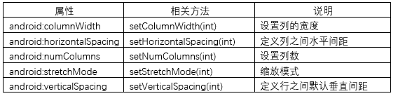
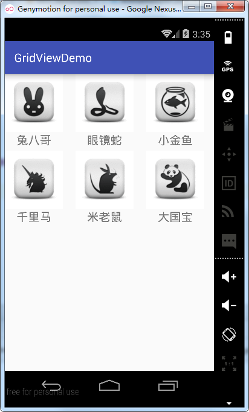
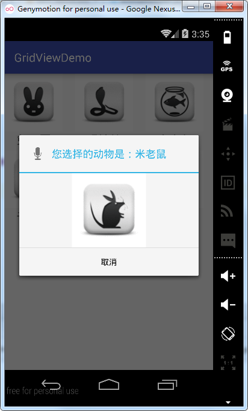

# 第十四章-GridView控件

上面的章节中，研究了ListView的部分使用方法，本部分将对GridView的属性和方法进行讲解，较ListView一般用于列表项的展示，GridView一般用于制作某些选项按钮上，常见的九宫格就可以用GridView来实现。首先我们来看一下GridView有哪些常用属性和相关方法：



下面通过一个简单实例看一下如何使用GridView控件，主布局文件如下：

```
<?xml version="1.0" encoding="utf-8"?>
<RelativeLayout xmlns:android="http://schemas.android.com/apk/res/android"
    android:layout_width="match_parent"
    android:layout_height="match_parent">
    <GridView
        android:id="@+id/gv"
        android:layout_width="match_parent"
        android:layout_height="match_parent"
        android:horizontalSpacing="5dp"
        android:numColumns="3"
        android:stretchMode="columnWidth"
        android:verticalSpacing="5dp" />
</RelativeLayout>

```

设置了numColumns属性，显示3列，设置了stretchMode属性为columnWidth表示图片的缩放与列宽的大小一致。
子项布局文件如下：

```
<?xml version="1.0" encoding="utf-8"?>
<LinearLayout xmlns:android="http://schemas.android.com/apk/res/android"
    android:layout_width="match_parent"
    android:orientation="vertical"
    android:layout_height="match_parent">
    <ImageView
        android:id="@+id/iv"
        android:layout_width="100dp"
        android:layout_height="100dp" />
    <TextView
        android:id="@+id/tv"
        android:layout_width="100dp"
        android:textSize="20sp"
        android:gravity="center"
        android:layout_height="wrap_content" />
</LinearLayout>
```

子项布局文件中包括一个ImageView控件和一个TextView控件，采用线性布局，并设置orientation属性为vertical。
为了方便操作，对Animal这一类进行了封装：

```
public class Animal {
    public Animal(String animal, int imgId) {
        this.animal = animal;
        this.imgId = imgId;
    }
    private String animal;
    private int imgId;
    public String getAnimal() {
        return animal;
    }
    public void setAnimal(String animal) {
        this.animal = animal;
    }
    public int getImgId() {
        return imgId;
    }
    public void setImgId(int imgId) {
        this.imgId = imgId;
    }
}
```

主要包含animal即动物名和imgId即图片ID这两个属性，设置了相应的setter和getter方法。
适配器类继承自BaseAdapter类，代码如下：

```
public class GridAdapter extends BaseAdapter {
    private Context context;
    private List<Animal> datas;
    public GridAdapter(Context context,List<Animal> datas){
        this.context=context;
        this.datas=datas;
    }
    //返回子项的个数
    @Override
    public int getCount() {
        return datas.size();
    }
    //返回子项对应的对象
    @Override
    public Object getItem(int position) {
        return datas.get(position);
    }
    //返回子项的下标
    @Override
    public long getItemId(int position) {
        return position;
    }
    //返回子项视图
    @Override
    public View getView(int position, View convertView, ViewGroup parent) {
        Animal animal= (Animal) getItem(position);
        View view;
        ViewHolder viewHolder;
        if(convertView==null){
            view = LayoutInflater.from(context).inflate(R.layout.item_layout,null);
            viewHolder=new ViewHolder();
   viewHolder.animalImage=(ImageView)view.findViewById(R.id.iv);
            viewHolder.animalName=(TextView)view.findViewById(R.id.tv);
            view.setTag(viewHolder);
        }else{
            view=convertView;
            viewHolder= (ViewHolder) view.getTag();
        }
        viewHolder.animalName.setText(animal.getAnimal());
        viewHolder.animalImage.setImageResource(animal.getImgId());
        return view;
    }
    //创建ViewHolder类
    class ViewHolder{
        ImageView animalImage;
        TextView animalName;
    }
}
```

细心的读者可以看到，这里的适配器类除了名字和ListView的适配器类不同之外，其余都相同，GridView和ListView都是继承自AbsListView，用法也有很多相似之处。学习要有举一反三的能力，找出控件使用时的共性，可以提高学习速度并能加深理解。这里就不再重复解释上面的代码，不清楚的同学可以翻看前面的ListView部分。

MainActivity.java:

```
public class MainActivity extends AppCompatActivity {
    private GridView gridView;
    private GridAdapter gridAdapter;
    private List<Animal> datas = new ArrayList<Animal>();
    @Override
    protected void onCreate(Bundle savedInstanceState) {
        super.onCreate(savedInstanceState);
        setContentView(R.layout.activity_main);
        gridView=(GridView)findViewById(R.id.gv);
        initDatas();//初始化数据
        gridAdapter=new GridAdapter(this,datas);//实例化适配器
        gridView.setAdapter(gridAdapter);//设置适配器
        gridView.setOnItemClickListener(new AdapterView.OnItemClickListener() {//设置子项单击监听
            @Override
            public void onItemClick(AdapterView<?> parent, View view, int position, long id) {
                String name=datas.get(position).getAnimal();
                ImageView imageView=new ImageView(MainActivity.this);
                imageView.setScaleType(ImageView.ScaleType.CENTER);
                imageView.setLayoutParams(new LinearLayout.LayoutParams(ViewGroup.LayoutParams.WRAP_CONTENT, ViewGroup.LayoutParams.WRAP_CONTENT));
              imageView.setImageResource(datas.get(position).getImgId());
                Dialog dialog=new AlertDialog.Builder(MainActivity.this)
                        .setIcon(android.R.drawable.ic_btn_speak_now)
                        .setTitle("您选择的动物是："+name)
                        .setView(imageView)
                        .setNegativeButton("取消", new DialogInterface.OnClickListener() {
                            @Override
                            public void onClick(DialogInterface dialog, int which) {
                            }
                        }).create();
                dialog.show();
            }
        });

    }

    private void initDatas() {
        Animal animal0 = new Animal("兔八哥", R.drawable.rabbit);
        Animal animal1 = new Animal("眼镜蛇", R.drawable.snack);
        Animal animal2 = new Animal("小金鱼", R.drawable.fish);
        Animal animal3 = new Animal("千里马", R.drawable.horse);
        Animal animal4 = new Animal("米老鼠", R.drawable.mouse);
        Animal animal5 = new Animal("大国宝", R.drawable.panda);
        datas.add(animal0);
        datas.add(animal1);
        datas.add(animal2);
        datas.add(animal3);
        datas.add(animal4);
        datas.add(animal5);
    }
}
```

总结来讲，实现GridView需要三个步骤：

-	准备数据源（initDatas()）
-	新建适配器（GridAdapter extends BaseAdapter）
-	加载适配器（setAdapter()）

这里我们还实现了GridView的子项点击监听（setOnItemClickListener）点击某个子项时，弹出Dialog窗口，通过List的get方法获取单击子项对应的Animal对象，然后再通过Animal类的getAnimal方法获取对应的动物名。同理根据上面的方法获得图片资源对象，调用Dialog的setView方法，将资源图片对象传入，可以把对应子项的图片显示在Dialog对话框中。
运行实例如下：





