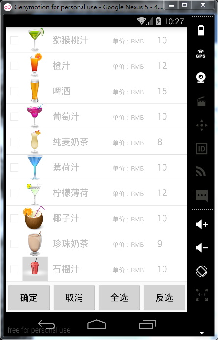
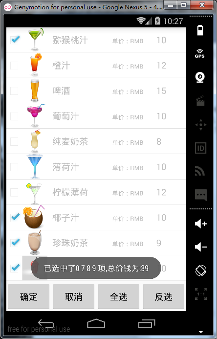

# 第十三章-ListView扩展（多选、全选、反选）

本实例可以直接嫁接与各类点餐APP上，当然你也可以发挥你的想象应用到其他项目之上，本实例主要实现的功能是，实现子类项目的单选、多选、全选和反选功能，点击确定时还能对应生成价格，下面结合代码对实例进行讲解。
主布局文件：

```
<?xml version="1.0" encoding="utf-8"?>
<RelativeLayout xmlns:android="http://schemas.android.com/apk/res/android"
    android:layout_width="match_parent"
    android:layout_height="match_parent"
    android:orientation="vertical">
    <ListView
        android:id="@+id/lv_drink"
        android:layout_width="match_parent"
        android:layout_height="match_parent"
        android:layout_above="@+id/ll_btns"></ListView>
    <LinearLayout
        android:id="@+id/ll_btns"
        android:layout_width="match_parent"
        android:layout_height="58dp"
        android:layout_alignParentBottom="true"
        android:orientation="horizontal">
        <Button
            android:id="@+id/btn_commit"
            android:layout_width="wrap_content"
            android:layout_weight="1"
            android:layout_height="58dp"
            android:text="确定" />
        <Button
            android:id="@+id/btn_select"
            android:layout_width="wrap_content"
            android:layout_weight="1"
            android:layout_height="58dp"
            android:text="点餐" />
        <Button
            android:id="@+id/btn_select_all"
            android:layout_width="wrap_content"
            android:layout_weight="1"
            android:layout_height="58dp"
            android:text="全选" />
        <Button
            android:id="@+id/btn_select_none"
            android:layout_width="wrap_content"
            android:layout_weight="1"
            android:layout_height="58dp"
            android:text="反选" />
    </LinearLayout>
</RelativeLayout> 
```

这里给每个Button的设置了layout_weight属性并赋值为1，这样所有的Button就可以平分整个屏幕宽度，这点在面试或项目中也是经常会遇到的，需要注意。

ListView的子项布局文件：

```
<?xml version="1.0" encoding="utf-8"?>
<LinearLayout xmlns:android="http://schemas.android.com/apk/res/android"
    android:layout_width="match_parent"
    android:layout_height="match_parent"
    android:background="#ffffff"
    android:orientation="horizontal" >
    <CheckBox
        android:id="@+id/check_box"
        android:layout_width="wrap_content"
        android:layout_height="wrap_content"
        android:clickable="false"
        android:focusable="false"
        android:focusableInTouchMode="true" />

    <ImageView
        android:id="@+id/food_imager"
        android:layout_width="50dp"
        android:layout_height="50dp"
        android:background="#ffffff" />
    <TextView
        android:id="@+id/food_name"
        android:layout_width="100dp"
        android:layout_height="50dp"
        android:text="咖啡"
        android:gravity="center_vertical"
        android:layout_marginLeft="10dp"
        android:textSize="18sp" />
    <TextView
        android:layout_width="wrap_content"
        android:layout_height="50dp"
        android:text="单价：RMB  "
        android:paddingLeft="20dp"
        android:textSize="12sp" />
    <TextView
        android:id="@+id/price"
        android:layout_width="wrap_content"
        android:layout_height="50dp"
        android:paddingRight="10dp"
        android:text="18"
        android:layout_marginLeft="20dp"
        android:textSize="18sp" />
</LinearLayout>
```

采用线性布局，并设置了其orientation属性的值为horizontal即水平布局，包括一个CheckBox用于点餐选择（此处CheckBox的clickable属性设置成了false，意为不处理单击事件，交由父控件处理），一个ImageView用于图片展示，和三个TextView分别显示名称和价格。
为了方面数据操作，可以把属性封装成bean，此举也符合面向对象的思想，在开发中经常会用到，代码如下：

```
public class MyListAdapter extends BaseAdapter {
    // 填充数据的list
    private ArrayList<Drink> drinklist;
    // 用来控制CheckBox的选中状况
    private static HashMap<Integer, Boolean> isSelected;
    // 上下文
    private Context context;
    // 用来导入布局
    private LayoutInflater inflater = null;

    private Boolean isShow = false;
    // 构造器
    public MyListAdapter(ArrayList<Drink> list, Context context, Boolean isShow) {
        this.context = context;
        this.drinklist = list;
        inflater = LayoutInflater.from(context);
        isSelected = new HashMap<Integer, Boolean>();
        this.isShow = isShow;
        // 初始化数据
        initDatas();
    }
    // 初始化isSelected的数据
    private void initDatas() {
        for (int i = 0; i < drinklist.size(); i++) {
            getIsSelected().put(i, false);
        }
    }
    @Override
    public int getCount() {
        return drinklist.size();
    }
    @Override
    public Object getItem(int position) {
        return drinklist.get(position);
    }
    @Override
    public long getItemId(int position) {
        return position;
    }
    @Override
    public View getView(int position, View convertView, ViewGroup parent) {
        ViewHolder holder = null;
        if (convertView == null) {
            // 获得ViewHolder对象
            holder = new ViewHolder();
            // 导入布局并赋值给convertview
            convertView = inflater.inflate(R.layout.item, null);
            holder.imageView = (ImageView) convertView
                    .findViewById(R.id.food_imager);
            holder.tv_name = (TextView) convertView.findViewById(R.id.food_name);
            holder.tv_price = (TextView) convertView.findViewById(R.id.price);
            holder.cb = (CheckBox) convertView.findViewById(R.id.check_box);
            // 为view设置标签
            convertView.setTag(holder);
        } else {
            // 取出holder
            holder = (ViewHolder) convertView.getTag();
        }
        // 获取数据
        Drink food = drinklist.get(position);
        // 将数据填充到当前convertView的对应控件中
        if (isShow) {
            holder.cb.setVisibility(View.VISIBLE);
        } else {
            holder.cb.setVisibility(View.GONE);
        }
        holder.imageView.setImageResource(food.drink_img);
        holder.tv_name.setText(food.drink_name);
        holder.tv_price.setText(food.drink_price);
        // 设置list中TextView的显示
        // 根据isSelected来设置checkbox的选中状况
        holder.cb.setChecked(getIsSelected().get(position));
        return convertView;
    }
    public static HashMap<Integer, Boolean> getIsSelected() {
        return isSelected;
    }
    public static void setIsSelected(HashMap<Integer, Boolean> isSelected) {
        MyListAdapter.isSelected = isSelected;
    }
    public class ViewHolder {
        public TextView tv_name;
        public TextView tv_price;
        public ImageView imageView;
        public CheckBox cb;
    }
}
```

对部分代码进行讲解：

-	这里创建了一个Map容器用以保存每个CheckBox的选择情况，当被选择时，Map的key存入CheckBox的序号，其Value存入true，反之，没有没选择Value存入false。为了方面操作这个Map容器，使用了getter和setter进行了封装。

-	InitDatas方法初始化了初始状态下的CheckBox都是未选择的。

-	构造方法传入了三个参数，分别是数据源、上下文对象、决定CheckBox和全选及反选按钮是否显示的标识。

-	四个必须覆写的方法上一节已经讲解它们的作用，这里就不再重复，为了提高运行效率，这里也使用了ViewHolder类。在getView方法中根据传入的isShow的布尔值决定是否显示CheckBox。
最后，MainActivity.java代码如下：（代码较长，分段讲解）

```
public class MainActivity extends Activity implements OnClickListener, OnItemClickListener {
    private ListView listView;
    private Button mCommitButton, mSelectButton, mSelectAllButton, mCancelAllButton;
    private ArrayList<Drink> drinks = new ArrayList<Drink>();
    private MyListAdapter adapter;
    private CheckBox checkBox;
    private int checkNum; // 记录选中的条目数量  
    private ArrayList<String> list;
    private Boolean isShow = false;
    private Handler handler = new Handler() {
        public void handleMessage(android.os.Message msg) {
            if (msg.what == 1) {
                show();
            } else if (msg.what == 0) {
                dismiss();
            }
        };
    };
    private void show() {
        adapter = new MyListAdapter(drinks, getApplicationContext(), true);
        listView.setAdapter(adapter);
        isShow = true;
        mCancelAllButton.setVisibility(View.VISIBLE);
        mSelectAllButton.setVisibility(View.VISIBLE);
    }
    private void dismiss() {
        adapter = new MyListAdapter(drinks, getApplicationContext(), false);
        listView.setAdapter(adapter);
        isShow = false;
        mCancelAllButton.setVisibility(View.GONE);
        mSelectAllButton.setVisibility(View.GONE);
    }
```

-	为了方便统一处理监听事件，这里实现了OnClickListener单击监听和ListView的OnItemClickListener子项点击监听。此外，因为涉及到动态改变UI布局中控件的显示与否，这里采用了Handler机制，Handler机制一般用于更改主线程UI，在后面的章节还会详细讲解。

-	代码中有两个方法，一个是show，用于显示子项中的CheckBox（重新调用构造方法，第三个参数传入true）和主布局文件中的反选和全选按钮，dismiss方法则用于隐藏子项中的CheckBox（重新调用构造方法，第三个参数传入false）和主布局文件中的反选和全选按钮。

```
protected void onCreate(Bundle savedInstanceState) {
    super.onCreate(savedInstanceState);
    requestWindowFeature(Window.FEATURE_NO_TITLE);
    setContentView(R.layout.activity_main);
    initView();// 初始化控件  
    initData();// 初始化数据
    adapter = new MyListAdapter(drinks, getApplicationContext(), false);
    isShow = false;
    listView.setAdapter(adapter);
}
/**
 * 初始化控件 
 */
public void initView() {
    View view = LayoutInflater.from(this).inflate(R.layout.item, null);
    checkBox = (CheckBox) view.findViewById(R.id.check_box);
    listView = (ListView) findViewById(R.id.lv_drink);// listview列表控件
    mCommitButton = (Button) findViewById(R.id.btn_commit);// 确定按钮  
    list = new ArrayList<String>();
    mSelectButton = (Button) findViewById(R.id.btn_select);
    mSelectAllButton = (Button) findViewById(R.id.btn_select_all);
    mCancelAllButton = (Button) findViewById(R.id.btn_select_none);
    mSelectAllButton.setOnClickListener(this);
    mCancelAllButton.setOnClickListener(this);
    if (isShow) {
        mSelectButton.setText("取消");
        mCancelAllButton.setVisibility(View.VISIBLE);
        mSelectAllButton.setVisibility(View.VISIBLE);
    } else {
        mSelectButton.setText("点餐");
        mCancelAllButton.setVisibility(View.GONE);
        mSelectAllButton.setVisibility(View.GONE);
    }
    mSelectButton.setOnClickListener(this);
    mCommitButton.setOnClickListener(this);
    listView.setOnItemClickListener(this);
}
/**
 * 初始化虚拟数据 
 */
public void initData() {
    Class cls = R.drawable.class;// 反射
    try {
        drinks.add(new Drink(cls.getDeclaredField("d1").getInt(null), "猕猴桃汁", "10"));
        drinks.add(new Drink(cls.getDeclaredField("d2").getInt(null), "橙汁", "12"));
        drinks.add(new Drink(cls.getDeclaredField("d3").getInt(null), "啤酒", "15"));
        drinks.add(new Drink(cls.getDeclaredField("d4").getInt(null), "葡萄汁", "10"));
        drinks.add(new Drink(cls.getDeclaredField("d5").getInt(null), "纯麦奶茶", "8"));
        drinks.add(new Drink(cls.getDeclaredField("d6").getInt(null), "薄荷汁", "10"));
        drinks.add(new Drink(cls.getDeclaredField("d7").getInt(null), "柠檬薄荷", "12"));
        drinks.add(new Drink(cls.getDeclaredField("d8").getInt(null), "椰子汁", "10"));
        drinks.add(new Drink(cls.getDeclaredField("d9").getInt(null), "珍珠奶茶", "9"));
        drinks.add(new Drink(cls.getDeclaredField("d10").getInt(null), "石榴汁", "10"));
        for (int i = 0; i < drinks.size(); i++) {
            list.add("data" + " " + i);
        }
    } catch (Exception e) {
        e.printStackTrace();
    }
}

```

这里主要有三个方法

-	onCreate方法，界面加载时首先会调用的方法，用于完成界面的初始化工作。这里初始化了适配器类MyListAdapter，这个类要传入三个参数，分别是数据源、上下文对象和控件显示标识，因为初始化时CheckBox、反选和全选按钮都不显示，所以这里传入false，最后调用setAdapter方法，设置适配器。

-	initView方法，为了控制子项中的控件，这里通过LayoutInflater.from(this).inflate(R.layout.item, null)方法获得了子项的布局文件，然后通过findViewById获得每一个控件对象。根据标识位isShow在初始化时控制第二个Button的text属性，并控制全选和反选按钮的显示与否。方法最后设置了三个控件的点击事件监听。

-	initData方法，采用Java反射机制获取图片资源，然后将数据存储到list 集合中。

```
//按钮点击事件处理
    @Override
    public void onClick(View v) {
        int mID = v.getId();
        switch (mID) {
            case R.id.btn_commit:
                myPrice();// 计算总价并输出
                break;
            case R.id.btn_select:
                whatToShow();
                break;
            case R.id.btn_select_all:
                selectAll();
                break;
            case R.id.btn_select_none:
                selectNone();
                break;
        }
    }

    //全选方法
    private void selectAll() {
        // 遍历list的长度，将MyAdapter中的map值全部设为true  
        for (int i = 0; i < list.size(); i++) {
            MyListAdapter.getIsSelected().put(i, true);
        }
        // 数量设为list的长度  
        checkNum = list.size();
        // 刷新listview和TextView的显示  
        adapter.notifyDataSetChanged();
    }

    //决定第二个按钮显示
    private void whatToShow() {
        if (isShow) {
            Message message = Message.obtain();
            message.what = 0;
            handler.sendMessage(message);
            mSelectButton.setText("点餐");
        } else {
            Message message = Message.obtain();
            message.what = 1;
            handler.sendMessage(message);
            mSelectButton.setText("取消");
        }
    }
    //反选方法
    private void selectNone() {
        // 遍历list的长度，将MyAdapter中的map值全部设为true
        for (int i = 0; i < list.size(); i++) {
            MyListAdapter.getIsSelected().put(i, false);
        }
        // 数量设为list的长度
        checkNum = list.size();
        // 刷新listview和TextView的显示
        adapter.notifyDataSetChanged();
    }
    /**
     * 计算总价格的方法 
     */
    public void myPrice() {
        HashMap<Integer, Boolean> map = MyListAdapter.getIsSelected();
        String str = "";
        int money = 0;
        for (int i = 0; i < map.size(); i++) {
            if (map.get(i)) {
                str += (i + " ");
                money += Integer.parseInt(drinks.get(i).drink_price);
            }
        }
        MyListAdapter.getIsSelected().get("");
        Toast.makeText(getApplicationContext(), "已选中了" + str + "项,总价钱为:" + money, Toast.LENGTH_SHORT).show();
    }

    /**
     * listview的item的选择的方法 
     */
    @Override
    public void onItemClick(AdapterView<?> parent, View view, int position, long id) {
        // 取得ViewHolder对象，这样就省去了通过层层的findViewById去实例化我们需要的cb实例的步骤  
        MyListAdapter.ViewHolder holder = (MyListAdapter.ViewHolder) view.getTag();
        // 改变CheckBox的状态  
        holder.cb.toggle();
        // 将CheckBox的选中状况记录下来  
        MyListAdapter.getIsSelected().put(position, holder.cb.isChecked());
    }
}

```

-	覆写了onClick方法，根据参数view并调用其getId的方法用来判断单击了哪一个按钮，然后进行相应的逻辑操作。

-	selectAll是全选的方法，通过遍历整个数据集合，将Map集合中的所有value改成true，并调用notifyDataSetChanged方法刷新ListView，selectNone则是反选的方法，同理遍历数据集合将Map中所有value的值改成false，并调用notifyDataSetChanged即可。

-	whatToShow方法，根据isShow的值判断是否显示CheckBox、反选和全选按钮，并动态这时mSelectButton的text属性。这里用到了Hanlder机制进行传值。

-	myPrice方法用于计算选择子项的总价格，通过getIsSelected方法获取是否选定的Map集合，然后进行数据集合的遍历，将选定的子项的价格求和即得到总的价格。

-	最后覆写了ListView的子项单击事件监听，将是否选定的结果记录到MyListAdapter.getIsSelected()方法获得的Map集合中。这里单击子项即可以选择CheckBox，因为在布局文件中将CheckBox的clickable属性设置成了false，由事件分发机制可知，子控件不消费点击事件，交由父控件（这里是ListView的子项）拦截消费单击监听，事件分发机制后面还会讲解。

-	这里传递数据的方式也可以选择接口回调的方式，对于回调方式，下一节会介绍，这里读者可以尝试自行实现。
运行实例如下：





单击点餐按钮后，点餐按钮本身会变成取消按钮，同时全选、反选按钮和CheckBox控件会显示出来，选择要点的饮料，点击确定按钮，会自动计算出选择饮料的总价格，通过Toast输出。