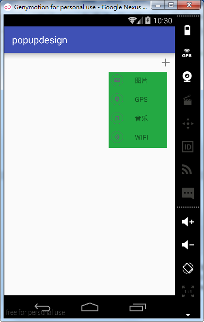

# 第二十二章-PopupWindow浮动窗

PopupWindow的官方定义如下：

> A popup window that can be used to display an arbitrary view. The
> popup window is a floating container that appears on top of the
> current activity.

也就是说它是一个浮动在当前界面上方并且可以显示在任意位置的View，前面的章节我们学习了弹出框，各式各样的，那么PopupWindow应该有两点和弹出框不同，一是PopupWindow必须指定宽高属性，而弹出框则不是必须指定；二是PopupWindow必须指定其布局文件。下面总结一下常用方法：


由上面方法可以看出，PopupWindow共有两种弹出方式，一种在某控件的下方，一种在父控件的任意方向，弹出位置可以任意设定，十分灵活。
首先通过一个实例熟悉一下PopupWindow的用法，这里采用showAtLocation方法弹出PopupWindow。
主布局文件代码（activity_main.xml）

```
<?xml version="1.0" encoding="utf-8"?>
<RelativeLayout xmlns:android="http://schemas.android.com/apk/res/android"
    android:layout_width="match_parent"
    android:layout_height="match_parent">
    <Button
        android:layout_width="match_parent"
        android:layout_height="wrap_content"
        android:gravity="center"
        android:textSize="20sp"
        android:onClick="test"
        android:layout_centerInParent="true"
        android:text="PopupWindowTest" />
</RelativeLayout>
```

定义了一个Button控件，设置了其onClick属性用于单击事件监听。
PopupWindow布局文件代码（popupwindow_layout.xml）

```
<?xml version="1.0" encoding="utf-8"?>
<LinearLayout
    xmlns:android="http://schemas.android.com/apk/res/android"
    android:layout_width="match_parent"
    android:layout_height="wrap_content"
    android:background="#ffffff"
    android:orientation="vertical"
    android:paddingBottom="1dp">
    <View
        android:layout_width="match_parent"
        android:layout_height="2dp"
        android:background="#10a324"
        android:layout_alignParentTop="true"/>
    <TextView
        android:id="@+id/tv_exit"
        android:layout_width="match_parent"
        android:layout_height="wrap_content"
        style="@style/text_style"
        android:text="退出"/>
    <View
        android:layout_width="match_parent"
        android:layout_height="1dp"
        android:background="#d4d2d2"/>
    <TextView
        android:id="@+id/tv_set"
        android:layout_width="match_parent"
        android:layout_height="wrap_content"
        style="@style/text_style"
        android:text="设置"/>
    <View
        android:layout_width="match_parent"
        android:layout_height="1dp"
        android:background="#d4d2d2"/>
    <TextView
        android:id="@+id/tv_cancel"
        android:layout_width="match_parent"
        android:layout_height="wrap_content"
        style="@style/text_style"
        android:text="取消"/>
</LinearLayout>
```

这里TextView引入了样式，样式表如下：

```
<style name="text_style">
    <item name="android:paddingTop">5dp</item>
    <item name="android:paddingBottom">5dp</item>
    <item name="android:gravity">center</item>
    <item name="android:textColor">#10a324</item>
</style>
```

一些共用的属性可以提取出来做成样式表，方便后期维护，每一个属性由一个item标签包裹。

MainActivity代码（MainActivity.java）

```
public class MainActivity extends Activity implements View.OnClickListener {
    private PopupWindow popupWindow;
    private TextView tvExit,tvSet,tvCancel;
    private View rootView;
    @Override
    protected void onCreate(Bundle savedInstanceState) {
        super.onCreate(savedInstanceState);
        setContentView(R.layout.activity_main);
    }
    private void showPopup() {
        View view = LayoutInflater.from(this).inflate(R.layout.popupwindow_layout,null);//PopupWindow对象
        popupWindow=new PopupWindow(this);//初始化PopupWindow对象
        popupWindow.setContentView(view);//设置PopupWindow布局文件
        popupWindow.setWidth(ViewGroup.LayoutParams.MATCH_PARENT);//设置PopupWindow宽
        popupWindow.setHeight(ViewGroup.LayoutParams.WRAP_CONTENT);//设置PopupWindow高
        rootView =LayoutInflater.from(this).inflate(R.layout.activity_main, null);//父布局
        popupWindow.showAtLocation(rootView, Gravity.BOTTOM,0,0);
        popupWindow.setOutsideTouchable(true);
        tvSet=(TextView)view.findViewById(R.id.tv_set);
        tvCancel=(TextView)view.findViewById(R.id.tv_cancel);
        tvExit=(TextView)view.findViewById(R.id.tv_exit);//在view对象中通过findViewById找到TextView控件
        tvSet.setOnClickListener(this);//注册点击监听
        tvCancel.setOnClickListener(this);//注册点击监听
        tvExit.setOnClickListener(this);//注册点击监听
        popupWindow.setOnDismissListener(new PopupWindow.OnDismissListener() {
            @Override
            public void onDismiss() {
                Toast.makeText(MainActivity.this,"PupWindow消失了！",Toast.LENGTH_SHORT).show();
            }
        });
    }
    @Override
    public void onClick(View v) {
        switch (v.getId()){
            case R.id.tv_cancel:
                popupWindow.dismiss();//关闭PopupWindow
                break;
            case R.id.tv_exit:
                finish();//调用Activity的finish方法退出应用程序
                break;
            case R.id.tv_set:
                Toast.makeText(this,"设置",Toast.LENGTH_SHORT).show();
                popupWindow.dismiss();
                break;
        }
    }
    public void test(View view){
        if(popupWindow==null) {
            showPopup();
        }else{
            popupWindow.showAtLocation(rootView, Gravity.BOTTOM,0,0);//设置PopupWindow的弹出位置。
        }
    }
}
```

在按钮的单击响应事件test中判断在没有初始化时调用showPopup方法， 否则调用showAtLocation弹出PopupWindow，这个方法需要传入四个参数，第一个是父布局对象，第二个是弹出位置，第三个是关于x轴偏移量，第四个是关于y轴偏移量。

ShowPopup方法首先获取到了PopupWindow的布局文件，初始化了一个PopupWindow对象，使用该对象调用setWidth方法设置宽度，调用setHeight方法设置高度。然后调用showAtLocation方法显示出PopupWindow，通过findViewById的方法获取PopupWindow中的每个控件，方便注册单击监听，进行逻辑事件的处理。

最后设置了使用setOnDismissListener方法对PopupWindow 进行了消失事件监听。
运行实例如下：


点击按钮会在主界面正下方弹出popupWindow，点击设置按钮popupWindow消失，并触发消失事件监听。

用过微信的朋友都会熟悉如下的界面，这个效果同样也可以用popupWindow模拟实现。


主布局文件代码（activity_main.xml）

```
<?xml version="1.0" encoding="utf-8"?>
<RelativeLayout xmlns:android="http://schemas.android.com/apk/res/android"
    android:layout_width="match_parent"
    android:layout_height="match_parent">
    <ImageView
        android:id="@+id/iv_add"
        android:layout_width="40dp"
        android:layout_height="40dp"
        android:layout_alignParentRight="true"
        android:padding="10dp"
        android:src="@drawable/add" />
</RelativeLayout>
```

主布局文件引入了一个ImageView，设置了layout_alignParentRight属性为true，将控件显示在主布局右方，设置src属性选择图片源。
popupWindow布局文件代码（pop_layout.xml）

```
<?xml version="1.0" encoding="utf-8"?>
<LinearLayout xmlns:android="http://schemas.android.com/apk/res/android"
    android:layout_width="match_parent"
    android:layout_height="match_parent"
    android:background="#24a943"
    android:orientation="vertical">

    <LinearLayout
        android:id="@+id/ll_pic"
        android:layout_width="match_parent"
        android:layout_height="40dp"
        android:orientation="horizontal">
        <ImageView
            android:layout_width="35dp"
            android:layout_height="35dp"
            android:padding="5dp"
            android:src="@drawable/pic" />
        <TextView
            android:layout_width="wrap_content"
            android:layout_height="35dp"
            android:gravity="center"
            android:paddingLeft="20dp"
            android:paddingRight="40dp"
            android:text="图片" />
    </LinearLayout>
    <LinearLayout
        android:layout_width="match_parent"
        android:layout_height="40dp"
        android:orientation="horizontal">
        <ImageView
            android:layout_width="35dp"
            android:layout_height="35dp"
            android:padding="5dp"
            android:src="@drawable/location" />
        <TextView
            android:layout_width="wrap_content"
            android:layout_height="35dp"
            android:gravity="center"
            android:paddingLeft="20dp"
            android:paddingRight="40dp"
            android:text="GPS" />
    </LinearLayout>
    <LinearLayout
        android:layout_width="match_parent"
        android:layout_height="40dp"
        android:orientation="horizontal">
        <ImageView
            android:layout_width="35dp"
            android:layout_height="35dp"
            android:padding="5dp"
            android:src="@drawable/music" />
        <TextView
            android:layout_width="wrap_content"
            android:layout_height="35dp"
            android:gravity="center"
            android:paddingLeft="20dp"
            android:paddingRight="40dp"
            android:text="音乐" />
    </LinearLayout>
    <LinearLayout
        android:layout_width="match_parent"
        android:layout_height="40dp"
        android:orientation="horizontal">
        <ImageView
            android:layout_width="35dp"
            android:layout_height="35dp"
            android:padding="5dp"
            android:src="@drawable/wifi" />
        <TextView
            android:layout_width="wrap_content"
            android:layout_height="35dp"
            android:gravity="center"
            android:paddingLeft="20dp"
            android:paddingRight="40dp"
            android:text="WIFI" />
    </LinearLayout>
</LinearLayout>
```

这里设置了四个LinearLayout控件，并设置其orientation属性为horizontal，每个LinearLayout中添加了一个ImageView和一个TextView。

因为这里为popupWindow添加了动画，所以下面看一下两个动画文件：

popupWindow消失动画（anim_dismiss.xml）

```
<?xml version="1.0" encoding="utf-8"?>
<set xmlns:android="http://schemas.android.com/apk/res/android" >
    <translate
        android:duration="@android:integer/config_shortAnimTime"
        android:fromXDelta="0"
        android:fromYDelta="0"
        android:interpolator="@android:anim/accelerate_decelerate_interpolator"
        android:toXDelta="0"
        android:toYDelta="100%p" />
</set>
```

通过interpolator设置了内置的动画插值器用于动画加速。
popupWindow显示动画（anim_show.xml）

```
<?xml version="1.0" encoding="utf-8"?>
<set xmlns:android="http://schemas.android.com/apk/res/android">
    <translate
        android:duration="@android:integer/config_shortAnimTime"
        android:fromXDelta="0"
        android:fromYDelta="100%p"
        android:interpolator="@android:anim/accelerate_decelerate_interpolator"
        android:toXDelta="0"
        android:toYDelta="0"/>
</set>
```

设置了duration属性，选择内置的时间值：config_shortAnimTime=200ms。
PopupWindow设置动画调用setAnimationStyle方法需要传入style样式，因此定义如下样式表：

样式表代码（styles.xml）

```
<style name="popupAnim" parent="@android:style/Animation.Activity">
    <item name="android:windowEnterAnimation">@anim/anim_show</item>
    <item name="android:windowExitAnimation">@anim/anim_dismiss</item>
</style>
```

设置了windowEnterAnimation（窗口进入动画）和windowExitAnimation（窗口消失动画）属性，其值分别对应显示和消失动画。

MainActivity.java代码（MainActivity.java）

```
public class MainActivity extends AppCompatActivity {
    private ImageView imageView;
    private  PopupWindow popupWindow;
    private LinearLayout linearLayoutPic;
    @Override
    protected void onCreate(Bundle savedInstanceState) {
        super.onCreate(savedInstanceState);
        setContentView(R.layout.activity_main);
        imageView=(ImageView)findViewById(R.id.iv_add);
        imageView.setOnClickListener(new View.OnClickListener() {
            @Override
            public void onClick(View v) {
                addAnimation();
                if(popupWindow==null){
                    showPopupWindow();
                }else if(popupWindow.isShowing()){
                    popupWindow.dismiss();
                }
                else{
                    popupWindow.showAsDropDown(imageView,-300,0);
                }
            }
        });
    }
    private void addAnimation() {//加入了旋转动画
        RotateAnimation rotateAnimation=new RotateAnimation(0,360, Animation.RELATIVE_TO_SELF,0.5f,Animation.RELATIVE_TO_SELF,0.5f);
        rotateAnimation.setDuration(500);//设置动画时间	
        imageView.setAnimation(rotateAnimation);//设置动画
        imageView.startAnimation(rotateAnimation);//开始动画
    }
    private void showPopupWindow() {
        View view= LayoutInflater.from(this).inflate(R.layout.pop_layout,null);//获取popupWindow子布局对象
        popupWindow =new PopupWindow(view, ViewGroup.LayoutParams.WRAP_CONTENT,ViewGroup.LayoutParams.WRAP_CONTENT,false);//初始化
        popupWindow.showAsDropDown(imageView,-300,0);//在ImageView控件下方弹出
        popupWindow.setAnimationStyle(R.style.popupAnim);//设置动画
        linearLayoutPic=(LinearLayout)view.findViewById(R.id.ll_pic);
        linearLayoutPic.setOnClickListener(new View.OnClickListener() {
            @Override
            public void onClick(View v) {
                Toast.makeText(MainActivity.this, "单击了图片按钮！", Toast.LENGTH_SHORT).show();
                popupWindow.dismiss();
            }
        });
    }
}
```

为了提供用户体验，这里对ImageView图片也设置了旋转动画，每次点击图片显示出popupWindow时同样ImageView也会进行旋转。调用showAsDropDown方法在ImageView下方显示出popupWindow，并调用了setAnimationStyle为popupWindow设置了消失和显示时的动画，这个方法需要传入一个样式表。

运行项目实例如下：




通过快速截图可以看出，popupWindow通过动画从下方弹出，并且ImgeView也有了旋转动画。