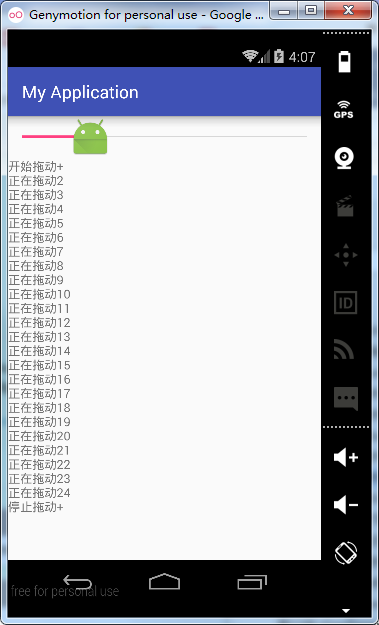
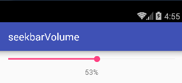
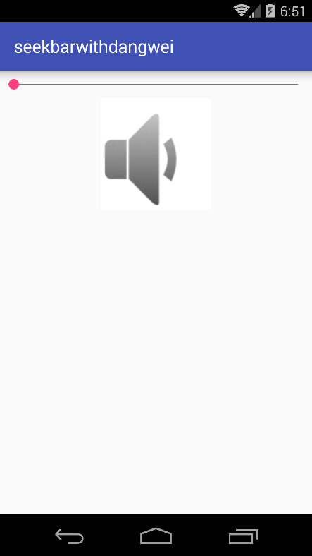
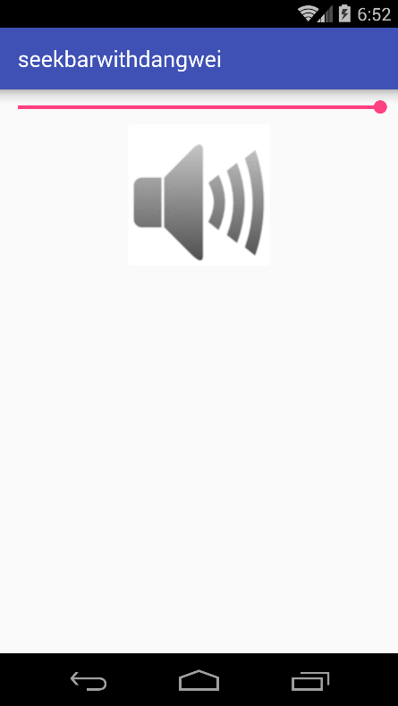

# 第十章-可以拖动的ProgressBar-SeekBar

SeekBar的继承结构如下:

```
public class
SeekBar
extends AbsSeekBar
java.lang.Object
   ↳	android.view.View
 	   ↳	android.widget.ProgressBar
 	 	   ↳	android.widget.AbsSeekBar
 	 	 	   ↳	android.widget.SeekBar
```

可以看出SeekBar继承自ProgressBar，因此ProgressBar的属性和方法在SeekBar中也同样适用，这里把SeekBar理解成可以拖动的ProgressBar。
API文档中定义了SeekBar一个独特的属性thumb，它可以在改变SeekBar的拖动块。判断SeekBar的拖动状态和拖动进度可以实现SeekBar.OnSeekBarChangeListener接口，下面通过一个简单的实例来了解一下它们的用法。
主布局文件代码（activity_main.xml）

```
<?xml version="1.0" encoding="utf-8"?>
<LinearLayout xmlns:android="http://schemas.android.com/apk/res/android"
    android:layout_width="match_parent"
    android:layout_height="match_parent"
    android:orientation="vertical">
    <SeekBar
        android:id="@+id/seekbar"
        android:thumb="@mipmap/ic_launcher"
        android:layout_width="match_parent"
        android:layout_height="wrap_content"
        android:max="100" />
    <TextView
        android:id="@+id/tv"
        android:layout_width="match_parent"
        android:layout_height="wrap_content" />
</LinearLayout>

```
引入了一个SeekBar组件，并且设置其thumb属性为一个图片，这样可以改变滑块样式。
MainActivity代码（MainActivity.java）

```
public class MainActivity extends AppCompatActivity {
    private SeekBar seekBar;
    private TextView textView;
    private StringBuffer stringBuffer;
    @Override
    protected void onCreate(Bundle savedInstanceState) {
        super.onCreate(savedInstanceState);
        setContentView(R.layout.activity_main);
        seekBar=(SeekBar)findViewById(R.id.seekbar);
        textView=(TextView)findViewById(R.id.tv);
        seekBar.setOnSeekBarChangeListener(new SeekBar.OnSeekBarChangeListener() {//设置滑动监听
            @Override
            public void onProgressChanged(SeekBar seekBar, int progress, boolean fromUser) {

                stringBuffer.append("正在拖动"+progress+"\n");
                textView.setText(stringBuffer);
            }
            @Override
            public void onStartTrackingTouch(SeekBar seekBar) {
                stringBuffer=new StringBuffer();
                stringBuffer.append("开始拖动+\n");
                textView.setText(stringBuffer);
            }
            @Override
            public void onStopTrackingTouch(SeekBar seekBar) {
                stringBuffer.append("停止拖动+\n");
                textView.setText(stringBuffer);
            }
        });
    }
}

```
通过setOnSeekBarChangeListener方法设置了SeekBar的滑动监听，这里要覆写三个方法：
	onProgressChanged(SeekBar seekBar, int progress, boolean fromUser)：SeekBar值变化时触发。
	onStartTrackingTouch(SeekBar seekBar)：开始拖动时触发。
	onStopTrackingTouch(SeekBar seekBar)：停止拖动时触发。

运行项目实例如下：



拖动滑块，首先打印开始拖动，然后触发正在拖动时间，最后是停止拖动事件触发。
SeekBar还有哪些应用场景呢？发挥我们的想象，应该说最常用的就是音量调节上了，下面通过一个实例讲解一下如何通过SeekBar改变系统音量。
主布局文件代码（activity_main.xml）

```
<?xml version="1.0" encoding="utf-8"?>
<LinearLayout xmlns:android="http://schemas.android.com/apk/res/android"
    android:layout_width="match_parent"
    android:orientation="vertical"
    android:layout_height="match_parent">
    <SeekBar
        android:id="@+id/sb_volume"
        android:layout_width="match_parent"
        android:layout_height="wrap_content"
        android:max="100"
        android:progress="10" />
    <TextView
        android:id="@+id/tv"
        android:layout_width="match_parent"
        android:layout_height="wrap_content"
        android:gravity="center" />
</LinearLayout>

```

放置了一个SeekBar拖动改变系统音量，TextView用于显示当前音量百分比。
MainActivity代码（MainActivity.java）

```
public class MainActivity extends AppCompatActivity {
    private SeekBar seekBar;
    private TextView textView;
    private int maxVolume,currentVolume;
    private AudioManager audioManager;
    @Override
    protected void onCreate(Bundle savedInstanceState) {
        super.onCreate(savedInstanceState);
        setContentView(R.layout.activity_main);
        seekBar=(SeekBar)findViewById(R.id.sb_volume);
        textView=(TextView)findViewById(R.id.tv);
        audioManager= (AudioManager) getSystemService(Context.AUDIO_SERVICE);//获得音量管理类
        maxVolume=audioManager.getStreamMaxVolume(AudioManager.STREAM_MUSIC);//获得系统最大音量
        currentVolume=audioManager.getStreamVolume(AudioManager.STREAM_MUSIC);//获得当前系统音量
        seekBar.setMax(maxVolume);//将系统最大音量设置为最大进度
        seekBar.setProgress(currentVolume);//将系统当前音量设置为当前进度
        textView.setText(currentVolume * 100 / maxVolume + "%");//设置音量显示的百分比
        seekBar.setOnSeekBarChangeListener(new SeekBar.OnSeekBarChangeListener() {
            @Override
            public void onProgressChanged(SeekBar seekBar, int progress, boolean fromUser) {
                audioManager.setStreamVolume(AudioManager.STREAM_MUSIC,progress,0);//设置音量
                textView.setText(progress * 100 / maxVolume + "%");
            }
            @Override
            public void onStartTrackingTouch(SeekBar seekBar) {
            }
            @Override
            public void onStopTrackingTouch(SeekBar seekBar) {
            }
        });
    }
}

```

通过getSystemService(Context.AUDIO_SERVICE)获取系统音量管理类AudioManager对象。调用getStreamMaxVolume方法获得系统最大音量，调用getStreamVolume方法获取系统当前音量。
设置滑动监听，在正在滑动的事件监听里利用setStreamVolume方法设置系统音量，改方法需要传入三个参数，第一个是音频类型（AudioManager.STREAM_MUSIC），第二个是进度（progress），第三个是标识位（0）。
运行实例如下：



为了测试是否真正改变了系统音量，可以播放音乐然后进行测试，可以发现确实改变了系统音量。
在应用中，经常会碰到调节字体大小，一般字体大小只有几种选择，这时使用SeekBar时就要考虑设置档位。这里模拟设置音量大小的功能，同样也是三个档位，并对应三张不同的音量图片。
主布局文件代码（activity_main.xml）

```
<?xml version="1.0" encoding="utf-8"?>
<LinearLayout xmlns:android="http://schemas.android.com/apk/res/android"
    android:layout_width="match_parent"
    android:orientation="vertical"
    android:layout_height="match_parent">
    <SeekBar
        android:id="@+id/seekBar"
        android:layout_width="match_parent"
        android:layout_height="wrap_content" />
    <ImageView
        android:id="@+id/iv"
        android:layout_gravity="center"
        android:src="@drawable/min"
        android:layout_width="wrap_content"
        android:layout_height="wrap_content" />
</LinearLayout>

```

MainActivity代码（MainActivity.java）

```
public class MainActivity extends AppCompatActivity {
    private SeekBar seekBar;
    private ImageView imageView;
    @Override
    protected void onCreate(Bundle savedInstanceState) {
        super.onCreate(savedInstanceState);
        setContentView(R.layout.activity_main);
        seekBar=(SeekBar)findViewById(R.id.seekBar);
        imageView=(ImageView)findViewById(R.id.iv);
        seekBar.setMax(20);
        seekBar.setOnSeekBarChangeListener(new SeekBar.OnSeekBarChangeListener() {
            @Override
            public void onProgressChanged(SeekBar seekBar, int progress, boolean fromUser) {
            }
            @Override
            public void onStartTrackingTouch(SeekBar seekBar) {
            }
            @Override
            public void onStopTrackingTouch(SeekBar seekBar) {
                if(seekBar.getProgress()<=5){
                    imageView.setImageResource(R.drawable.min);
                    seekBar.setProgress(0);
                }else if(seekBar.getProgress() > 5&&seekBar.getProgress()<15){
                    seekBar.setProgress(10);
                    imageView.setImageResource(R.drawable.middle);
                }else {
                    seekBar.setProgress(20);
                    imageView.setImageResource(R.drawable.max);
                }
            }
        });
    }
}

```
首先调用setMax方法，设置了最大进度值为20，然后设置了setOnSeekBarChangeListener监听，覆写三个方法，其中在onStopTrackingTouch中由seekBar.getProgress方法，获取现在的进度，当进度小于5时，设置进度为零；当进度为（5,15）时，设置进度为10；当进度为[15,20]时，设置进度为20。这时就相当于有了3个档位，即0档、10档和20档，每个档位并对应不同的图片。
运行实例：





SeekBar只能停在中间或两端，因此只有三个档位，若想更直观的看出档位，可以为SeekBar设置带有刻度的背景。