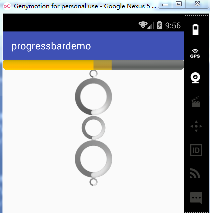
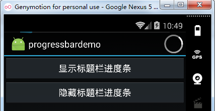
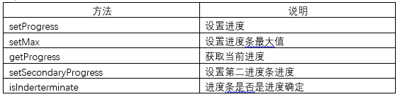
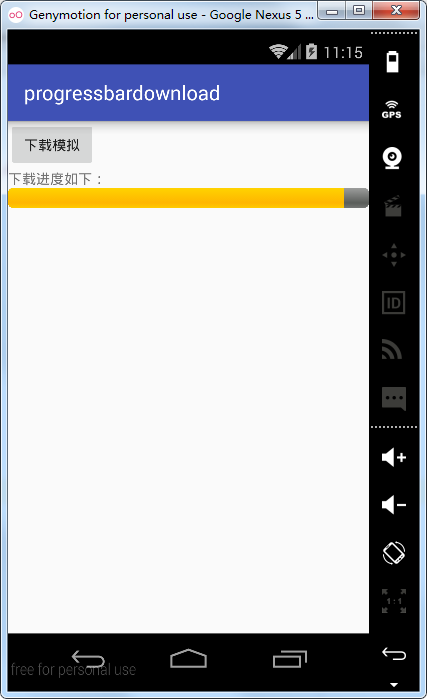

# 第九章-进度条ProgressBar

ProgressBar可以作为一些操作过程中的视觉指示器，可以将操作进度实时的反馈给用户，有时也会使用第二进度条用以辅助显示，例如我们在观看视频时，第一进度条可以显示当前播放进度，而第二进度条则用以显示缓冲进度，更好地提高用户体验。

同时，对于某些不确定的情况下，比如网络连接时，可以使用转圈的动画作为一个进度指示器，提示用户此时正在加载操作。

对于如何使用ProgressBar，API文档也给了一个代码样例：

```
public class MyActivity extends Activity {
     private static final int PROGRESS = 0x1;
     private ProgressBar mProgress;
     private int mProgressStatus = 0;
     private Handler mHandler = new Handler();
     protected void onCreate(Bundle icicle) {
         super.onCreate(icicle);

         setContentView(R.layout.progressbar_activity);
         mProgress = (ProgressBar) findViewById(R.id.progress_bar);
         // Start lengthy operation in a background thread
         new Thread(new Runnable() {
             public void run() {
                 while (mProgressStatus < 100) {
                     mProgressStatus = doWork();
                     // Update the progress bar
                     mHandler.post(new Runnable() {
                         public void run() {
                             mProgress.setProgress(mProgressStatus);
                         }
                     });
                 }
             }
         }).start();
     }
 }
```

从示例代码中可以看出，doWork方法属于耗时操作，因此这里新开了一个线程（PS：耗时操作不能在主线程UI中运行，否则可能会造成ANR，即应用程序无响应的情况，这里应该注意）。对于将耗时操作的进度反馈到UI线程，也有较多方法（后面课程会详细讲解），这里采用了Handler的post方法，将实时操作进度反馈到UI线程中的ProgressBar中。最后，新开了一个线程，不要忘记调用它的start方法，启动线程。

在布局文件中引入一个ProgressBar可以使用一个ProgressBar标签，还需要一些属性修饰，下面对常用属性进行一下介绍：


进度条的样式，Android提供了几种原生的进度条样式，可以通过style属性在布局文件中进行设置。

- Widget.ProgressBar.Horizontal    //水平进度条样式
- Widget.ProgressBar.Small        //小进度条
- Widget.ProgressBar.Large        //大进度条
- Widget.ProgressBar.Inverse       //不断跳变并旋转的进度条
- Widget.ProgressBar.Small.Inverse  //小的不断跳变并旋转的进度条
- Widget.ProgressBar.Large.Inverse  //大的不变跳变并旋转的进度条

这么解释不够直观，下面通过一个小实例来对上面进度条样式和属性进行学习。

布局代码如下：

```
<?xml version="1.0" encoding="utf-8"?>
<LinearLayout xmlns:android="http://schemas.android.com/apk/res/android"
    android:layout_width="match_parent"
    android:layout_height="match_parent"
    android:orientation="vertical">
    <!--水平进度条-->
    <ProgressBar
        style="@android:style/Widget.ProgressBar.Horizontal"
        android:layout_width="match_parent"
        android:layout_height="wrap_content"
        android:max="100"
        android:progress="50"
        android:secondaryProgress="60" />
    <!-- 小进度条-->
    <ProgressBar
        style="@android:style/Widget.ProgressBar.Small"
        android:layout_width="match_parent"
        android:layout_height="wrap_content" />
    <!--大进度条-->
    <ProgressBar
        style="@android:style/Widget.ProgressBar.Large"
        android:layout_width="match_parent"
        android:layout_height="wrap_content" />
    <ProgressBar
        style="@android:style/Widget.ProgressBar.Inverse"
        android:layout_width="match_parent"
        android:layout_height="wrap_content" />
    <ProgressBar
        style="@android:style/Widget.ProgressBar.Large.Inverse"
        android:layout_width="match_parent"
        android:layout_height="wrap_content" />
    <ProgressBar
        style="@android:style/Widget.ProgressBar.Small.Inverse"
        android:layout_width="match_parent"
        android:layout_height="wrap_content" />
</LinearLayout>
```

布局文件中定义了六种样式的进度条，并对第一个进度条设置了max（最大值）、progress（当前进度）、secondaryProgress（第二进度）等属性，下面运行实例观察一下不同样式进度条的外观差异：



除了上述样式的进度条之外，还有显示在标题栏上的进度条，
布局代码中添加了两个按钮：

```
<?xml version="1.0" encoding="utf-8"?>
<LinearLayout xmlns:android="http://schemas.android.com/apk/res/android"
    android:layout_width="match_parent"
    android:layout_height="match_parent"
    android:orientation="vertical">
    <Button
        android:id="@+id/btn_show"
        android:text="显示标题栏进度条"
        android:onClick="show"
        android:layout_width="match_parent"
        android:layout_height="wrap_content" />

    <Button
        android:id="@+id/btn_dismiss"
        android:text="隐藏标题栏进度条"
        android:onClick="dismiss"
        android:layout_width="match_parent"
        android:layout_height="wrap_content" />
</LinearLayout>
```

Activity代码如下：

```
public class MainActivity extends Activity {
    @Override
    protected void onCreate(Bundle savedInstanceState) {
        super.onCreate(savedInstanceState);
        //确定进度的标题栏进度条
        requestWindowFeature(Window.FEATURE_PROGRESS);
        //不确定进度的标题栏进度条
        requestWindowFeature(Window.FEATURE_INDETERMINATE_PROGRESS);
        setContentView(R.layout.activity_main);
    }
    public void show(View view) {
        setProgressBarVisibility(true);
        setProgress(800);
        setProgressBarIndeterminateVisibility(true);
    }
    public void dismiss(View view) {
        setProgressBarVisibility(false);
        setProgressBarIndeterminateVisibility(false);
    }
}
```

这里调用了Activity类的requestWindowFeature方法传入Window.FEATURE_PROGRESS参数显示有进度的标题栏进度条，传入Window.FEATURE_INDETERMINATE_PROGRESS参数则显示不带进度的标题栏进度条。注意这个方法要在setContentView方法之前调用，这里涉及到View绘制过程的知识，这里只需要记住这个顺序即可，后面还会从原理上讲解为什么要放在setContentView的前面。

调用setProgressBarVisibility方法传入布尔变量即可决定标题栏进度条的显示与否，同理setProgressBarIndeterminateVisibility用以决定标题栏不确定进度条的显示与否。

运行项目实例如下：



这里需要说明，使用Android Studio作为开发工具的同学要注意：项目默认的MainActivity继承自AppCompatActivity，需改成Activity，同时，在AndroidManifest文件中设置对应的Activity属性android:theme="@style/Theme.AppCompat.CompactMenu" （有顶部的标题栏的主题），就可以正常显示了。

上面介绍了标题栏进度条的显示和隐藏，下面通过一个小例子了解一下进度条是如何更新进度的，我们模拟了一个下载过程。布局代码如下：

```
<?xml version="1.0" encoding="utf-8"?>
<LinearLayout xmlns:android="http://schemas.android.com/apk/res/android"
    android:layout_width="match_parent"
    android:layout_height="match_parent"
    android:orientation="vertical">
    <Button
        android:id="@+id/btn_download"
        android:layout_width="wrap_content"
        android:layout_height="wrap_content"
        android:onClick="download"
        android:text="下载模拟" />
    <TextView
        android:layout_width="wrap_content"
        android:layout_height="wrap_content"
        android:text="下载进度如下："/>  
    <ProgressBar
        style="@android:style/Widget.ProgressBar.Horizontal"
        android:id="@+id/probar_download"
        android:layout_width="match_parent"
        android:layout_height="wrap_content" />
</LinearLayout>
```

Activity.java代码如下：

```
public class MainActivity extends AppCompatActivity {
    private ProgressBar progressBar;
    @Override
    protected void onCreate(Bundle savedInstanceState) {
        super.onCreate(savedInstanceState);
        setContentView(R.layout.activity_main);
        progressBar=(ProgressBar)findViewById(R.id.probar_download);
        progressBar.setMax(100);
        progressBar.setProgress(20);
    }
    public void download(View view){
        new Thread(){
            @Override
            public void run() {
                for (int i=0;i<100;i++){
                    try {
                        Thread.sleep(100);
                    } catch (InterruptedException e) {
                        e.printStackTrace();
                    }
                    progressBar.incrementProgressBy(1);
                }
            }
        }.start();
    }
}
```

这里新开了一个线程用于模拟下载过程，并调用ProgressBar的increaseProgressBy方法，在原来的基础上每次增加1。除了increaseProgressBy方法，还有如下表所示的常用方法，读者可以自行测试它们的用法。



运行实例如下：
