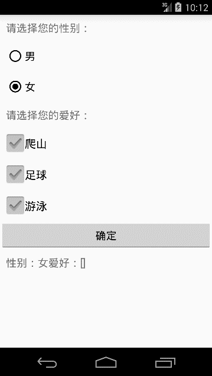
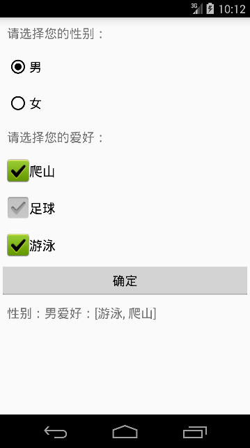

# 第四章-玩转单选和多选按钮

```
public abstract class
CompoundButton
extends Button
implements Checkable
java.lang.Object
   ↳	android.view.View
 	   ↳	android.widget.TextView
 	 	   ↳	android.widget.Button
 	 	 	   ↳	android.widget.CompoundButton
Known Direct Subclasses
CheckBox, RadioButton, Switch, ToggleButton
```

可以看出CheckBox和RadioButton同样都是CompoundButton抽象类的子类。其中CheckBox一般用于多选的情形，RadioButton一般用于单选的情形。注意，若想要RadioButton实现单选功能，必须用一个RadionGroup标签包裹所有的RadioButton。
这两个控件的使用都是比较简单的，下面通过一个实例来对这两个控件的方法和属性进行全面的学习。
主布局文件（activity_main.xml）

```
<?xml version="1.0" encoding="utf-8"?>
<LinearLayout xmlns:android="http://schemas.android.com/apk/res/android"
    android:layout_width="match_parent"
    android:layout_height="match_parent"
    android:orientation="vertical">
    <TextView
        android:layout_margin="10dp"
        android:layout_width="match_parent"
        android:text="请选择您的性别："
        android:textSize="18sp"
        android:layout_height="wrap_content" />
    <RadioGroup
        android:layout_width="wrap_content"
        android:layout_height="wrap_content">
        <RadioButton
            android:id="@+id/boy"
            android:text="男"
            android:checked="true"
            android:layout_margin="10dp"
            android:textSize="18sp"
            android:layout_width="wrap_content"
            android:layout_height="wrap_content" />
        <RadioButton
            android:id="@+id/girl"
            android:text="女"
            android:layout_margin="10dp"
            android:textSize="18sp"
            android:layout_width="wrap_content"
            android:layout_height="wrap_content" />
    </RadioGroup>

    <TextView
        android:layout_margin="10dp"
        android:layout_width="match_parent"
        android:text="请选择您的爱好："
        android:textSize="18sp"
        android:layout_height="wrap_content" />
    <CheckBox
        android:id="@+id/cb_climb"
        android:layout_width="wrap_content"
        android:layout_height="wrap_content"
        android:layout_margin="10dp"
        android:textSize="19sp"
        android:text="爬山"
        android:button="@drawable/checkbox_bg"
        android:checked="true" />
    <CheckBox
        android:id="@+id/cb_football"
        android:layout_width="wrap_content"
        android:layout_height="wrap_content"
        android:layout_margin="10dp"
        android:textSize="19sp"
        android:text="足球"
        android:button="@drawable/checkbox_bg"/>
    <CheckBox
        android:id="@+id/cb_swim"
        android:layout_width="wrap_content"
        android:layout_height="wrap_content"
        android:layout_margin="10dp"
        android:textSize="19sp"
        android:text="游泳"
        android:button="@drawable/checkbox_bg"
        android:checked="true" />
    <Button
        android:id="@+id/btn_ok"
        android:onClick="commit"
        android:text="确定"
        android:gravity="center"
        android:textSize="18sp"
        android:layout_width="match_parent"
        android:layout_height="wrap_content" />
    <TextView
        android:id="@+id/tv_result"
        android:layout_width="match_parent"
        android:padding="10dp"
        android:text="选择结果"
        android:textSize="18sp"
        android:layout_height="wrap_content" />
</LinearLayout>

```
这里对CheckBox的外观进行了自定义，设置了其button属性为："@drawable/checkbox_bg"。下面看一下checkbox_bg.xml:

```
<?xml version="1.0" encoding="utf-8"?>
<selector xmlns:android="http://schemas.android.com/apk/res/android">
    <item android:drawable="@drawable/checked" android:state_checked="true" />
    <item android:drawable="@drawable/unchecked" android:state_checked="false" />
</selector>

```
Selector标签进行包裹，主要用来设置控件背景，其中每一个item代表一个状态。设置了属性state_checked为true或false时分别对应不同的图片。
除了state_checked属性还有如下常用属性：
	android:state_selected控件是否被选中
	android:state_focused控件是否获得焦点
	android:state_pressed控件是否被点击
	android:state_enabled控件是否可用

MainActivity.java代码（MainActivity.java）

```
public class MainActivity extends Activity implements CompoundButton.OnCheckedChangeListener {
    private CheckBox checkBoxClimb, checkBoxFootBall, checkBoxSwim;
    private RadioButton radioButtonBoy, radioButtonGirl;
    private String string = new String();
    private Set<String> set = new HashSet<String>();
    private TextView textView;
    @Override
    protected void onCreate(Bundle savedInstanceState) {
        super.onCreate(savedInstanceState);
        setContentView(R.layout.activity_main);
        initViews();
        initText();
    }
    //不做选择直接按确定按钮时
    private void initText() {
        if (radioButtonGirl.isChecked()) {
            string ="性别：女、";
        } else {
            string="性别：男、";
        }
        if (checkBoxClimb.isChecked()) {
            set.add("爬山");
            if (checkBoxSwim.isChecked()) {
                set.add("游泳");
                if (checkBoxFootBall.isChecked()) {
                    set.add("足球");
                }
            }
        }
    }
    //初始化控件，设置事件监听
    private void initViews() {
        textView = (TextView) findViewById(R.id.tv_result);
        checkBoxClimb = (CheckBox) findViewById(R.id.cb_climb);
        checkBoxFootBall = (CheckBox) findViewById(R.id.cb_football);
        checkBoxSwim = (CheckBox) findViewById(R.id.cb_swim);
        radioButtonBoy = (RadioButton) findViewById(R.id.boy);
        radioButtonGirl = (RadioButton) findViewById(R.id.girl);
        checkBoxClimb.setOnCheckedChangeListener(this);
        checkBoxFootBall.setOnCheckedChangeListener(this);
        checkBoxSwim.setOnCheckedChangeListener(this);
        radioButtonBoy.setOnCheckedChangeListener(this);
        radioButtonGirl.setOnCheckedChangeListener(this);
    }
    @Override
    public void onCheckedChanged(CompoundButton buttonView, boolean isChecked) {
        switch (buttonView.getId()) {
            case R.id.boy:
                if (isChecked) {
                    string="性别：男、";
                }
                break;
            case R.id.girl:
                if (isChecked) {
                    string="性别：女、";
                }
                break;
            case R.id.cb_climb:
                if (isChecked) {
                    set.add("爬山");
                }else{
                    set.remove("爬山");
                }
                break;
            case R.id.cb_football:
                if (isChecked) {
                    set.add("足球");
                }else{
                    set.remove("足球");
                }
                break;
            case R.id.cb_swim:
                if (isChecked) {
                    set.add("游泳");
                }else {
                    set.remove("游泳");
                }
                break;
        }
    }
    public void commit(View view) {
        textView.setText(string.toString() + "爱好：" + set.toString());
    }
}

```
Activity实现了CompoundButton.OnCheckedChangeListener接口，覆写了onCheckedChanged方法，有参数CompoundButton的对象buttonView结合其getId方法获取所有选择控件的ID，根据ID的不同区分不同的选项按钮。
在逻辑处理方面要注意，这里采用了Set集合介绍爱好中的字符串，Set集合不接收重复的元素，可以满足本实例的需求。其中initText方法用于初始化选择内容。
运行实例如下：





可以看出CheckBox的外观是我们添加的图片，选择完成后点击确定按钮即可输出选择的性别和爱好。