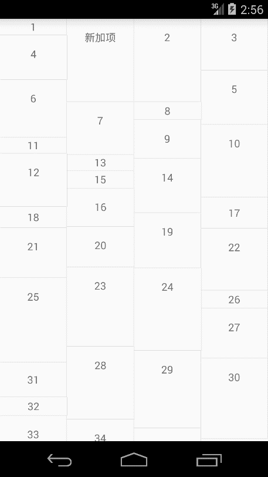
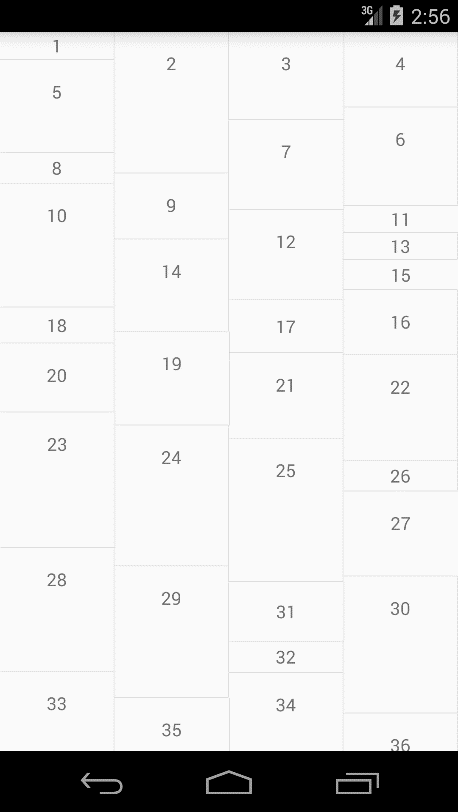
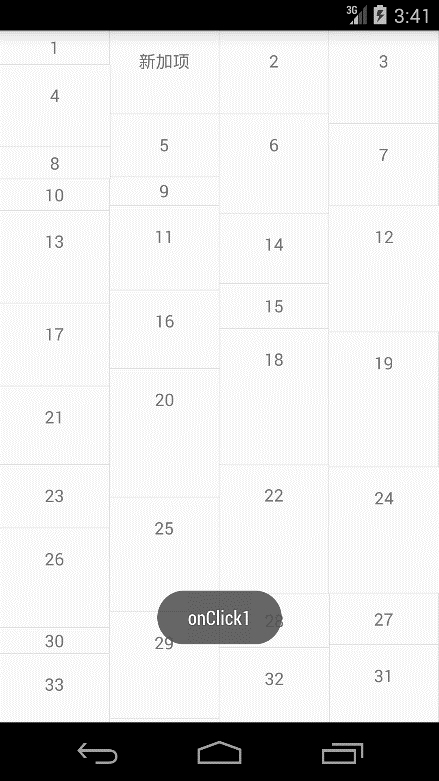
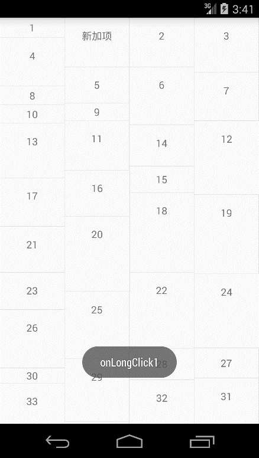

# 第二十四章-RecyclerView动态添加、删除及点击事件

上一节讲解了RecyclerView的三种显示方式，本节将主要研究一下RecyclerView的动态添加、删除及其单击和长按事件的处理。我们在上一节代码的基础上进行相关操作。

一、修改适配器类MyAdapter，加入添加和删除这两个方法：

```
public class MyAdapter extends RecyclerView.Adapter<MyAdapter.MyViewHolder> {
    private Context context;
    private List<String> datas;
    private List<Integer> mHights;
    public  MyAdapter(Context context,List<String> datas){
        this.context=context;
        this.datas=datas;
        mHights=new ArrayList<>();
        for (int i=0;i<datas.size();i++){
            mHights.add((int)(50+Math.random()*300));
        }
    }
    @Override
    public MyViewHolder onCreateViewHolder(ViewGroup parent, int viewType) {
        MyViewHolder holder = new MyViewHolder(LayoutInflater.from(
                context).inflate(R.layout.item, parent,
                false));
        return holder;
    }
    @Override
    public void onBindViewHolder(MyViewHolder holder, int position) {
        ViewGroup.LayoutParams layoutparams= holder.itemView.getLayoutParams();
        layoutparams.height=mHights.get(position);
        holder.itemView.setLayoutParams(layoutparams);
        holder.tv.setText(datas.get(position));
    }
    @Override
    public int getItemCount() {
        return datas.size();
    }
    public void addItem(int position){
        datas.add(position,"新加项");
        notifyItemInserted(position);
    }

    public void removeItem(int position){
        datas.remove(position);
        notifyItemRemoved(position);
    }
    class MyViewHolder extends RecyclerView.ViewHolder {
        TextView tv;
        public MyViewHolder(View view) {
            super(view);
            tv = (TextView) view.findViewById(R.id.id_num);
        }
    }
}
```

二、在MainActivity中添加两个菜单按钮，对应添加和删除方法：

```
public class MainActivity extends Activity {
    private RecyclerView mRecyclerView;
    private List<String> mDatas;
    private MyAdapter myAdapter;
    @Override
    protected void onCreate(Bundle savedInstanceState) {
        super.onCreate(savedInstanceState);
        setContentView(R.layout.activity_main);
        initData();
        mRecyclerView = (RecyclerView) findViewById(R.id.recycleview);
        mRecyclerView.setLayoutManager(new StaggeredGridLayoutManager(4,StaggeredGridLayoutManager.VERTICAL));
        myAdapter = new MyAdapter(this, mDatas);
        mRecyclerView.setAdapter(myAdapter);
        mRecyclerView.addItemDecoration(new DividerGridItemDecoration(this));
        mRecyclerView.setItemAnimator(new DefaultItemAnimator());
     }
    protected void initData() {
        mDatas = new ArrayList<String>();
        for (int i = 1; i < 100; i++) {
            mDatas.add("" +  i);
        }
    }

    @Override
    public boolean onCreateOptionsMenu(Menu menu)
    {
        menu.add(1,1,1,"添加");
        menu.add(1,2,2,"删除");
        return super.onCreateOptionsMenu(menu);
    }

    @Override
    public boolean onOptionsItemSelected(MenuItem item)
    {
        switch (item.getItemId())
        {
            case 1:
                myAdapter.addItem(1);
                break;
            case 2:
                myAdapter.removeItem(1);
                break;
        }
        return true;
    }
}
```

调用了setItemAnimator方法，传入系统默认的动画对象进行“添加或删除Item”动画的添加。编写了两个菜单按钮，单击添加按钮时，在positon为1的位置添加一个Item，单击删除按钮，删除position为1的Item 。
运行实例如下：





单击添加按钮时，添加了一个新加项，单击删除按钮时，这个新加项被删除。

RecyclerView没有提供单击监听和长按监听，需要我们自己实现，这里采用回调接口的方法实现这两个监听。

修改适配器类文件MyAdapter，添加一个接口，接口中定义两个方法：

```
public class MyAdapter extends RecyclerView.Adapter<MyAdapter.MyViewHolder> {
    private Context context;
    private List<String> datas;
    private List<Integer> mHights;
    public interface  onItemClickListener{
        void onItemClick(View view ,int position);
        void  onItemLongClick(View view,int position);
    }
    private onItemClickListener onItemClickListener;
    public void setOnItemClickListener(onItemClickListener onItemClickListener){
        this.onItemClickListener=onItemClickListener;
    }
    public  MyAdapter(Context context,List<String> datas){
        this.context=context;
        this.datas=datas;
        mHights=new ArrayList<>();
        for (int i=0;i<datas.size();i++){
            mHights.add((int)(50+Math.random()*300));
        }
    }
    @Override
    public MyViewHolder onCreateViewHolder(ViewGroup parent, int viewType) {
        MyViewHolder holder = new MyViewHolder(LayoutInflater.from(
                context).inflate(R.layout.item, parent,
                false));
        return holder;
    }
    @Override
    public void onBindViewHolder(final MyViewHolder holder, final int position) {
        ViewGroup.LayoutParams layoutparams= holder.itemView.getLayoutParams();
        layoutparams.height=mHights.get(position);
        holder.itemView.setLayoutParams(layoutparams);
        holder.tv.setText(datas.get(position));
        if(onItemClickListener!=null){
            holder.itemView.setOnClickListener(new View.OnClickListener() {
                @Override
                public void onClick(View v) {
                    int layoutPos=holder.getLayoutPosition();
                    onItemClickListener.onItemClick(holder.itemView,layoutPos);

                }
            });
            holder.itemView.setOnLongClickListener(new View.OnLongClickListener() {
                @Override
                public boolean onLongClick(View v) {
                    int layoutPos=holder.getLayoutPosition();
                    onItemClickListener.onItemLongClick(holder.itemView,layoutPos);
                    return false;
                }
            });
        }

    }
    @Override
    public int getItemCount() {
        return datas.size();
    }
    public void addItem(int position){
        datas.add(position,"新加项");
        notifyItemInserted(position);
    }

    public void removeItem(int position){
        datas.remove(position);
        notifyItemRemoved(position);
    }
    class MyViewHolder extends RecyclerView.ViewHolder {
        TextView tv;
        public MyViewHolder(View view) {
            super(view);
            tv = (TextView) view.findViewById(R.id.id_num);
        }
    }
}
```

这里采用了回调函数的方法，实现RecyclerView子Item的单击和长按监听。为了保证动态添加和删除时position值的正确性，我们使用了getLayoutPosition方法获得position，这里要注意。

MainActivity中也添加了一些代码如下：

```
public class MainActivity extends Activity {
    private RecyclerView mRecyclerView;
    private List<String> mDatas;
    private MyAdapter myAdapter;
    @Override
    protected void onCreate(Bundle savedInstanceState) {
        super.onCreate(savedInstanceState);
        setContentView(R.layout.activity_main);
        initData();
        mRecyclerView = (RecyclerView) findViewById(R.id.recycleview);
        mRecyclerView.setLayoutManager(new StaggeredGridLayoutManager(4,StaggeredGridLayoutManager.VERTICAL));
        myAdapter = new MyAdapter(this, mDatas);
        mRecyclerView.setAdapter(myAdapter);
        mRecyclerView.addItemDecoration(new DividerGridItemDecoration(this));
        mRecyclerView.setItemAnimator(new DefaultItemAnimator());
        myAdapter.setOnItemClickListener(new MyAdapter.onItemClickListener() {
            @Override
            public void onItemClick(View view, int position) {
                Toast.makeText(MainActivity.this,"onClick"+position,Toast.LENGTH_SHORT).show();
            }

            @Override
            public void onItemLongClick(View view, int position) {
                Toast.makeText(MainActivity.this,"onLongClick"+position,Toast.LENGTH_SHORT).show();
            }
        });
     }
    protected void initData() {
        mDatas = new ArrayList<String>();
        for (int i = 1; i < 100; i++) {
            mDatas.add("" +  i);
        }
    }

    @Override
    public boolean onCreateOptionsMenu(Menu menu)
    {
        menu.add(1,1,1,"添加");
        menu.add(1,2,2,"删除");
        return super.onCreateOptionsMenu(menu);
    }

    @Override
    public boolean onOptionsItemSelected(MenuItem item)
    {
        switch (item.getItemId())
        {
            case 1:
                myAdapter.addItem(1);
                break;
            case 2:
                myAdapter.removeItem(1);
                break;
        }
        return true;
    }
}
```

在对应的匿名内部类方法里写入了对应的Toast，用于测试是否正确，运行项目实例：





单击新加项Toast出了onClick1，长按新加项Toast出了onLongClick1。这时可能有同学会注意到一个问题，在Toast出onLongClick1后还Toast了一个onClick1，这时将MyAdapter中的onLongClick方法的返回值改成true即可，这样拦截了单击事件，可以再次运行测试一下。