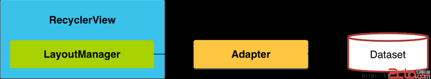
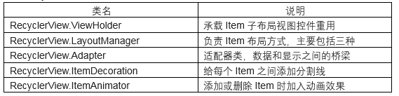
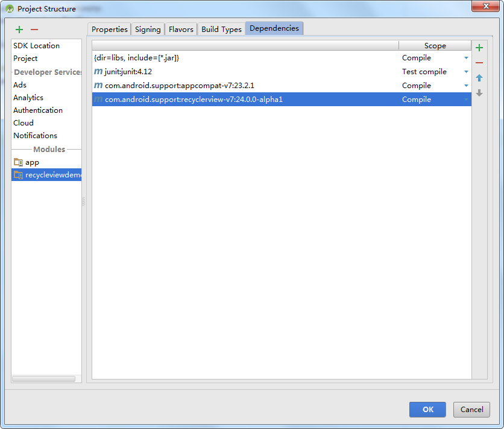
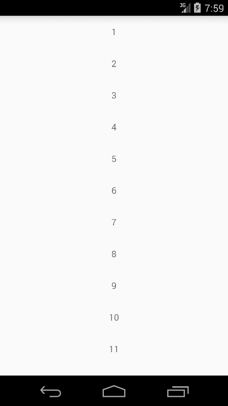
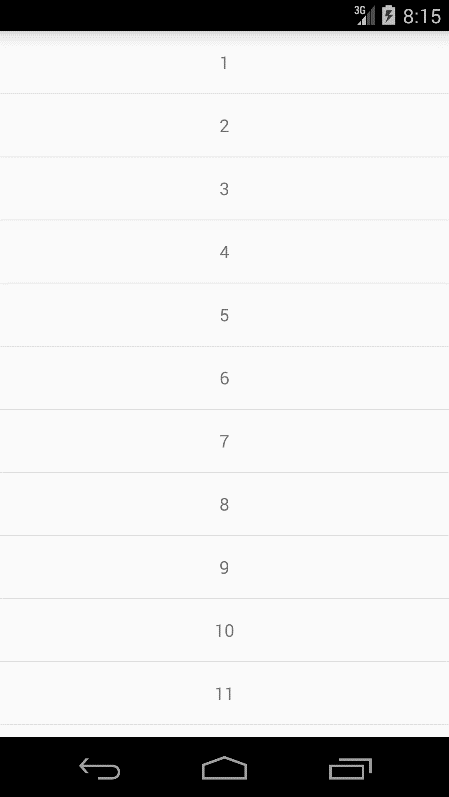
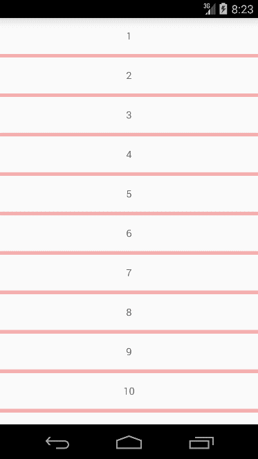
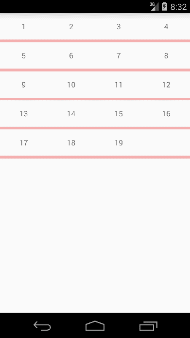
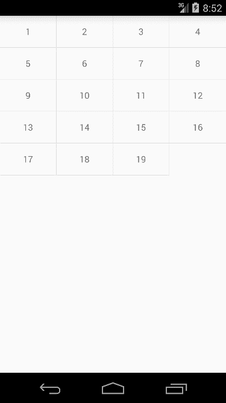
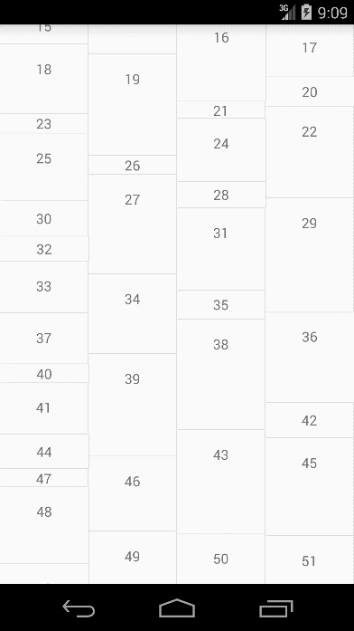

# 第二十三章-全新控件RecyclerView

Android 5.0引入了一个全新的列表控件-RecyclerView，这个控件更为灵活，同时也拥有比ListView和GridView控件较多的优点：例如Item View的创建、View的回收以及重用等机制。

RecyclerView控件提供了以下两种方法来进行简化和处理大数量集合:

- 采用LayoutManager来处理Item的布局
- 提供Item操作的默认动画，例如在增加或者删除item的时候

可以自定义LayoutManager或者设置添加/删除的动画，整体的RecyclerView结构图如下:



为了使用RecyclerView控件，需要创建一个Adapter和一个LayoutManager类，Adapter：继承自RecyclerView.Adapetr类，主要用来将数据和布局item进行绑定。LayoutManager:布局管理器，设置每一项view在RecyclerView中的位置布局以及控件item view的显示或者隐藏.当View重用或者回收的时候，LayoutManger都会向Adapter来请求新的数据来进行替换原来数据的内容。这种回收重用的机制可以提供性能，避免创建很多的view或者是频繁的调用findViewById方法。这种机制和ListView还是很相似的。

RecyclerView提供了三种内置的LayoutManager:

- LinearLayoutManager:线性布局,横向或者纵向滑动列表
- GridLayoutManager:表格布局
- StaggeredGridLayoutManager:流式布局,例如瀑布流效果

当然除了上面的三种内部布局之外，我们还可以继承RecyclerView.LayoutManager来实现一个自定义的LayoutManager。
RecyclerView对于Item的添加和删除是默认开启动画的。我们当然也可以通过RecyclerView.ItemAnimator类定制动画，然后通过RecyclerView.setItemAnimator()方法来进行使用。
RecyclerView常用类:



下面通过一个简单实例对RecyclerView有一个简单的理解。
主布局文件代码（activity_main.xml）：

```
<?xml version="1.0" encoding="utf-8"?>
<RelativeLayout xmlns:android="http://schemas.android.com/apk/res/android"
    android:layout_width="match_parent"
    android:layout_height="match_parent">
    <android.support.v7.widget.RecyclerView
        android:id="@+id/recycleview"
        android:layout_width="match_parent"
        android:layout_height="match_parent"
        android:scrollbars="vertical" />
</RelativeLayout>
```

注意要引入V7的包才能使用RecyclerView控件，如下图：



主布局文件代码（item.xml）：

```
<?xml version="1.0" encoding="utf-8"?>
<RelativeLayout xmlns:android="http://schemas.android.com/apk/res/android"
    android:layout_width="match_parent"
    android:layout_height="50dp">
    <TextView
        android:id="@+id/id_num"
        android:layout_width="match_parent"
        android:layout_height="50dp"
        android:gravity="center"
        android:text="1" />
</RelativeLayout>
```

这个是RecyclerView子Item的布局文件。
适配器类代码（MyAdapter.java）：

```
public class MyAdapter extends RecyclerView.Adapter<MyAdapter.MyViewHolder> {
    private Context context;
    private List<String> datas;
    public  MyAdapter(Context context,List<String> datas){
        this.context=context;
        this.datas=datas;
    }
    @Override
    public MyViewHolder onCreateViewHolder(ViewGroup parent, int viewType) {
        MyViewHolder holder = new MyViewHolder(LayoutInflater.from(
                context).inflate(R.layout.item, parent,
                false));
        return holder;
    }
    @Override
    public void onBindViewHolder(MyViewHolder holder, int position) {
        holder.tv.setText(datas.get(position));
    }
    @Override
    public int getItemCount() {
        return datas.size();
    }
    class MyViewHolder extends RecyclerView.ViewHolder {
        TextView tv;
        public MyViewHolder(View view) {
            super(view);
            tv = (TextView) view.findViewById(R.id.id_num);
        }
    }
```

适配器类继承自RecyclerView.Adapter，这里有几个方法需要解释一下其用法：

- 构造方法- MyAdapter，传入了Context对象和数据集合，这点和ListView一样。
- OnCreateViewHolder方法，这是必须要覆写的方法，返回一个ViewHolder对象。
- onBindViewHolder方法：绑定控件数据。	
- getItemCount方法：返回数据项个数。

MainActivity代码（MainActivity.java）：

```
public class MainActivity extends Activity {
    private RecyclerView mRecyclerView;
    private List<String> mDatas;
    private MyAdapter myAdapter;
    @Override
    protected void onCreate(Bundle savedInstanceState) {
        super.onCreate(savedInstanceState);
        setContentView(R.layout.activity_main);
        initData();
        mRecyclerView = (RecyclerView) findViewById(R.id.recycleview);
        mRecyclerView.setLayoutManager(new LinearLayoutManager(this));
        mRecyclerView.setAdapter(myAdapter = new MyAdapter(this,mDatas));
    }
    protected void initData() {
        mDatas = new ArrayList<String>();
        for (int i = 1; i < 20; i++) {
            mDatas.add("" +  i);
        }
    }
}
```

initData方法初始化了19条数据，setLayoutManger方法设置RecyclerView的排版方式，一般有三种：

- LinearLayoutManager 线行管理器，支持横向、纵向，类似ListView。
- GridLayoutManager 网格布局管理器，类似GridView。
- StaggeredGridLayoutManager 瀑布流式布局。

运行项目实例如下：



我们可以看到，默认是不显示item之间的分割线的，添加分割线的方法比较固定，下面讲解一下如何实现。

这里需要一个DividerItemDecoration类：

```
public class DividerItemDecoration extends RecyclerView.ItemDecoration {
    private static final int[] ATTRS = new int[]{android.R.attr.listDivider};
    public static final int HORIZONTAL_LIST = LinearLayoutManager.HORIZONTAL;
    public static final int VERTICAL_LIST = LinearLayoutManager.VERTICAL;
    private Drawable mDivider;
    private int mOrientation;
    public DividerItemDecoration(Context context, int orientation) {
        final TypedArray a = context.obtainStyledAttributes(ATTRS);
        mDivider = a.getDrawable(0);
        a.recycle();
        setOrientation(orientation);
    }
    public void setOrientation(int orientation) {
        if (orientation != HORIZONTAL_LIST && orientation != VERTICAL_LIST) {
            throw new IllegalArgumentException("invalid orientation");
        }
        mOrientation = orientation;
    }
    @Override
    public void onDraw(Canvas c, RecyclerView parent) {
        if (mOrientation == VERTICAL_LIST) {
            drawVertical(c, parent);
        } else {
            drawHorizontal(c, parent);
        }
    }
    public void drawVertical(Canvas c, RecyclerView parent) {
        final int left = parent.getPaddingLeft();
        final int right = parent.getWidth() - parent.getPaddingRight();
        final int childCount = parent.getChildCount();
        for (int i = 0; i < childCount; i++) {
            final View child = parent.getChildAt(i);
            RecyclerView v = new RecyclerView(
                    parent.getContext());
            final RecyclerView.LayoutParams params = (RecyclerView.LayoutParams) child
                    .getLayoutParams();
            final int top = child.getBottom() + params.bottomMargin;
            final int bottom = top + mDivider.getIntrinsicHeight();
            mDivider.setBounds(left, top, right, bottom);
            mDivider.draw(c);
        }
    }
    public void drawHorizontal(Canvas c, RecyclerView parent) {
        final int top = parent.getPaddingTop();
        final int bottom = parent.getHeight() - parent.getPaddingBottom();

        final int childCount = parent.getChildCount();
        for (int i = 0; i < childCount; i++) {
            final View child = parent.getChildAt(i);
            final RecyclerView.LayoutParams params = (RecyclerView.LayoutParams) child
                    .getLayoutParams();
            final int left = child.getRight() + params.rightMargin;
            final int right = left + mDivider.getIntrinsicHeight();
            mDivider.setBounds(left, top, right, bottom);
            mDivider.draw(c);
        }
    }
    @Override
    public void getItemOffsets(Rect outRect, int itemPosition,
                               RecyclerView parent) {
        if (mOrientation == VERTICAL_LIST) {
            outRect.set(0, 0, 0, mDivider.getIntrinsicHeight());
        } else {
            outRect.set(0, 0, mDivider.getIntrinsicWidth(), 0);
        }
    }
}
```

这个方法比较固定，大家可以网上自行下载。在MainActivity中添加一条语句即可添加横线：

```
public class MainActivity extends Activity {
    private RecyclerView mRecyclerView;
    private List<String> mDatas;
    private MyAdapter myAdapter;
    @Override
    protected void onCreate(Bundle savedInstanceState) {
        super.onCreate(savedInstanceState);
        setContentView(R.layout.activity_main);
        initData();
        mRecyclerView = (RecyclerView) findViewById(R.id.recycleview);
        mRecyclerView.setLayoutManager(new LinearLayoutManager(this));
        mRecyclerView.setAdapter(myAdapter = new MyAdapter(this,mDatas));
        mRecyclerView.addItemDecoration(new DividerItemDecoration(this, DividerItemDecoration.VERTICAL_LIST));

    }
    protected void initData() {
        mDatas = new ArrayList<String>();
        for (int i = 1; i < 20; i++) {
            mDatas.add("" +  i);
        }
    }
}
```

调用了RecyclerView的addItemDecoration方法，传入DividerItemDecoration对象，实例化该对象时传入了两个参数，一个是上下文对象，一个是排列布局方式。
运行项目实例如下：



这时可以看到每个Item之间有了一条浅浅灰色分割线。这个灰色的分割线不够明显，也不美观，我们可以借助主题的listDivider属性改变分割线，找到当前主题，添加一条语句如下（加粗语句）：

```
<resources>
    <!-- Base application theme. -->
    <style name="AppTheme" parent="Theme.AppCompat.Light.DarkActionBar">
        <!-- Customize your theme here. -->
        <item name="colorPrimary">@color/colorPrimary</item>
        <item name="colorPrimaryDark">@color/colorPrimaryDark</item>
        <item name="colorAccent">@color/colorAccent</item>
        <item name="android:listDivider">@drawable/bg</item>
    </style>
</resources>
```

再次运行项目实例如下：



分割线变成了我们自定义个bg图片，这时就可以实现任意的自定义了。
上面实现了类似ListView的布局方式，下面实现一个类似GridView的布局方式，这里需要修改一下MainActivity的一条语句（加粗），如下：

```
public class MainActivity extends Activity {
    private RecyclerView mRecyclerView;
    private List<String> mDatas;
    private MyAdapter myAdapter;
    @Override
    protected void onCreate(Bundle savedInstanceState) {
        super.onCreate(savedInstanceState);
        setContentView(R.layout.activity_main);
        initData();
        mRecyclerView = (RecyclerView) findViewById(R.id.recycleview);
        mRecyclerView.setLayoutManager(new GridLayoutManager(this,4));
        mRecyclerView.setAdapter(myAdapter = new MyAdapter(this, mDatas));
        mRecyclerView.addItemDecoration(new DividerItemDecoration(this, DividerItemDecoration.VERTICAL_LIST));

    }
    protected void initData() {
        mDatas = new ArrayList<String>();
        for (int i = 1; i < 20; i++) {
            mDatas.add("" +  i);
        }
    }
}
```

setLayoutManager方法传入了GridLayoutManager的对象，实例化该对象需要两个参数，第一个是上下文对象，第二个是每一行显示item的个数。

运行实例如下：



可以看到类似GridView的效果，但是分割线好像不太正确，我们还需要新建一个分割线类：

```
public class DividerGridItemDecoration extends RecyclerView.ItemDecoration {
    private static final int[] ATTRS = new int[]{android.R.attr.listDivider};
    private Drawable mDivider;
    public DividerGridItemDecoration(Context context) {
        final TypedArray a = context.obtainStyledAttributes(ATTRS);
        mDivider = a.getDrawable(0);
        a.recycle();
    }
    @Override
    public void onDraw(Canvas c, RecyclerView parent, State state) {
        drawHorizontal(c, parent);
        drawVertical(c, parent);
    }
    private int getSpanCount(RecyclerView parent) {
        // 列数
        int spanCount = -1;
        LayoutManager layoutManager = parent.getLayoutManager();
        if (layoutManager instanceof GridLayoutManager) {
            spanCount = ((GridLayoutManager) layoutManager).getSpanCount();
        } else if (layoutManager instanceof StaggeredGridLayoutManager) {
            spanCount = ((StaggeredGridLayoutManager) layoutManager)
                    .getSpanCount();
        }
        return spanCount;
    }
    public void drawHorizontal(Canvas c, RecyclerView parent) {
        int childCount = parent.getChildCount();
        for (int i = 0; i < childCount; i++) {
            final View child = parent.getChildAt(i);
            final RecyclerView.LayoutParams params = (RecyclerView.LayoutParams) child
                    .getLayoutParams();
            final int left = child.getLeft() - params.leftMargin;
            final int right = child.getRight() + params.rightMargin
                    + mDivider.getIntrinsicWidth();
            final int top = child.getBottom() + params.bottomMargin;
            final int bottom = top + mDivider.getIntrinsicHeight();
            mDivider.setBounds(left, top, right, bottom);
            mDivider.draw(c);
        }
    }
    public void drawVertical(Canvas c, RecyclerView parent) {
        final int childCount = parent.getChildCount();
        for (int i = 0; i < childCount; i++) {
            final View child = parent.getChildAt(i);
            final RecyclerView.LayoutParams params = (RecyclerView.LayoutParams) child
                    .getLayoutParams();
            final int top = child.getTop() - params.topMargin;
            final int bottom = child.getBottom() + params.bottomMargin;
            final int left = child.getRight() + params.rightMargin;
            final int right = left + mDivider.getIntrinsicWidth();
            mDivider.setBounds(left, top, right, bottom);
            mDivider.draw(c);
        }
    }
    private boolean isLastColum(RecyclerView parent, int pos, int spanCount,
                                int childCount) {
        LayoutManager layoutManager = parent.getLayoutManager();
        if (layoutManager instanceof GridLayoutManager) {
            if ((pos + 1) % spanCount == 0)// 如果是最后一列，则不需要绘制右边
            {
                return true;
            }
        } else if (layoutManager instanceof StaggeredGridLayoutManager) {
            int orientation = ((StaggeredGridLayoutManager) layoutManager)
                    .getOrientation();
            if (orientation == StaggeredGridLayoutManager.VERTICAL) {
                if ((pos + 1) % spanCount == 0)// 如果是最后一列，则不需要绘制右边
                {
                    return true;
                }
            } else {
                childCount = childCount - childCount % spanCount;
                if (pos >= childCount)// 如果是最后一列，则不需要绘制右边
                    return true;
            }
        }
        return false;
    }
    private boolean isLastRaw(RecyclerView parent, int pos, int spanCount,
                              int childCount) {
        LayoutManager layoutManager = parent.getLayoutManager();
        if (layoutManager instanceof GridLayoutManager) {
            childCount = childCount - childCount % spanCount;
            if (pos >= childCount)// 如果是最后一行，则不需要绘制底部
                return true;
        } else if (layoutManager instanceof StaggeredGridLayoutManager) {
            int orientation = ((StaggeredGridLayoutManager) layoutManager)
                    .getOrientation();
            // StaggeredGridLayoutManager 且纵向滚动
            if (orientation == StaggeredGridLayoutManager.VERTICAL) {
                childCount = childCount - childCount % spanCount;
                // 如果是最后一行，则不需要绘制底部
                if (pos >= childCount)
                    return true;
            } else
            // StaggeredGridLayoutManager 且横向滚动
            {
                // 如果是最后一行，则不需要绘制底部
                if ((pos + 1) % spanCount == 0) {
                    return true;
                }
            }
        }
        return false;
    }

    @Override
    public void getItemOffsets(Rect outRect, int itemPosition,
                               RecyclerView parent) {
        int spanCount = getSpanCount(parent);
        int childCount = parent.getAdapter().getItemCount();
        if (isLastRaw(parent, itemPosition, spanCount, childCount))// 如果是最后一行，则不需要绘制底部
        {
            outRect.set(0, 0, mDivider.getIntrinsicWidth(), 0);
        } else if (isLastColum(parent, itemPosition, spanCount, childCount))// 如果是最后一列，则不需要绘制右边
        {
            outRect.set(0, 0, 0, mDivider.getIntrinsicHeight());
        } else {
            outRect.set(0, 0, mDivider.getIntrinsicWidth(),
                    mDivider.getIntrinsicHeight());
        }
    }
}
```

getItemOffsets方法中进行了逻辑判断，最后一行时，不必绘制底部分割线，最后一列，不必绘制右边的分割线。将主题中的自定义分割线语句去除，再次运行项目：



下面讲解第三种布局方式-瀑布流的实现，首先我们修改MainActivity代码如下：

```
public class MainActivity extends Activity {
    private RecyclerView mRecyclerView;
    private List<String> mDatas;
    private MyAdapter myAdapter;
    @Override
    protected void onCreate(Bundle savedInstanceState) {
        super.onCreate(savedInstanceState);
        setContentView(R.layout.activity_main);
        initData();
        mRecyclerView = (RecyclerView) findViewById(R.id.recycleview);
        mRecyclerView.setLayoutManager(new StaggeredGridLayoutManager(4,StaggeredGridLayoutManager.VERTICAL));
       // mRecyclerView.setLayoutManager(new GridLayoutManager(this, 4));
        mRecyclerView.setAdapter(myAdapter = new MyAdapter(this, mDatas));
        //mRecyclerView.addItemDecoration(new DividerItemDecoration(this, DividerItemDecoration.VERTICAL_LIST));
        mRecyclerView.addItemDecoration(new DividerGridItemDecoration(this));
     }
    protected void initData() {
        mDatas = new ArrayList<String>();
        for (int i = 1; i < 100; i++) {
            mDatas.add("" +  i);
        }
    }
}
```

修改部分加粗，在setLayoutManager方法中传入了StaggeredGridLayoutManager的对象，对象初始化传入两个参数，第一个是每一行的列数，第二个是布局方式。
此外，我们还需要修改适配器文件，随机化子控件的高度，这样才有瀑布流的效果，如下：

```
public class MyAdapter extends RecyclerView.Adapter<MyAdapter.MyViewHolder> {
    private Context context;
    private List<String> datas;
    private List<Integer> mHights;
    public  MyAdapter(Context context,List<String> datas){
        this.context=context;
        this.datas=datas;
        mHights=new ArrayList<>();
        for (int i=0;i<datas.size();i++){
            mHights.add((int)(50+Math.random()*300));
        }
    }
    @Override
    public MyViewHolder onCreateViewHolder(ViewGroup parent, int viewType) {
        MyViewHolder holder = new MyViewHolder(LayoutInflater.from(
                context).inflate(R.layout.item, parent,
                false));
        return holder;
    }
    @Override
    public void onBindViewHolder(MyViewHolder holder, int position) {
        ViewGroup.LayoutParams layoutparams= holder.itemView.getLayoutParams();
        layoutparams.height=mHights.get(position);
        holder.itemView.setLayoutParams(layoutparams);
        holder.tv.setText(datas.get(position));
    }
    @Override
    public int getItemCount() {
        return datas.size();
    }
    class MyViewHolder extends RecyclerView.ViewHolder {
        TextView tv;
        public MyViewHolder(View view) {
            super(view);
            tv = (TextView) view.findViewById(R.id.id_num);
        }
    }
}
```

新添加了一个List对象mHeights用于存储随机的高度数值，在onBindViewHolder方法中为TextView控件设置了随机的高度。
运行实例如下：



可以看出，所有的子Item的高度都是随机产生的，也就产生了瀑布流的效果，我们可以看出，RecyclerView较传统的控件来讲使用更为灵活，在今后的开发中也将会经常用到。