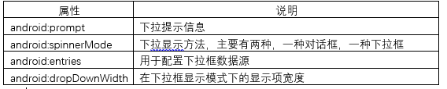
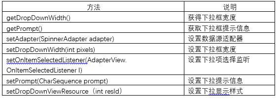
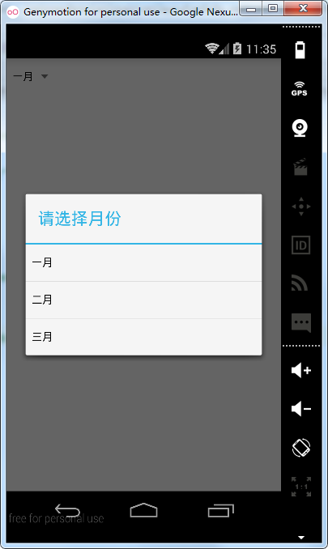
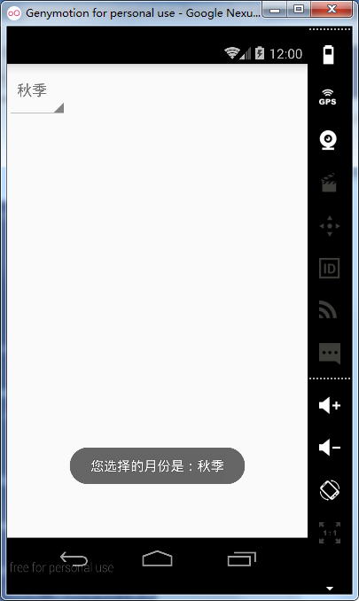
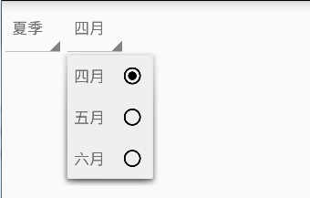

# 第七章-下拉框Spinner控件

Android程序运行在手机上，手机屏幕存在着较大的尺寸局限，怎样在有限的布局里显示更多的内容，下拉列表控件可以有效地解决这一问题，主要在信息较固定的场合使用，例如注册信息时的性别选择、省份选择和出生日期选择等等。首先看一下Spinner的结构：

```
public class
Spinner
extends AbsSpinner
implements DialogInterface.OnClickListener
java.lang.Object
   ↳	android.view.View
 	   ↳	android.view.ViewGroup
 	 	   ↳	android.widget.AdapterView<T extends android.widget.Adapter>
 	 	 	   ↳	android.widget.AbsSpinner
 	 	 	 	   ↳	android.widget.Spinner
```

从API文档给出的继承结构来看，Spinner类继承自AbsSpinner，实现了DialogInterface.OnClickListener 接口。Spinner常用属性有：



常用方法有：



下拉列表框中的列表项有两种配置方式，一种通过布局文件的entries属性配置，一种在代码中配置，首先介绍一下如何通过属性进行配置。

-	方式一

1.编写数据源文件：

```
<?xml version="1.0" encoding="utf-8"?>
<resources>
    <string-array name="months">
        <item>一月</item>
        <item>二月</item>
        <item>三月</item>
    </string-array>
</resources>

```

用string-array标签包裹，每一个item代表一个下拉列表项。

2.布局文件

```
<?xml version="1.0" encoding="utf-8"?>
<RelativeLayout xmlns:android="http://schemas.android.com/apk/res/android"
    android:layout_width="match_parent"
    android:layout_height="match_parent">
    <Spinner
        android:id="@+id/spinner"
        android:entries="@array/months"
        android:layout_width="wrap_content"
        android:spinnerMode="dialog"
        android:prompt="@string/month"
        android:layout_height="wrap_content" />
</RelativeLayout>
```

布局文件的Spinner标签中添加了entries属性，spinnerMode属性选择了对话框模式，并设置了其prompt属性，运行实例如下：



- 方式二
通过代码进行控制，这里以适配器形式设置数据源，并设置了下拉项选择监听，选择项目后会Toast选择了哪一项。

1.布局文件：

```
<?xml version="1.0" encoding="utf-8"?>
<RelativeLayout xmlns:android="http://schemas.android.com/apk/res/android"
    android:layout_width="match_parent"
    android:layout_height="match_parent">
    <Spinner
        android:id="@+id/spinner"
        android:layout_width="wrap_content"
        android:layout_height="wrap_content" />
</RelativeLayout>
```

2.Activity程序：

```
public class MainActivity extends Activity {
    private Spinner spinner;
    ArrayAdapter <String> adapter;
    private List<String> list;

    @Override
    protected void onCreate(Bundle savedInstanceState) {
        super.onCreate(savedInstanceState);
        setContentView(R.layout.activity_main);
        spinner=(Spinner)findViewById(R.id.spinner);
        spinner.setPrompt("请选择季节");
        initDatas();
        adapter=new ArrayAdapter<String>(this,android.R.layout.simple_list_item_1,list);
        spinner.setAdapter(adapter);
        spinner.setOnItemSelectedListener(new AdapterView.OnItemSelectedListener() {
            @Override
            public void onItemSelected(AdapterView<?> parent, View view, int position, long id) {
                Toast.makeText(MainActivity.this,"您选择的月份是："+list.get(position),Toast.LENGTH_SHORT).show();
            }

            @Override
            public void onNothingSelected(AdapterView<?> parent) {

            }
        });

    }

    private void initDatas() {
        list=new ArrayList<String>();
        list.add("春季");
        list.add("夏季");
        list.add("秋季");
        list.add("冬季");

    }
}

```
这里使用了ArrayAdapter适配器填充了数据源，ArrayAdapter初始化时需要传入三个参数，分别是上下文对象、显示布局文件和数据源对象。初始化ArrayAdapter后，调用Spinner的setAdapter方法，设置数据源。调用了setPrompt方法设置提示信息，同时还设置了Spinner子项的选择监听事件，通过覆写方法中的position参数，可以确定选择的是哪一个子项，通过Toast输出选择信息。

运行项目实例如下：



下拉级联是我们在开发中经常会遇到的问题，下面结合单选选择监听，动态控制下级下拉框内容的渲染，通过一个实例进行说明如何实现这一需求。

1.布局文件：

```
<?xml version="1.0" encoding="utf-8"?>
<RelativeLayout xmlns:android="http://schemas.android.com/apk/res/android"
    android:layout_width="match_parent"
    android:layout_height="match_parent">

    <Spinner
        android:id="@+id/spinner_season"
        android:layout_width="wrap_content"
        android:layout_height="wrap_content" />
    <Spinner
        android:id="@+id/spinner_month"
        android:layout_width="wrap_content"
        android:prompt="@string/month"
        android:layout_toRightOf="@+id/spinner_season"
        android:layout_height="wrap_content" />
</RelativeLayout>
```

2.MainActivity 代码：

```
public class MainActivity extends Activity {
    private Spinner spinner_season,spinner_month;
    ArrayAdapter <String> adapter_season,adapter_month;
    private List<String> list_season;
    String   months[][]={{"一月","二月","三月"},{"四月","五月","六月"},{"七月","八月","九月"},{"十月","十一月","十二月"}};

    @Override
    protected void onCreate(Bundle savedInstanceState) {
        super.onCreate(savedInstanceState);
        setContentView(R.layout.activity_main);
        spinner_season=(Spinner)findViewById(R.id.spinner_season);
        spinner_month=(Spinner)findViewById(R.id.spinner_month);
        spinner_season.setPrompt("请选择季节");
        initDatas();
        adapter_season=new ArrayAdapter<String>(this,android.R.layout.simple_list_item_1,list_season);
        spinner_season.setAdapter(adapter_season);
        spinner_season.setOnItemSelectedListener(new AdapterView.OnItemSelectedListener() {
            @Override
            public void onItemSelected(AdapterView<?> parent, View view, int position, long id) {
                adapter_month=new ArrayAdapter<String>(MainActivity.this,android.R.layout.simple_list_item_1,months[position]);//通过二维数组及position的值动态决定下级菜单的数据源
                adapter_month.setDropDownViewResource(android.R.layout.simple_list_item_single_choice);//设置下拉显示样式
                spinner_month.setAdapter(adapter_month);
            }

            @Override
            public void onNothingSelected(AdapterView<?> parent) {

            }
        });

    }

    private void initDatas() {
        list_season=new ArrayList<String>();
        list_season.add("春季");
        list_season.add("夏季");
        list_season.add("秋季");
        list_season.add("冬季");

    }
}
```

这里定义了一个二维数组，在覆写的onItemSelected方法中根据传入的position的值动态决定下级列表框的数据源，从而实现数据级联的效果。这里还利用Spinner的setDropDownViewResource方法设置了下拉显示样式，参考下图：

