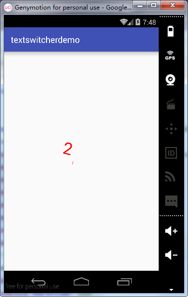
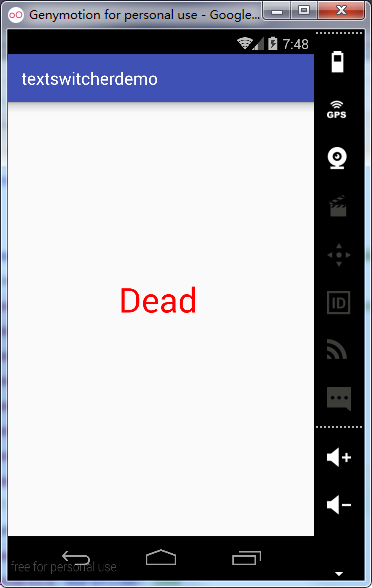
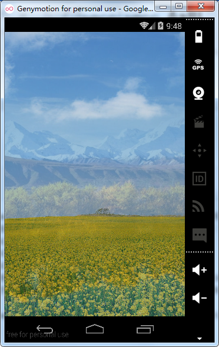

# 第六章-切换类TextSwitcher和ImageSwitcher

顾名思义，Switcher是“切换者”的意思，那么TextSwitcher就是文本切换器，ImageSwitcher就是图片切换器，在某些需要频繁切换文本或图片的场景可以考虑使用这两个类，同时可以在切换过程中加上动画效果，使界面更为美观。其继承结构如下：

```
public class
ViewSwitcher
extends ViewAnimator
java.lang.Object
   ↳	android.view.View
 	   ↳	android.view.ViewGroup
 	 	   ↳	android.widget.FrameLayout
 	 	 	   ↳	android.widget.ViewAnimator
 	 	 	 	   ↳	android.widget.ViewSwitcher
Known Direct Subclasses
ImageSwitcher, TextSwitcher
```

可以看出ImageSwitcher和TextSwitcher同属于ViewSwitcher的子类，下面通过一个有趣的倒计时实例学习一下TextSwitcher的用法。
主布局文件（activity_main.xml）

```
<?xml version="1.0" encoding="utf-8"?>
<RelativeLayout xmlns:android="http://schemas.android.com/apk/res/android"
    android:layout_width="match_parent"
    android:layout_height="match_parent">
    <TextSwitcher
        android:id="@+id/textSwitcher"
        android:layout_width="100dp"
        android:layout_height="100dp"
        android:layout_centerInParent="true" />
</RelativeLayout>
```

TextSwitcher控件由标签TextSwitcher标签包裹，整个布局采用相对布局，设置TextSwitcher属性layout_centerInParent属性为true，居中显示控件。

动画文件（textswitcher_in.xml）

```
<?xml version="1.0" encoding="utf-8"?>
<set xmlns:android="http://schemas.android.com/apk/res/android" >
    <scale
        android:interpolator="@android:anim/accelerate_interpolator"
        android:duration="200"
        android:pivotX="50%"
        android:pivotY="50%"
        android:fromXScale="0"
        android:fromYScale="0"
        android:toXScale="1"
        android:toYScale="1"/>
    <rotate android:fromDegrees="0"
        android:toDegrees="360"
        android:duration="500"
        android:pivotX="0.5"
        android:pivotY="0.5"/>
</set>
```

设置了scale大小动画（scale大小设置从0到1）和rotate（0-360度）旋转动画。

动画文件（textswitcher_out.xml）

```
<?xml version="1.0" encoding="utf-8"?>
<set xmlns:android="http://schemas.android.com/apk/res/android">
    <scale
        android:duration="500"
        android:fromXScale="1"
        android:fromYScale="1"
        android:interpolator="@android:anim/accelerate_interpolator"
        android:pivotX="50%"
        android:pivotY="50%"
        android:toXScale="0"
        android:toYScale="0" />
    <rotate
        android:duration="500"
        android:fromDegrees="0"
        android:pivotX="50%"
        android:pivotY="50%"
        android:toDegrees="360" />
</set>
```

MainActivity.java代码（MainActivity.java）

```
 protected void onCreate(Bundle savedInstanceState) {
        super.onCreate(savedInstanceState);
        setContentView(R.layout.activity_main);
        timeCount=new TimeCount(10*1000,1000);//初始化倒计时类
        textSwitcher=(TextSwitcher)findViewById(R.id.textSwitcher);
        textSwitcher.setInAnimation(AnimationUtils.loadAnimation(this, R.anim.textswitcher_in));//载入动画
        textSwitcher.setOutAnimation(AnimationUtils.loadAnimation(this, R.anim.textswitcher_out));//载入动画
        timeCount.start();//倒计时类开始
        textSwitcher.setFactory(new ViewSwitcher.ViewFactory() {
            @Override
            public View makeView() {
                TextView textView = new TextView(MainActivity.this);
                textView.setTextColor(Color.RED);//设置字体颜色
                textView.setTextSize(40);//设置字体大小
                textView.setLayoutParams(new TextSwitcher.LayoutParams(ViewGroup.LayoutParams.MATCH_PARENT, 
                        ViewGroup.LayoutParams.MATCH_PARENT));//设置宽高属性
                return textView;
            }
        });
    }
    class TimeCount extends CountDownTimer{//倒计时类
        public TimeCount(long millisInFuture, long countDownInterval) {//必须重载的构造方法
            super(millisInFuture, countDownInterval);
        }
        @Override
        public void onTick(long millisUntilFinished) {//计时过程中触发
           count=(int)millisUntilFinished/1000;
            textSwitcher.setText(count+"");
        }
        @Override
        public void onFinish() {//计时结束时触发
            textSwitcher.setText("Dead");
        }
    }
}
```

看过上一节的读者应该对CountDownTimer类不陌生，这是一个倒计时类，它是一个抽象类，这里通过TimeCount类继承它，并覆写了它的两个方法onTick（倒计时过程中触发）和onFinish（倒计时结束时触发），同时重载了其构造方法，包含两个参数，一个是millisInFuture表示倒计时时长，单位为毫秒；另一个countDownInterval表示倒计时间隔，单位也为毫秒。

TextSwitcher必须实现ViewSwitcher.ViewFactory接口，并覆写其中的makeView方法。调用setFactory方法为TextSwitcher设置转换工厂。

运行实例如下：





倒计时是旋转着并从小到大显示，倒计时结束后显示“Dead”。
上面介绍了ImageSwitcher如何进行文字切换的，下面来研究一下ImageSwitcher的用法。

主布局文件代码（activity_main.xml）

```
<?xml version="1.0" encoding="utf-8"?>
<RelativeLayout xmlns:android="http://schemas.android.com/apk/res/android"
    android:layout_width="match_parent"
    android:layout_height="match_parent">
    <ImageSwitcher
        android:id="@+id/imageSwitcher"
        android:layout_width="match_parent"
        android:layout_height="match_parent"/>
</RelativeLayout>
```

图片切换器用ImageSwitcher标签包裹。
MainActivity代码（MainActivity.java）

```
public class MainActivity extends Activity {
    private ImageSwitcher imageSwitcher;
    private int pics[]={R.drawable.pic1,R.drawable.pic2,R.drawable.pic3};//图片源
    private int index=0;//图片标识位
    float startX=0;//手指按下时的x坐标
    @Override
    protected void onCreate(Bundle savedInstanceState) {
        super.onCreate(savedInstanceState);
        requestWindowFeature(Window.FEATURE_NO_TITLE);
        setContentView(R.layout.activity_main);
        imageSwitcher=(ImageSwitcher)findViewById(R.id.imageSwitcher);
        imageSwitcher.setFactory(new ViewSwitcher.ViewFactory() {//设置转换工厂
            @Override
            public View makeView() {
                ImageView imageView = new ImageView(MainActivity.this);
                imageView.setScaleType(ImageView.ScaleType.FIT_XY);
                imageView.setLayoutParams(new ImageSwitcher.LayoutParams(ViewGroup.LayoutParams.MATCH_PARENT,
                        ViewGroup.LayoutParams.MATCH_PARENT));//设置宽高
                return imageView;
            }
        });
        imageSwitcher.setImageResource(pics[0]);
    }
    @Override
    public boolean onTouchEvent(MotionEvent event) {//覆写此方法用于判断左划右划
        switch (event.getAction()){
            case MotionEvent.ACTION_DOWN:
                startX=event.getX();//手指按下时的x坐标作为起始坐标
                break;
            case  MotionEvent.ACTION_UP:
                float endX=event.getX();//手指离开时的x坐标作为结束坐标
                if( endX-startX>100){//上一页
                    if(index>0) {
                        index--;}else {
                        index=2;
                    }
                    imageSwitcher.setImageResource(pics[index%3]);
                    imageSwitcher.setInAnimation(MainActivity.this, android.R.anim.fade_in);//设置动画
                    imageSwitcher.setOutAnimation(MainActivity.this, android.R.anim.fade_out);//设置动画
                }else if(startX-endX>100){//下一页
                    index++;
                    imageSwitcher.setInAnimation(MainActivity.this, android.R.anim.fade_in);//设置动画
                    imageSwitcher.setOutAnimation(MainActivity.this,android.R.anim.fade_out);//设置动画
                    imageSwitcher.setImageResource(pics[index % 3]);
                }
                break;
        }
        return true;
    }
}
```

可以看出ImageSwitcher同样也需要设置图片转换工厂，在图片切换操作上覆写了onTouchEvent方法，根据传入的event参数调取getAction方法可以得到三个常量：

- MotionEvent.ACTION_DOWN：手指按下时触发
- MotionEvent.ACTION_UP：手指抬起时触发
- MotionEvent.ACTION_MOVE：手指在屏幕上滑动时触发

在手指按下时记录按下时的X轴坐标，抬起时记录结束的X轴坐标，根据两次坐标差值可以得出手指的滑动方向，然后进行图片的切换。注意图片切换时index图片下标的逻辑处理问题。

同时这里用到了ImageSwitcher的setInAnimation方法，引入了系统内置的淡入淡出动画效果。

运行实例：



左右滑动切换图片，可以看出图片具有的淡入淡出效果。