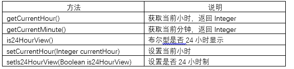
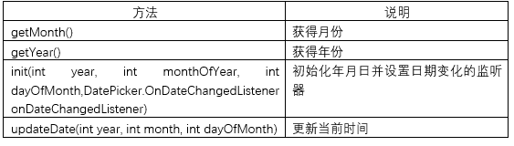
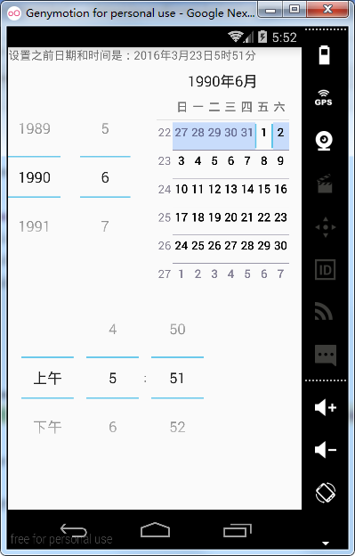
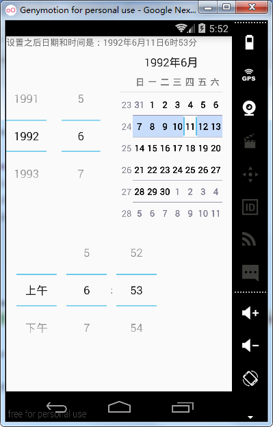
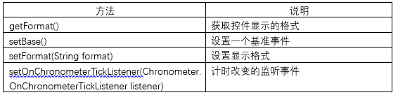
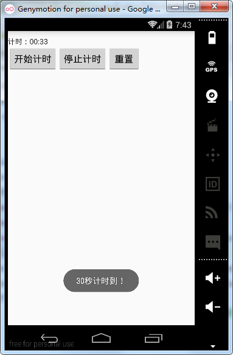
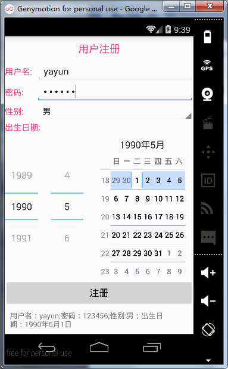

# 第八章-时间相关控件

1.	TimePicker和DatePicker

TimePicker是时间选择控件，那么DatePicker就是日期选择控件，在日期时间选择上它们俩常常组合起来使用。
TimePicker常用方法有：



除了上述方法，还有一个TimePicker.OnTimeChangedListener  ，实现该接口并覆写相关方法可以完成时间变化时的监听。

DatePicker常用方法如下表：



通过一个实例来看一下如何使用TimePicker和DatePicker控件，并设置它们的变化监听，布局文件代码如下：

```
<?xml version="1.0" encoding="utf-8"?>
<RelativeLayout xmlns:android="http://schemas.android.com/apk/res/android"
    xmlns:tools="http://schemas.android.com/tools"
    android:layout_width="match_parent"
    android:layout_height="match_parent">
    <TextView
        android:id="@+id/textView"
        android:layout_width="wrap_content"
        android:layout_height="wrap_content"
        android:text="Hello World!" />
    <DatePicker
        android:id="@+id/datePicker"
        android:layout_width="wrap_content"
        android:layout_height="wrap_content"
        android:layout_alignParentLeft="true"
        android:layout_alignParentStart="true"
        android:layout_below="@+id/textView" />
    <TimePicker
        android:id="@+id/timePicker"
        android:layout_width="wrap_content"
        android:layout_height="wrap_content"
        android:layout_alignParentLeft="true"
        android:layout_alignParentStart="true"
        android:layout_below="@+id/datePicker" />
</RelativeLayout>
```

定义了一个DatePicker和一个TimePicker控件及一个TextView控件，TextView控件用于显示时间和日期。
Activity代码如下：

```
public class MainActivity extends Activity {
    private TextView textView;
    private DatePicker datePicker;
    private TimePicker timePicker;
    private int yearPre, month, day, hour, minutePre;
    @Override
    protected void onCreate(Bundle savedInstanceState) {
        super.onCreate(savedInstanceState);
        setContentView(R.layout.activity_main);
        textView = (TextView) findViewById(R.id.textView);
        datePicker = (DatePicker) findViewById(R.id.datePicker);
        timePicker = (TimePicker) findViewById(R.id.timePicker);
        yearPre = datePicker.getYear();
        month = datePicker.getMonth();
        day = datePicker.getDayOfMonth();
        hour = timePicker.getCurrentHour();
        minutePre = timePicker.getCurrentMinute();
        textView.setText("设置之前日期和时间是：" + yearPre + "年" + (month + 1) + "月" + day + "日" + hour + "时" + minutePre + "分");
        //设置时间监听
        timePicker.setOnTimeChangedListener(new TimePicker.OnTimeChangedListener() {
            @Override
            public void onTimeChanged(TimePicker view, int hourOfDay, int minute) {
                hour = hourOfDay;
                minutePre = minute;
                textView.setText("设置之前日期和时间是：" + yearPre + "年" + (month + 1) + "月" + day + "日" + hour + "时" + minutePre + "分");
            }
        });
        //对于日期变化监听，不能直接设置监听，要通过init方法设置
        datePicker.init(1990, 05, 01, new DatePicker.OnDateChangedListener() {
            @Override
            public void onDateChanged(DatePicker view, int year, int monthOfYear, int dayOfMonth) {
                yearPre = year;
                month = monthOfYear;
                day = dayOfMonth;
                textView.setText("设置之后日期和时间是：" + yearPre + "年" + (month + 1) + "月" + day + "日" + hour + "时" + minutePre + "分");
            }
        });
    }
}
```

通过上面表格中的方法获取了当前的年、月、日、时、分、秒等信息，在TextView中显示，设置了日期变化和时间变化的监听，更新TextView中显示的时间信息。

运行项目实例：





2.Chronometer计时控件

```
public class 
Chronometer
extends TextView
java.lang.Object 
   ↳ android.view.View 
     ↳ android.widget.TextView 
       ↳ android.widget.Chronometer
```

计时控件继承自TextView，其中API中介绍：Chronometr是一个简单的定时器,你可以给它一个开始时间,并以此定时,或者如果你不给它一个开始时间,它将会使用你的时间通话开始。默认情况下它会显示在当前定时器的值得形式"分:秒" 或"MM:SS",或者可以使用set(字符串)的定时器值到一个任意字符串。

其常用方法参考下表：



```
<?xml version="1.0" encoding="utf-8"?>
<RelativeLayout xmlns:android="http://schemas.android.com/apk/res/android"
    xmlns:tools="http://schemas.android.com/tools"
    android:layout_width="match_parent"
    android:layout_height="match_parent">
    <Chronometer
        android:id="@+id/chronometer"
        android:layout_width="wrap_content"
        android:layout_height="wrap_content"
        android:layout_marginTop="10dp"
        android:gravity="center" />
    <LinearLayout
        android:layout_width="wrap_content"
        android:layout_height="wrap_content"
        android:layout_below="@+id/chronometer">
        <Button
            android:layout_width="wrap_content"
            android:layout_height="wrap_content"
            android:onClick="start"
            android:text="开始计时" />
        <Button
            android:layout_width="wrap_content"
            android:layout_height="wrap_content"
            android:onClick="stop"
            android:text="停止计时" />
        <Button
            android:layout_width="wrap_content"
            android:layout_height="wrap_content"
            android:onClick="reset"
            android:text="重置" />
    </LinearLayout>
</RelativeLayout>
```

Activity 代码如下：

```
public class MainActivity extends Activity {
    private Chronometer chronometer;
    private long elapseTime = 0;
    @Override
    protected void onCreate(Bundle savedInstanceState) {
        super.onCreate(savedInstanceState);
        setContentView(R.layout.activity_main);
        chronometer = (Chronometer) findViewById(R.id.chronometer);
        chronometer.setFormat("计时：%s");
        chronometer.setOnChronometerTickListener(new Chronometer.OnChronometerTickListener() {
            @Override
            public void onChronometerTick(Chronometer chronometer) {
                String time = chronometer.getText().toString().replaceAll("[^(\\d{2}:\\d{2})]", "");
                if ("00:30".equals(time)) {
                    Toast.makeText(MainActivity.this, "30秒计时到！", Toast.LENGTH_LONG).show();
                }
            }
        });

    }
    //开始按钮监听
    public void start(View view) {
        //再次开始时要减去暂停时走过的时间
        chronometer.setBase(SystemClock.elapsedRealtime() - elapseTime);
        chronometer.start();
    }

    //暂停按钮监听
    public void stop(View view) {
        chronometer.stop();
        elapseTime = SystemClock.elapsedRealtime() - chronometer.getBase();//记录暂停时走过的时间
    }
    //重置按钮监听
    public void reset(View view) {
        elapseTime = 0;
        chronometer.setBase(SystemClock.elapsedRealtime());
    }
}
```

本程序调用了start、stop和setBase方法实现了开始、暂停和重置的功能，还调用了setOnChronometerTickListener方法，实现了计时监听，计时到达30秒时，采用Toast进行提示。

运行实例如下：



前面五节讲解了开发中经常会遇到的控件，这里用一个例子集中再复习一下，注册页是应用中经常要编辑的页面，就以注册页面的布局和相关逻辑处理，再次总结一下控件的用法。
布局文件：

```
<?xml version="1.0" encoding="utf-8"?>
<RelativeLayout xmlns:android="http://schemas.android.com/apk/res/android"
    xmlns:tools="http://schemas.android.com/tools"
    android:layout_width="match_parent"
    android:layout_height="match_parent">
    <TextView
        android:id="@+id/tv_title"
        android:layout_width="wrap_content"
        android:layout_height="wrap_content"
        android:layout_centerHorizontal="true"
        android:gravity="center_horizontal"
        android:padding="10dp"
        android:text="用户注册"
        android:textColor="@color/colorAccent"
        android:textSize="20sp" />
    <LinearLayout
        android:id="@+id/ll_username"
        android:layout_width="match_parent"
        android:layout_height="wrap_content"
        android:layout_below="@+id/tv_title"
        android:orientation="horizontal">
        <TextView
            android:layout_width="wrap_content"
            android:layout_height="wrap_content"
            android:layout_marginRight="10dp"
            android:text="用户名:"
            android:textColor="@color/colorAccent"
            android:textSize="16sp" />
        <EditText
            android:id="@+id/et_username"
            android:layout_width="match_parent"
            android:layout_height="wrap_content" />
    </LinearLayout>
    <LinearLayout
        android:id="@+id/ll_password"
        android:layout_width="match_parent"
        android:layout_height="wrap_content"
        android:layout_below="@+id/ll_username"
        android:orientation="horizontal">
        <TextView
            android:layout_width="wrap_content"
            android:layout_height="wrap_content"
            android:layout_marginRight="24dp"
            android:text="密码:"
            android:textColor="@color/colorAccent"
            android:textSize="16sp" />
        <EditText
            android:id="@+id/et_password"
            android:layout_width="match_parent"
            android:layout_height="wrap_content"
            android:password="true" />
    </LinearLayout>
    <LinearLayout
        android:id="@+id/ll_sex"
        android:layout_width="match_parent"
        android:layout_height="wrap_content"
        android:layout_below="@+id/ll_password"
        android:orientation="horizontal">

        <TextView
            android:layout_width="wrap_content"
            android:layout_height="wrap_content"
            android:layout_marginRight="24dp"
            android:text="性别:"
            android:textColor="@color/colorAccent"
            android:textSize="16sp" />
        <Spinner
            android:id="@+id/spinner"
            android:layout_width="match_parent"
            android:layout_height="wrap_content"
            android:entries="@array/sex"></Spinner>
    </LinearLayout>
    <TextView
        android:id="@+id/tv_born"
        android:layout_width="wrap_content"
        android:layout_height="wrap_content"
        android:layout_below="@+id/ll_sex"
        android:layout_marginRight="24dp"
        android:text="出生日期:"
        android:textColor="@color/colorAccent"
        android:textSize="16sp" />
    <DatePicker
        android:id="@+id/date"
        android:layout_width="match_parent"
        android:layout_height="wrap_content"
        android:layout_below="@+id/tv_born"></DatePicker>
    <Button
        android:id="@+id/btn_submit"
        android:layout_width="match_parent"
        android:layout_height="wrap_content"
        android:layout_below="@+id/date"
        android:text="注册" />
    <TextView
        android:id="@+id/tv_information"
        android:layout_width="match_parent"
        android:layout_height="wrap_content"
        android:layout_below="@+id/btn_submit"
        android:padding="10dp"
        android:text="注册信息" />
</RelativeLayout>
```

这里要注意常用属性的配置方法。
Activity代码如下：

```
public class MainActivity extends Activity {
    private EditText etUserName, etPassword;
    private Spinner spinnerSex;
    private DatePicker datePickerBorn;
    private Button btnSubmit;
    private TextView tvInformation;
    private String sexStr;
    private String bornStr;

    @Override
    protected void onCreate(Bundle savedInstanceState) {
        super.onCreate(savedInstanceState);
        setContentView(R.layout.activity_main);
        initViews();
    }

    //初始化View
    private void initViews() {
        bornStr = "1990年05月01日";
        etUserName = (EditText) findViewById(R.id.et_username);
        etPassword = (EditText) findViewById(R.id.et_password);
        spinnerSex = (Spinner) findViewById(R.id.spinner);
        spinnerSex.setOnItemSelectedListener(new AdapterView.OnItemSelectedListener() {//设置选择监听
            @Override
            public void onItemSelected(AdapterView<?> parent, View view, int position, long id) {
                if (position == 0) {
                    sexStr = "男";
                } else {
                    sexStr = "女";
                }
            }
            @Override
            public void onNothingSelected(AdapterView<?> parent) {
                sexStr = "男";
            }
        });
        datePickerBorn = (DatePicker) findViewById(R.id.date);
        datePickerBorn.init(1990, 04, 01, new DatePicker.OnDateChangedListener() {//日期变化的监听
            @Override
            public void onDateChanged(DatePicker view, int year, int monthOfYear, int dayOfMonth) {
                bornStr = year + "年" + (monthOfYear + 1) + "月" + dayOfMonth + "日";
            }
        });
        btnSubmit = (Button) findViewById(R.id.btn_submit);
        tvInformation = (TextView) findViewById(R.id.tv_information);
        btnSubmit.setOnClickListener(new View.OnClickListener() {//单击监听
            @Override
            public void onClick(View v) {
                tvInformation.setText("用户名：" + etUserName.getText().toString() +
                        ";密码：" + etPassword.getText().toString() + ";性别:" + sexStr +
                        "；出生日期：" + bornStr);
            }
        });
    }
}
```

这里共设置了setOnItemSelectedListener（Spinner控件子项选择监听）、OnDateChangedListener（日期变换监听）、setOnClickListener（单击监听）三种监听响应用户操作。
运行实例如下：



DatePicker在布局中占用了太多的界面，导致整个界面看起来很不美观，在实际开发中一般使用DatePickerDialog，采用对话框的形式，这样可以有效减少界面占用，后面在对话框的章节会详细介绍。