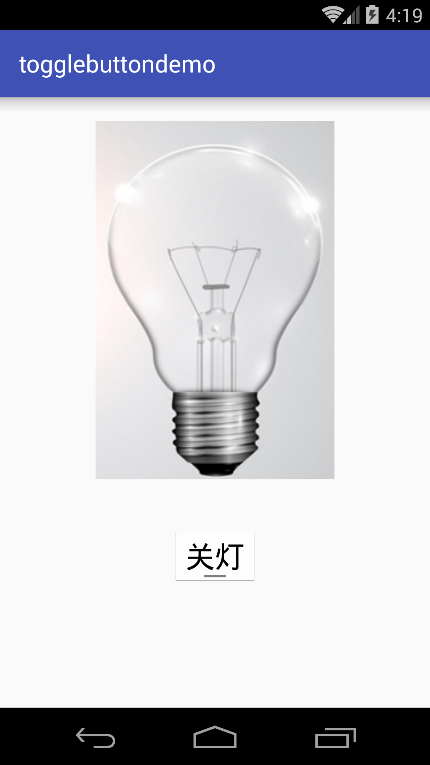
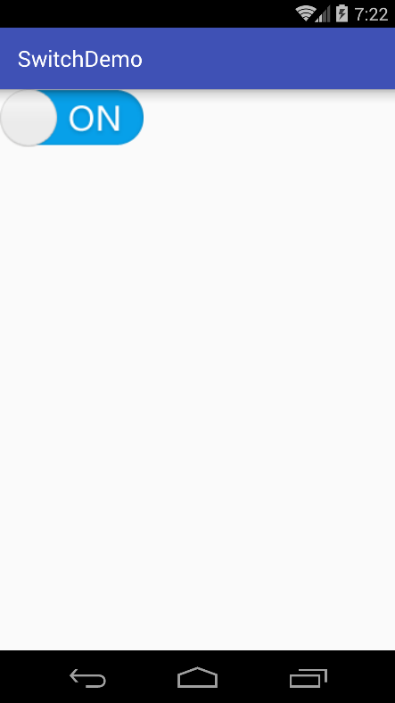
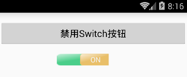
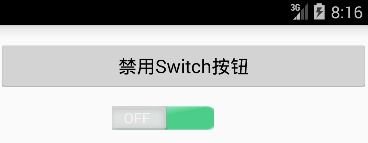
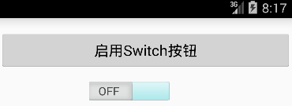

# 第五章-开关按钮ToggleButton和Switch

```
public abstract class
CompoundButton
extends Button
implements Checkable
java.lang.Object
   ↳	android.view.View
 	   ↳	android.widget.TextView
 	 	   ↳	android.widget.Button
 	 	 	   ↳	android.widget.CompoundButton
Known Direct Subclasses
CheckBox, RadioButton, Switch, ToggleButton
```

由继承结构可以看出Switch和ToggleButton都继承自CompoundButton这一抽象类。因此它们属性和方法都是类似的，首先看一下ToggleButton的用法。

## ToggleButton

常用的属性很简单就两个：

-	android:textOff：按钮关闭时显示的文本
-	android:textOn：按钮开启时显示的文本

开关监听为：setOnCheckedChangeListener，覆写onCheckedChanged(CompoundButton buttonView, boolean isChecked)方法，其中isChecked表示是否选中。

用过小米手电筒APP的用户都会对它的UI有印象，也就是开灯时，手机屏幕里的灯泡也会亮，关灯时手机屏幕里的灯泡则不会亮，下面我们就结合ToggleButton实现这一功能。
主布局文件（activity_main.xml）

```
<?xml version="1.0" encoding="utf-8"?>
<LinearLayout xmlns:android="http://schemas.android.com/apk/res/android"
    android:layout_width="match_parent"
    android:orientation="vertical"
    android:layout_height="match_parent">
    <ImageView
        android:id="@+id/iv"
        android:layout_margin="20dp"
        android:layout_gravity="center"
        android:src="@drawable/off"
        android:layout_width="wrap_content"
        android:layout_height="wrap_content" />

    <ToggleButton
        android:id="@+id/tb"
        android:layout_gravity="center"
        android:layout_width="wrap_content"
        android:layout_height="wrap_content"
        android:textOff="关灯"
        android:disabledAlpha="@android:integer/config_longAnimTime"
        android:textSize="25sp"
        android:layout_margin="20dp"
        android:textOn="开灯" />
</LinearLayout>

```
设置了一个ImageView用于显示灯泡的开关，设置了一个ToggleButton当做开关，并设置了textOff和textOn属性。

MainActivity.java代码（MainActivity.java）

```
public class MainActivity extends AppCompatActivity {
    private ToggleButton toggleButton;
    private ImageView imageView;
    @Override
    protected void onCreate(Bundle savedInstanceState) {
        super.onCreate(savedInstanceState);
        setContentView(R.layout.activity_main);
        toggleButton=(ToggleButton)findViewById(R.id.tb);
        imageView=(ImageView)findViewById(R.id.iv);
        toggleButton.setOnCheckedChangeListener(new CompoundButton.OnCheckedChangeListener() {
            @Override
            public void onCheckedChanged(CompoundButton buttonView, boolean isChecked) {
     imageView.setImageResource(isChecked?R.drawable.on:R.drawable.off);
            }
        });
    }
}

```
这里设置了setOnCheckedChangeListener选择变化的监听，并覆写了其onCheckedChanged方法，根据参数isChecked判断要显示哪张图片。
运行实例如下：




选择关灯时灯泡显示的也是暗的，选择开灯，灯泡相应变亮。
有同学会说这样的开关按钮不够直观、不够美观，下面介绍一下如何自定义ToggleButton的外观。

首先准备两张图片：


在drawable文件下创建xml文件，代码如下：

```
<?xml version="1.0" encoding="utf-8"?>
<selector xmlns:android="http://schemas.android.com/apk/res/android">
    <item android:drawable="@drawable/on" android:state_checked="true"/>
    <item android:drawable="@drawable/off" android:state_checked="false"/>
</selector>

```
设置了在android:state_checked为true的时候显示on图片，在android:state_checked为false时显示off图片。
在styles.xml文件中添加代码：

```
<style name="MySwitch" parent="@android:style/Widget.CompoundButton">
    <item name="android:button">@drawable/switch_button</item>
</style>

```

布局文件代码如下：

```
<?xml version="1.0" encoding="utf-8"?>
<LinearLayout xmlns:android="http://schemas.android.com/apk/res/android"
    android:layout_width="match_parent"
    android:layout_height="match_parent">
    <ToggleButton
        android:id="@+id/sw"
        style="@style/MySwitch"
        android:layout_width="wrap_content"
        android:layout_height="wrap_content"
        android:background="#00000000"
        android:checked="true"
        android:textOff="@null"
        android:textOn="@null" />
</LinearLayout>

```
设置了style属性，引入我们设置的style样式，并设置textOff和textOn为@null这样就不会在图片上显示文字了。运行项目实例如下：



这时可以看到ToggleButton的外观改变了。

## Switch##
这里外观实现了Switch的自定义样式，功能实现了动态控制WIFI的开关。首先看一下滑块外观（switch_bg.xml）：

```
<selector xmlns:android="http://schemas.android.com/apk/res/android">
    <item android:state_enabled="true" android:drawable="@drawable/enable" />
    <item android:state_pressed="true"  android:drawable="@drawable/press" />
    <item android:state_checked="true"  android:drawable="@drawable/check_on" />
</selector>

```
这里定义了三种状态下的图片，一种是state_enable（可用状态）为true时，一种是state_pressed（按下状态时）为true，一种是state_checked（选择状态）为true。每种状态对应不同的背景图片。
对于滑动轨道的背景定义了两种不同的图片（track_bg.xml）：

```
<selector xmlns:android="http://schemas.android.com/apk/res/android">
    <item android:drawable="@drawable/track_disable" android:state_enabled="false" />
    <item android:drawable="@drawable/track_default" />
</selector>

```
一种是可用状态即默认状态下显示track_default图片，一种是不可用状态下，显示track_default图片。
主布局文件如下：

```
<LinearLayout
    xmlns:android="http://schemas.android.com/apk/res/android"
    android:layout_width="match_parent"
    android:layout_height="wrap_content"
    android:orientation="vertical"
    android:gravity="center">
    <Button
        android:id="@+id/btn"
        android:layout_width="fill_parent"
        android:layout_height="wrap_content"
        android:layout_marginTop="16dp"
        android:text="禁用Switch按钮"
        android:layout_marginBottom="15dp"
        android:onClick="button_click"/>
        <Switch
            android:id="@+id/sw"
            android:layout_width="wrap_content"
            android:layout_height="wrap_content"
            android:textOff="OFF"
            android:textOn="ON"
            android:layout_alignParentRight="true"
            android:layout_marginRight="20dp"
            android:thumb="@drawable/switch_bg"
            android:track="@drawable/track_bg"
            android:layout_marginBottom="15dp" />
</LinearLayout>

```
定义了一个按钮Button，设置了其onClick事件用于动态控制Switch是否可用。定义了一个Switch按钮，设置了其thumb即滑块外观和track即滑动轨道外观分别为上面定义的两个图片。
MainActivity.java代码如下：

```
public class MainActivity extends Activity {
    Button button;
    Switch sw;
    boolean is_enable = true;
    WifiManager wifiManager;
    AudioManager audioManager;
    @Override
    public void onCreate(Bundle savedInstanceState) {
        super.onCreate(savedInstanceState);
        setContentView(R.layout.activity_main);
        button = (Button)findViewById(R.id.btn);
        sw = (Switch)findViewById(R.id.sw);
        sw.setChecked(true);
        audioManager = (AudioManager) getSystemService(Context.AUDIO_SERVICE);

        sw.setOnCheckedChangeListener(new CompoundButton.OnCheckedChangeListener() {
            @Override
            public void onCheckedChanged(CompoundButton buttonView, boolean isChecked) {
                if (buttonView.isChecked()) {
                    wifiManager = (WifiManager) getSystemService(Context.WIFI_SERVICE);
                    wifiManager.setWifiEnabled(true);
                } else {
                    wifiManager = (WifiManager) getSystemService(Context.WIFI_SERVICE);
                    wifiManager.setWifiEnabled(false);
                }
            }
        });
    }

  public void button_click(View view){
        if(is_enable == true)
        {
            is_enable = false;
            button.setText("启用Switch按钮");
        }
        else{
            is_enable = true;
            button.setText("禁用Switch按钮");
        }
      sw.setEnabled(is_enable);
  }
}

```
设置了布尔型的标识位is_enable用于判断Switch的使能状态，并动态控制Button按钮上文本的显示。实现了setOnCheckedChangeListener监听，判断Switch的选择与否，根据isChecked参数进行判断是否选中。
对于开启和关闭WIFI，这里首先通过getSystemService方法并传入Context.WIFI_SERVICE常量获取WifiManager对象，调用这个对象的setWifiEnable传入true或者false就可以控制WIFI的开启或关闭了。注意这里要配置相应的权限，AndroidManifest.xml代码如下：

```
<?xml version="1.0" encoding="utf-8"?>
<manifest xmlns:android="http://schemas.android.com/apk/res/android"
    package="demo.androidwar.com.switchdemo">
    <application
        android:allowBackup="true"
        android:icon="@mipmap/ic_launcher"
        android:label="@string/app_name"
        android:supportsRtl="true"
        android:theme="@style/AppTheme">
        <activity android:name=".MainActivity">
            <intent-filter>
                <action android:name="android.intent.action.MAIN" />
                <category android:name="android.intent.category.LAUNCHER" />
            </intent-filter>
        </activity>
    </application>
    <uses-permission android:name="android.permission.CHANGE_WIFI_STATE"/>

</manifest>

```
配置了CHANGE_WIFI_STATE的权限。
运行项目实例如下：





第一个图片展示开启WIFI的状态，我们可以在手机状态栏中看到WIFI的状态图标，第二个图片展示关闭WIFI的状态，手机状态栏中已经看不到WIFI状态图标了，第三个图片是禁用Switch按钮的状态。