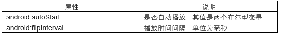
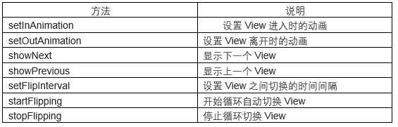
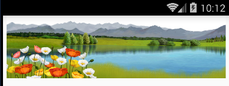

# 第十六章-幻灯片ViewFlipper

ViewFlipper一般用于动态图片循环播放的场景，其继承结构如下：

```
public class
ViewFlipper
extends ViewAnimator
java.lang.Object
   ↳	android.view.View
 	   ↳	android.view.ViewGroup
 	 	   ↳	android.widget.FrameLayout
 	 	 	   ↳	android.widget.ViewAnimator
 	 	 	 	   ↳	android.widget.ViewFlipper
```

可以看出ViewFlipper继承自ViewAnimator，ViewAnimator的官方解释如下：

Base class for a FrameLayout container that will perform animations when switching between its views.
也就是说ViewAnimator是一个视图容器基类，并在其子View切换时提供动画效果。其直接子类除了本节介绍的ViewFlipper之外还有ViewSwitcher。言归正传，下面看一下ViewFlipper常用的属性和方法有哪些？



常用方法如下表：



ViewFlipper进行图片配置时也有两种方式，一种称为静态配置，即在布局文件中进行配置，另一种称为动态配置，即在Java代码中进行配置，下面通过一个小实例看一下如何实现这两种配置。

## 静态配置


【实例11.1】主布局文件（activity_main.xml）

```
<?xml version="1.0" encoding="utf-8"?>
<RelativeLayout xmlns:android="http://schemas.android.com/apk/res/android"
    android:layout_width="match_parent"
    android:layout_height="match_parent">
    <ViewFlipper
        android:id="@+id/viewflipper"
        android:layout_width="match_parent"
        android:layout_height="100dp">
        <ImageView
            android:layout_width="match_parent"
            android:layout_height="100dp"
            android:src="@drawable/img1" />
        <ImageView
            android:layout_width="match_parent"
            android:layout_height="100dp"
            android:src="@drawable/img2" />
        <ImageView
            android:layout_width="match_parent"
            android:layout_height="100dp"
            android:src="@drawable/img3" />
    </ViewFlipper>
</RelativeLayout>
```

在ViewFlipper标签中嵌入三个ImageView，并通过src属性配置了每个ImageView的图片源。

MainActivity代码（MainActivity.java）

```
public class MainActivity extends Activity  {
    private ViewFlipper viewFlipper;
    @Override
    protected void onCreate(Bundle savedInstanceState) {
        super.onCreate(savedInstanceState);
        setContentView(R.layout.activity_main);
        viewFlipper = (ViewFlipper) findViewById(R.id.viewflipper);
        viewFlipper.setAutoStart(true); // 设置自动播放功能（点击事件，前自动播放）
        viewFlipper.setFlipInterval(3000);//间隔3秒
        if (viewFlipper.isAutoStart() && !viewFlipper.isFlipping()) {
            viewFlipper.startFlipping();//自动播放
        }
    }
}
```

实例化ViewFlipper之后调用其setAutoStart方法设置自动播放；调用setFlipInterval设置播放时间间隔；调用startFlipping方法开始自动播放。

## 动态配置

主布局文件（activity_main.xml）

```
<?xml version="1.0" encoding="utf-8"?>
<RelativeLayout xmlns:android="http://schemas.android.com/apk/res/android"
    android:layout_width="match_parent"
    android:layout_height="match_parent">
    <ViewFlipper
        android:id="@+id/viewflipper"
        android:layout_width="match_parent"
        android:layout_height="100dp" />
</RelativeLayout>
```

动态配置不用再布局文件中添加子View，通过Java代码动态添加。

```
public class MainActivity extends Activity  {
    private int[] imgs = { R.drawable.img1, R.drawable.img2, R.drawable.img3 };//图片源
    private ViewFlipper viewFlipper;
    @Override
    protected void onCreate(Bundle savedInstanceState) {
        super.onCreate(savedInstanceState);
        setContentView(R.layout.activity_main);
        viewFlipper = (ViewFlipper) findViewById(R.id.viewflipper);
        for (int i = 0; i < imgs.length; i++) { // 动态添加图片源
            ImageView iv = new ImageView(this);
            iv.setImageResource(imgs[i]);
            iv.setScaleType(ImageView.ScaleType.FIT_XY);
            viewFlipper.addView(iv, new LayoutParams(LayoutParams.MATCH_PARENT,
                    LayoutParams.MATCH_PARENT));
        }
        viewFlipper.setAutoStart(true); // 设置自动播放功能（点击事件，前自动播放）
        viewFlipper.setFlipInterval(3000);//间隔3秒
        if (viewFlipper.isAutoStart() && !viewFlipper.isFlipping()) {
            viewFlipper.startFlipping();//自动播放
        }
    }
}
```

首先设置了图片源imgs数组，然后通过遍历的方式，将ImageView通过add方法添加到ViewFlipper中，这里ImageView调用了setScaleType方法设置了图片在ImageView上的显示样式，这里总结一下方法里参数的含义：

-	SetScaleType(ImageView.ScaleType.CENTER)：不改变图片的size居中显示，当图片的长/宽超过View的长或宽时，截取图片的居中部分显示。
-	setScaleType(ImageView.ScaleType.CENTER_INSIDE)：改变图片的size居中显示，可以显示完成的图片。
-	setScaleType(ImageView.ScaleType.FIT_CENTER)：把图片按比例缩放到View的宽度，居中显示。
-	setScaleType(ImageView.ScaleType.FIT_XY)：不按比例缩放图片，将图片塞满整个View（图片会被拉扯变形）。
-	SetScaleType(ImageView.ScaleType.CENTER_CROP)：按比例扩大图片居中显示，占据整个View，图片会被截取，不会变形。
-	SetScaleType(ImageView.ScaleType.FIT_START/FIT_END)：与FIT_CENTER一样，都是按比例缩放图片，只不过FiT_CENTER是居中显示，而FIT_START是置于顶部，FIT_END是置于底部。

代码中调用了ViewFlipper的setAutoStart方法，设置自动播放，调用了setFlipInterval方法，设置了自动播放的时间间隔，调用了startFlipping方法，开始自动播放。


运行项目实例如下：



图片每隔3秒钟会自动切换。

除了自动播放之外，还可以通过覆写onTouch方法，通过监听用户手指滑动方向，并结合showPrevious和showNext方法实现图片切换。下面在MainActivity中添加一些代码实现手势切换图片。

MainActivity代码（MainActivity.java）

```
public class MainActivity extends Activity  {
    private int[] imgs = { R.drawable.img1, R.drawable.img2, R.drawable.img3 };//图片源
    private ViewFlipper viewFlipper;
    @Override
    protected void onCreate(Bundle savedInstanceState) {
        super.onCreate(savedInstanceState);
        setContentView(R.layout.activity_main);
        viewFlipper = (ViewFlipper) findViewById(R.id.viewflipper);
        for (int i = 0; i < imgs.length; i++) { // 动态添加图片源
            ImageView iv = new ImageView(this);
            iv.setImageResource(imgs[i]);
            iv.setScaleType(ImageView.ScaleType.CENTER);
            viewFlipper.addView(iv, new LayoutParams(LayoutParams.MATCH_PARENT,
                    LayoutParams.MATCH_PARENT));
        }
        viewFlipper.setAutoStart(true); // 设置自动播放功能（点击事件，前自动播放）
        viewFlipper.setFlipInterval(3000);//间隔3秒
        if (viewFlipper.isAutoStart() && !viewFlipper.isFlipping()) {
            viewFlipper.startFlipping();//自动播放
        }
    }

    @Override
    public boolean onTouchEvent(MotionEvent event) {
        float startX=0f,tempX;
        switch (event.getAction()){
            case MotionEvent.ACTION_DOWN:
                startX=event.getX();
                break;
            case MotionEvent.ACTION_MOVE:
                break;
            case MotionEvent.ACTION_UP:
                viewFlipper.stopFlipping();
                tempX=event.getX();
                if(tempX-startX>100){//向右滑动看前一页
                    viewFlipper.showPrevious();
                 viewFlipper.setInAnimation(this,R.anim.push_left_in);
                 viewFlipper.setOutAnimation(this,R.anim.push_left_out);
                }else if(startX-tempX>100){//向左滑动看后一页
                    viewFlipper.showNext();
               viewFlipper.setInAnimation(this,R.anim.push_right_in);
               viewFlipper.setOutAnimation(this,R.anim.push_right_out);
                }
                break;
        }
        return super.onTouchEvent(event);
    }
}
```

这里覆写了onTouchEvent方法，由参数event并调用getAction方法可以获得三个常量：

-	MotionEvent.ACTION_DOWN：手指按下事件，每按下一次触发一次
-	MotionEvent.ACTION_MOVE：手指滑动事件，滑动时触发N次
-	MotionEvent.ACTION_UP：手指抬起事件，每抬起一次触发一次

这里在手指按下时，通过变量startX记录初始x坐标值，在手指抬起时，记录抬起时刻的x坐标值，通过两次坐标值之差间接反映用户左划还是右划，然后调用showNext或showPrevious方法进行图片的切换，并在切换时设置了动画效果。注意，在手动切换时调用ViewFlipper的stopFlipping方法停止自动播放图片，以免造成切换混乱。下面将讲解四个动画文件，动画文件中各标签的含义在动画部分会详细讲解。

动画代码（push_left_in.xml）

```
<?xml version="1.0" encoding="utf-8"?>
<set xmlns:android="http://schemas.android.com/apk/res/android" >
    <translate
        android:duration="1500"
        android:fromXDelta="100%p"
        android:toXDelta="0" />  <!-- 位移   -->
    <alpha
        android:duration="1500"
        android:fromAlpha="0.1"
        android:toAlpha="1.0" /> <!-- 渐变    -->
</set>   
```

动画代码（push_left_out.xml）

```
<?xml version="1.0" encoding="utf-8"?>
<set xmlns:android="http://schemas.android.com/apk/res/android" >
    <translate
        android:duration="1500"
        android:fromXDelta="0"
        android:toXDelta="-100%p" />
    <alpha
        android:duration="1500"
        android:fromAlpha="1.0"
        android:toAlpha="0.1" />
</set>
```

动画代码（push_right_in.xml）

```
<?xml version="1.0" encoding="utf-8"?>
<set xmlns:android="http://schemas.android.com/apk/res/android" >
    <translate
        android:duration="1500"
        android:fromXDelta="-100%p"
        android:toXDelta="0" />
    <alpha
        android:duration="1500"
        android:fromAlpha="0.1"
        android:toAlpha="1.0" />
</set>
```

动画代码（push_right_out.xml）

```
<set xmlns:android="http://schemas.android.com/apk/res/android" >
    <translate
        android:duration="1500"
        android:fromXDelta="0"
        android:toXDelta="100%p" />
    <alpha
        android:duration="1500"
        android:fromAlpha="1.0"
        android:toAlpha="0.1" />
</set>
```

运行实例：


这时可以看到动画过渡效果。