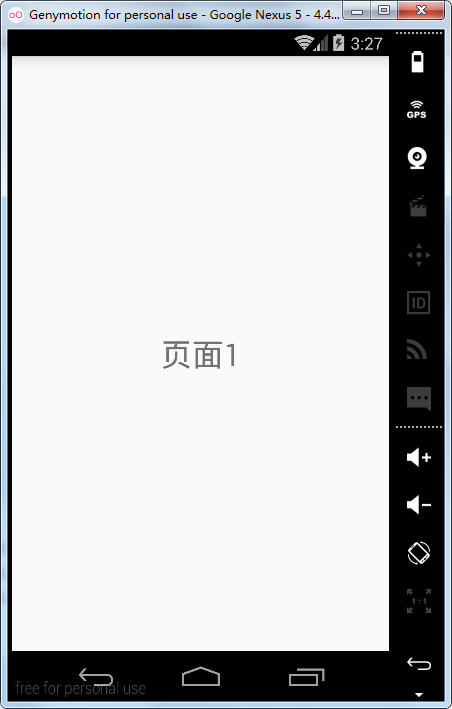
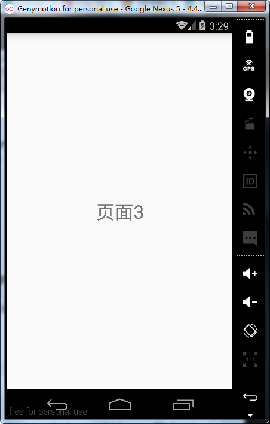

# 第十七章-ViewPager切换界面

ViewFlipper一般仅用于图片的展示，如果要进行布局文件的切换就要用到ViewPager控件，其继承结构如下：

```
public class
ViewPager
extends ViewGroup
java.lang.Object
   ↳	android.view.View
 	   ↳	android.view.ViewGroup
 	 	   ↳	android.support.v4.view.ViewPager
```

继承自ViewGroup可以看出来是一个容器类，类前包名是android.support.v4，这是一个兼容包，注意在布局文件中引入该控件时，标签要写全即：< android.support.v4.view.ViewPager >。API文档中对ViewPager进行了描述，总结如下：

-	ViewPager类直接继承自ViewGroup类，作为一个容器类，可以向其中添加Viewl类
-	数据源和显示之间需要一个适配器类PagerAdapter进行适配
-	ViewPager经常和Fragemnet一起使用，并且提供专门的适配器类FragmentPagerAdapter和FragmentStatePagerAdapter类供开发者调用。

实现PageAdapter必须实现四个方法，这里进行介绍：

-	public Object instantiateItem(ViewGroup container, int position) ：初始化一个子View
-	public void destroyItem(ViewGroup container, int position,Object object)：销毁一个子View
-	public int getCount()：返回子View的个数
-	public boolean isViewFromObject(View arg0, Object arg1)：返回一个布尔型变量，判断子View是否来自Object。
主布局文件（activity_main.xml）

```
<?xml version="1.0" encoding="utf-8"?>
<RelativeLayout xmlns:android="http://schemas.android.com/apk/res/android"
    android:layout_width="match_parent"
    android:layout_height="match_parent">
    <android.support.v4.view.ViewPager
        android:id="@+id/viewPager"
        android:layout_width="match_parent"
        android:layout_height="match_parent" />
</RelativeLayout>
```

注意，标签内需要填入包.类名，否则会报错。
子布局文件（view1.xml）

```
<?xml version="1.0" encoding="utf-8"?>
<LinearLayout xmlns:android="http://schemas.android.com/apk/res/android"
    android:layout_width="match_parent"
    android:layout_height="match_parent">
    <TextView
        android:layout_width="match_parent"
        android:gravity="center"
        android:text="页面1"
        android:textSize="30sp"
        android:layout_height="match_parent" />
</LinearLayout>
```

一共有三个子View文件作为演示，每个子View中都包含一个TextView，由于只是text属性的不同，这里仅贴出view1的代码。
适配器类（MyViewPagerAdapter.java）

```
public class MyViewPagerAdapter extends PagerAdapter {
    private List<View> datas;
   public  MyViewPagerAdapter(List<View> datas ){
       this.datas=datas;
   }
    @Override
    public int getCount() {//返回页卡数量
        return datas.size();
    }
    @Override
    public boolean isViewFromObject(View view, Object object) {//判断View是否来自Object
        return view==object;
    }
    @Override
    public Object instantiateItem(ViewGroup container, int position) {//初始化一个页卡
         container.addView(datas.get(position));
        return datas.get(position);
    }
    @Override
    public void destroyItem(ViewGroup container, int position, Object object) {//销毁一个页卡
        container.removeView(datas.get(position));
    }
}
```

自定义适配器类MyViewPagerAdapter继承自PagerAdapter，编写了构造函数，用于传入datas数据集。此外，覆写了四个必须要覆写的方法，这四个方法的含义参照注释。
（MainActivity.java）

```
public class MainActivity extends Activity {
    private ViewPager viewPager;
    private List<View> datas;
    private MyViewPagerAdapter myViewPagerAdapter;
    @Override
    protected void onCreate(Bundle savedInstanceState) {
        super.onCreate(savedInstanceState);
        setContentView(R.layout.activity_main);
        viewPager=(ViewPager)findViewById(R.id.viewPager);
        initDatas();//初始化数据集
        myViewPagerAdapter=new MyViewPagerAdapter(datas);
        viewPager.setAdapter(myViewPagerAdapter);//设置适配器
    }
    private void initDatas() {
        datas=new ArrayList<>();
        View view1= LayoutInflater.from(this).inflate(R.layout.view1,null);
        View view2= LayoutInflater.from(this).inflate(R.layout.view2,null);
        View view3= LayoutInflater.from(this).inflate(R.layout.view3,null);
        datas.add(view1);
        datas.add(view2);
        datas.add(view3);
    }
}
```

总结一下，PagerView的实现可以分为三个步骤：

1.	准备数据源（initDatas）
2.	准备适配器类并初始化（MyViewPagerAdapter）
3.	设置适配器（setAdapter）

运行实例如下：





这时，左右滑动屏幕就可以切换不同的View了，下面我们看一下如何添加顶部或底部导航，Android提供了两种方式供我们选择，分别是PagerTitleStrip和PagerTabStrip，下面分别研究一下两者的异同点。

- PagerTitleStrip
API中这么定义：是一个非交互的当前页面指示器，一般指示ViewPager中的前一页、当前页和下一页三个页面。可以通过PagerTitleStrip标签添加到xml布局当中。我们可以设置layout_gravity属性为TOP或者BOTTOM来决定在页面顶部或者底部显示，添加PagerTitleStrip要在适配器中覆写getPageTitle方法。
上面是抽象的理论描述，下面通过一个实例来看一下如何在ViewPager中添加PagerTitleStrip控件。

主布局文件（activity_main.xml）

```
<?xml version="1.0" encoding="utf-8"?>
<RelativeLayout xmlns:android="http://schemas.android.com/apk/res/android"
    android:layout_width="match_parent"
    android:layout_height="match_parent">

    <android.support.v4.view.ViewPager
        android:id="@+id/viewPager"
        android:layout_width="match_parent"
        android:layout_height="match_parent">
        <android.support.v4.view.PagerTitleStrip
            android:id="@+id/pagerTitleStrip"
            android:layout_width="match_parent"
            android:layout_height="wrap_content">
        </android.support.v4.view.PagerTitleStrip>
    </android.support.v4.view.ViewPager>
</RelativeLayout>
```

PagerTitleStrip标签也要设置全路径，并放在ViewPager标签内，默认没有添加layout_gravity属性，标签显示在页面顶部，若想设置在底部，添加这一属性设置其值为BOTTOM即可。
适配器类（MyViewPagerAdapter.java）

```
public class MyViewPagerAdapter extends PagerAdapter {
    private List<View> datas;
    private List<String> titles;
   public  MyViewPagerAdapter(List<View> datas,List<String> titles ){
       this.datas=datas;
       this.titles=titles;
   }
    @Override
    public int getCount() {//返回页卡数量
        return datas.size();
    }
    @Override
    public boolean isViewFromObject(View view, Object object) {//判断View是否来自Object
        return view==object;
    }
    @Override
    public Object instantiateItem(ViewGroup container, int position) {//初始化一个页卡
         container.addView(datas.get(position));
        return datas.get(position);
    }
    @Override
    public void destroyItem(ViewGroup container, int position, Object object) {//销毁一个页卡
        container.removeView(datas.get(position));
    }
    @Override
    public CharSequence getPageTitle(int position) {
        return titles.get(position);
    }
}
```

为了方便观察，较上一个实例增加或修改的代码部分进行了加粗，首先是修改了构造方法，多传入了一个标题的数据集，然后覆写了一个getPagerTitle的方法，这个方法可以根据position参数返回对应的title。

MainActivity（MainActivity.java）

```
public class MainActivity extends Activity {
    private ViewPager viewPager;
    private PagerTitleStrip pagerTitleStrip;
    private List<View> datas;
    private List<String> titles;
    private MyViewPagerAdapter myViewPagerAdapter;
    @Override
    protected void onCreate(Bundle savedInstanceState) {
        super.onCreate(savedInstanceState);
        setContentView(R.layout.activity_main);
        viewPager=(ViewPager)findViewById(R.id.viewPager);
      pagerTitleStrip=(PagerTitleStrip)findViewById(R.id.pagerTitleStrip);
        initDatas();
        myViewPagerAdapter=new MyViewPagerAdapter(datas,titles);
        viewPager.setAdapter(myViewPagerAdapter);
    }
    private void initDatas() {
        datas=new ArrayList<>();
        titles=new ArrayList<>();
        View view1= LayoutInflater.from(this).inflate(R.layout.view1,null);
        View view2= LayoutInflater.from(this).inflate(R.layout.view2,null);
        View view3= LayoutInflater.from(this).inflate(R.layout.view3,null);
        datas.add(view1);
        datas.add(view2);
        datas.add(view3);
        titles.add("第一页");
        titles.add("第二页");
        titles.add("第三页");
    }
}
```

较上一个实例来讲，这里添加了一个标题的数据集titles，初始化MyViewPagerAdapter的时候传入了两个参数，页面布局数据集（datas）和标题数据集（titles）。
运行实例如下：


点击顶部的标题栏，不会进行页面切换，正如API文档里描述的那样-non-interactive indicator，只能作为一个页面指示器，不具有交互作用，下面我们共同来实践一下具有交互效果的PagerTabStrip。

-	PagerTabStrip
API中这么描述PagerTabStrip：

> PagerTabStrip is an interactive indicator of the current, next, and previous pages of a ViewPager. It is intended to be used as a child view of a ViewPager widget in your XML layout. Add it as a child of a ViewPager in your layout file and set its android:layout_gravity to TOP or BOTTOM to pin it to the top or bottom of the ViewPager. The title from each page is supplied by the method getPageTitle(int) in the adapter supplied to the ViewPager.

For a non-interactive indicator, see PagerTitleStrip.
这里把英文的API文档贴出来，带领大家大致翻译一下：PagerTabStrip是一个关于当前页、下一页和上一页可交互的页面指示器。作为一个子View布局在ViewPager控件内部。同时，也可以通过设置layout_gravity属性为TOP或BOTTOM来决定显示在页面顶部或底部。每个页面标题是通过适配器类中覆写getPageTitle方法提供给ViewPager的。最后一句也点明了，若要使用一个非交互指示器，可以参考PagerTitleStrip。

从API文档上可以看出，两个方式使用方法一样，因此，这里只要在布局文件中更换一下标签如下：

```
<?xml version="1.0" encoding="utf-8"?>
<RelativeLayout xmlns:android="http://schemas.android.com/apk/res/android"
    android:layout_width="match_parent"
    android:layout_height="match_parent">
    <android.support.v4.view.ViewPager
        android:id="@+id/viewPager"
        android:layout_width="match_parent"
        android:layout_height="match_parent">
        <android.support.v4.view.PagerTabStrip
            android:id="@+id/pagerTabStrip"
            android:layout_width="match_parent"
            android:layout_height="wrap_content">
        </android.support.v4.view.PagerTabStrip>
    </android.support.v4.view.ViewPager>
</RelativeLayout>
```

将标签换成android.support.v4.view.PagerTabStrip。
MainActivity.java中，将PagerTitleStrip换成PagerTabStrip即可，其余代码不变：

```
private PagerTabStrip pagerTabStrip= (PagerTabStrip)findViewById(R.id.pagerTabStrip);
```

运行实例如下：


点击顶部指示页，可以进行页面切换，除此之外，较PagerTitleStrip而言，PagerTabStrip当前页的下面还多了一个小横标，以上功能基本实现了，下面来研究一下，如何让外观变得更漂亮，Android也给我们提供了一些方法用于改变指示栏的样式。常用方法参考下表：


在MainActivity.java的onCreate方法中加入如下代码：

```
pagerTabStrip.setDrawFullUnderline(false);//取消标题栏子View之间的分割线
pagerTabStrip.setTabIndicatorColor(Color.WHITE);//改变指示器颜色为白色
pagerTabStrip.setTextColor(Color.WHITE);//该变字体颜色为白色
pagerTabStrip.setBackgroundResource(android.R.drawable.alert_dark_frame);//设置标题栏背景图片
```

再次运行实例如下：


上面讲解了加载布局文件的ViewPager，由API文档可知，ViewPager还可以加载Fragment控件，也有两个适配器类（FragmentPagerAdapter和FragmentStatePagerAdapter）可以实现，下面分别实现并介绍相关异同点。

-	FragmentPagerAdapter实现

```
public abstract class
FragmentPagerAdapter
extends PagerAdapter
java.lang.Object
   ↳	android.support.v4.view.PagerAdapter
 	   ↳	android.support.v4.app.FragmentPagerAdapter
```

由继承结构可以看出FragmentPagerAdapter继承自PagerAdapter，子页面由Fragment组成，该适配器没有实现页面销毁的方法，所有的页面都保存在内存当中，当页面比较大时要考虑使用FragmentStatePagerAdapter适配器类。
实现FragmentPagerAdapter时必须要覆写的方法是getItem和getCount方法。

下面通过一个实例进行实现，分三个步骤实现：

- 准备Fragment的数据集
- 编写适配器类
- 初始化数据集，设置适配器
Fragment代码（MyFragment1.java）

```
public class MyFragment1 extends Fragment {
    @Override
    public View onCreateView(LayoutInflater inflater, ViewGroup container, Bundle savedInstanceState) {
        return inflater.inflate(R.layout.view1,null);
    }
}
```

Fragment中只覆写了onCreateView方法，其他两个Fragment差别只是载入了不同的view，这里就不再贴出。

适配器类代码（MyFragmentViewPagerAdapter.java）

```
public class MyFragmentViewPagerAdapter extends FragmentPagerAdapter{
   private  List<Fragment> datas;
    private List<String> titles;
    public MyFragmentViewPagerAdapter(FragmentManager fm, List<Fragment> datas,List<String> titles) {
        super(fm);
        this.titles=titles;
        this.datas=datas;
    }
    @Override
    public Fragment getItem(int position) {
        return datas.get(position);
    }
    @Override
    public int getCount() {
        return datas.size();
    }
    @Override
    public CharSequence getPageTitle(int position) {
        return titles.get(position);
    }
}
```

这里构建构造方法时传入了FragmentManager参数，并传入了Fragment类的数据集合String型的标题集。必须要覆写的方法只有getI	tem（获取子项）和getCount（获取子项个数）两个。为了显示标题栏，这里覆写了getPageTitle方法。

MainActivity（MainActivity.java）

```
public class MainActivity extends FragmentActivity {
    private ViewPager viewPager;
    private PagerTabStrip pagerTabStrip;
    private List<Fragment> datas;//数据源
    private List<String> titles;
    private MyFragmentViewPagerAdapter myFragmentViewPagerAdapter;
    @Override
    protected void onCreate(Bundle savedInstanceState) {
        super.onCreate(savedInstanceState);
        setContentView(R.layout.activity_main);
        viewPager=(ViewPager)findViewById(R.id.viewPager);
        pagerTabStrip=(PagerTabStrip)findViewById(R.id.pagerTabStrip);
        pagerTabStrip.setDrawFullUnderline(false);//取消标题栏和子View直接的分割线
        pagerTabStrip.setTabIndicatorColor(Color.WHITE);
        pagerTabStrip.setTextColor(Color.WHITE);
        pagerTabStrip.setBackgroundResource(android.R.drawable.alert_dark_frame);
        initDatas();
        myFragmentViewPagerAdapter=new MyFragmentViewPagerAdapter(getSupportFragmentManager(),datas,titles);
        viewPager.setAdapter(myFragmentViewPagerAdapter);
    }
    private void initDatas() {
        datas=new ArrayList<>();
        titles=new ArrayList<>();
        datas.add(new MyFragment1());
        datas.add(new MyFragment2());
        datas.add(new MyFragment3());
        titles.add("第一页");
        titles.add("第二页");
        titles.add("第三页");
    }
}
```

初始化数据源时，加入的是Fragment对象，初始化适配器类MyFragmentViewPagerAdapter时要传入FragmentManager对象，这里使用getSupportFragmentManager方法获取，不过，要注意这时MainActivity要继承自FragmentActivity，才好调用这个方法。
运行实例如下：


运行效果和PagerAdapter类实现的一样。

- FragmentStatePagerAdapter实现
同样也是继承自PagerAdapter，此适配器更适用于大量页面的情形，因为不被显示的页面会被回收，可以大大降低内存的使用率。在使用FragmentStatePagerAdapter作为适配器时，其余都不用改动，只要覆写instantiateItem（初始化子页面）和destroyItem（销毁子页面）两个方法即可。如下：

```
@Override
public Object instantiateItem(ViewGroup container, int position) {
    return super.instantiateItem(container, position);
}
@Override
public void destroyItem(ViewGroup container, int position, Object object) {
    super.destroyItem(container, position, object);
}
```

此方式可以销毁不可见的页面（不在标题栏中的页面，标题栏中一般存在三个页面），回收内存，在实际开发中推荐使用。
ViewPager控件提供了页面切换时的事件监听，下面就在MainActivity中实现一下：

```
public class MainActivity extends FragmentActivity implements ViewPager.OnPageChangeListener{
    private ViewPager viewPager;
    private PagerTabStrip pagerTabStrip;
    private List<Fragment> datas;
    private List<String> titles;
    private MyFragmentViewPagerAdapter myFragmentViewPagerAdapter;
    @Override
    protected void onCreate(Bundle savedInstanceState) {
        super.onCreate(savedInstanceState);
        setContentView(R.layout.activity_main);
        viewPager=(ViewPager)findViewById(R.id.viewPager);
        pagerTabStrip=(PagerTabStrip)findViewById(R.id.pagerTabStrip);
        pagerTabStrip.setDrawFullUnderline(false);//取消标题栏和子View直接的分割线
        pagerTabStrip.setTabIndicatorColor(Color.WHITE);
        pagerTabStrip.setTextColor(Color.WHITE);
        pagerTabStrip.setBackgroundResource(android.R.drawable.alert_dark_frame);
        initDatas();
        myFragmentViewPagerAdapter=new MyFragmentViewPagerAdapter(getSupportFragmentManager(),datas,titles);
        viewPager.setAdapter(myFragmentViewPagerAdapter);
        viewPager.setOnPageChangeListener(this);
    }
    private void initDatas() {
        datas=new ArrayList<>();
        titles=new ArrayList<>();
        datas.add(new MyFragment1());
        datas.add(new MyFragment2());
        datas.add(new MyFragment3());
        titles.add("第一页");
        titles.add("第二页");
        titles.add("第三页");
    }

    @Override
    public void onPageScrolled(int position, float positionOffset, int positionOffsetPixels) {

    }

    @Override
    public void onPageSelected(int position) {
        Toast.makeText(MainActivity.this,"当前是第："+(position+1)+"页",Toast.LENGTH_SHORT).show();

    }

    @Override
    public void onPageScrollStateChanged(int state) {

    }
}
```

实现了onPageChangeListener接口，需要覆写三个方法：
- void onPageScrolled(int position, float positionOffset, int positionOffsetPixels)：页面滚动时触发；
- void onPageSelected(int position)：页面选择时触发；
- void onPageScrollStateChanged(int state)：页面滚动状态切换时触发；

在页面选择触发的方法里通过position参数获得当前页面信息，然后由Toast输出信息。

运行实例如下：


切换页面后会Toast出当前所在页。